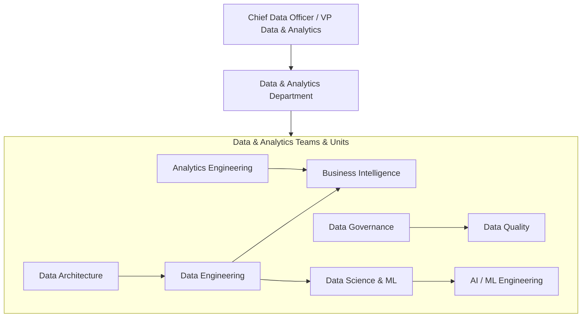
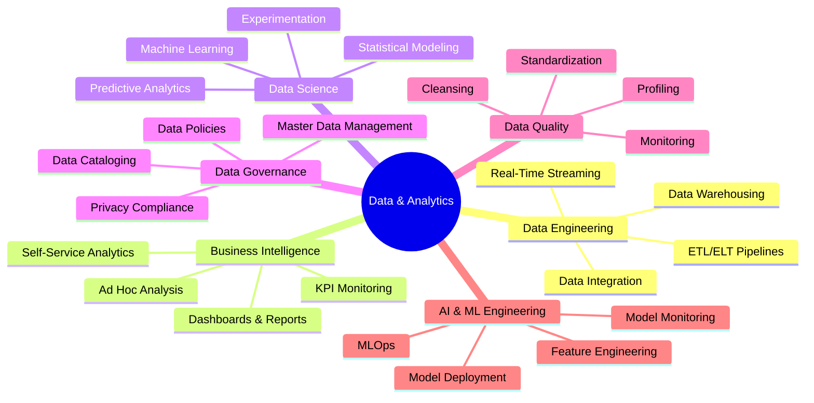
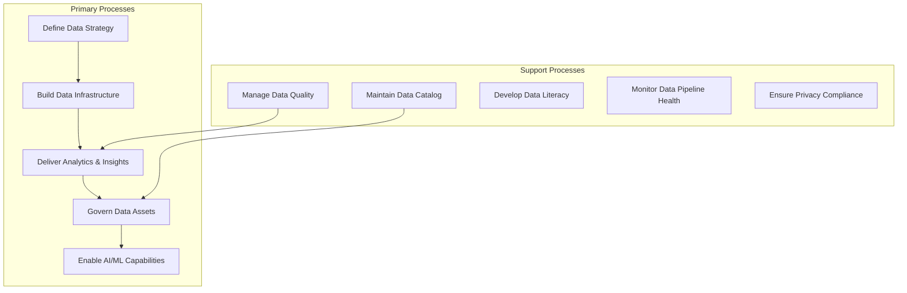
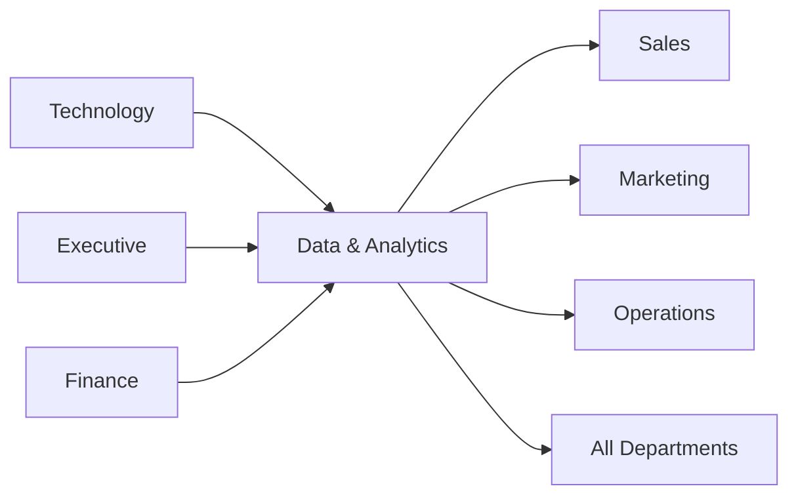

# Data & Analytics

> Data management, business intelligence, advanced analytics, and data governance

## Overview

The Data & Analytics function is responsible for transforming the organization's data assets into actionable insights that drive better decision-making across all business functions. This department manages data infrastructure, governance, quality, and analytics capabilities that enable evidence-based management and data-driven culture. Data & Analytics serves as the custodian of organizational data, ensuring information is accurate, accessible, secure, and utilized effectively to create competitive advantage.

Modern data organizations have evolved from reporting-focused business intelligence teams into comprehensive data platforms that support self-service analytics, machine learning, real-time decisioning, and data-as-a-product strategies. The function plays an increasingly strategic role in digital transformation, AI enablement, and organizational agility, providing the data foundation upon which advanced capabilities like predictive analytics, automation, and generative AI are built.

## Department Structure

## Key Statistics

| Metric | Value |
|--------|-------|
| Function Code | APQC 10009 |
| Parent Function | [Technology](../Technology) |
| Process Group | [Manage Enterprise Information](/processes/ManageEnterpriseInformation) |
| Typical Headcount | 1-5% of total workforce (varies significantly by industry) |

## Core Responsibilities

### Data Engineering

Data Engineering builds and maintains the data infrastructure, pipelines, and platforms that enable the organization to collect, process, store, and serve data at scale.

**Key Activities:**
- Design and build data pipelines and ETL/ELT processes
- Manage data warehouse and data lake infrastructure
- Develop real-time data streaming capabilities
- Ensure data platform reliability, scalability, and performance
- Implement data integration across source systems

### Business Intelligence

Business Intelligence delivers reporting, dashboards, and analytical tools that enable business users to monitor performance, identify trends, and make data-informed decisions.

**Key Activities:**
- Develop and maintain executive dashboards and reports
- Create self-service analytics environments for business users
- Define and maintain business KPI frameworks
- Perform ad hoc analysis to support business questions
- Train business users on analytics tools and data literacy

### Data Science and Machine Learning

Data Science applies advanced statistical methods, machine learning, and AI to discover patterns, predict outcomes, and automate decisions that drive business value.

**Key Activities:**
- Develop predictive models and machine learning algorithms
- Design and analyze A/B tests and experiments
- Build recommendation and personalization systems
- Apply natural language processing and computer vision
- Deploy and monitor models in production environments

## Key Roles

| Role | Level | Description |
|------|-------|-------------|
| [Computer and Information Systems Managers](/occupations/Management/ComputerAndInformationSystemsManagers) | Director/VP | Plan, direct, or coordinate data and analytics activities |
| [Data Scientists](/occupations/Technology/DataScientists) | Scientist | Develop analytics applications and machine learning models |
| [Database Architects](/occupations/Technology/DatabaseArchitects) | Architect | Design database and data warehouse systems |
| [Business Intelligence Analysts](/occupations/Technology/BusinessIntelligenceAnalysts) | Analyst | Produce intelligence and identify data patterns |
| [Software Developers](/occupations/Technology/SoftwareDevelopers) | Engineer | Design and develop data engineering solutions |
| [Statisticians](/occupations/Technology/Statisticians) | Analyst | Apply statistical theory and methods to data problems |
| [Operations Research Analysts](/occupations/Technology/OperationsResearchAnalysts) | Analyst | Apply optimization methods using analytical techniques |
| [Database Administrators](/occupations/Technology/DatabaseAdministrators) | Administrator | Administer and maintain database management systems |

## Processes Owned

- [Manage Enterprise Information](/processes/ManageEnterpriseInformation) - Primary Owner
- [Define Business Technology and Governance Strategy](/processes/industries/utilities/utilities_UtilityCompanies_DefineBusinessTechnologyAndGovernanceStrategy) - Shared with Technology
- [Define and Manage Technology Innovation](/processes/industries/utilities/utilities_UtilityCompanies_DefineAndManageTechnologyInnovation) - Shared with Technology
- [Develop and Manage Infrastructure Resource Planning](/processes/industries/utilities/utilities_UtilityCompanies_DevelopAndManageInfrastructureResourcePlanning) - Shared with Technology
- [Create and Manage Support Services/Solutions](/processes/industries/utilities/utilities_UtilityCompanies_CreateAndManageSupportServicessolutions) - Shared with Technology

## Cross-Functional Relationships

### Upstream Dependencies
- [Technology](../Technology) - Cloud infrastructure, compute resources, network services
- [Executive](../Executive) - Data strategy direction, analytics priorities, investment decisions
- [Finance](../Finance) - Budget allocation, financial data access, ROI tracking

### Downstream Consumers
- [Sales](../Sales) - Customer analytics, lead scoring, forecasting models
- [Marketing](../Marketing) - Campaign analytics, attribution modeling, customer segmentation
- [Operations](../Operations) - Operational analytics, predictive maintenance, process optimization
- All Departments - Self-service analytics, dashboards, reporting, data access

## Industry Variations

### Financial Services

Financial services data teams manage regulatory reporting, risk modeling, and real-time analytics while handling sensitive financial data with strict compliance requirements.

**Specific Focus Areas:**
- Regulatory reporting automation (Basel, CCAR)
- Credit risk and fraud detection models
- Real-time trading and market analytics
- Anti-money laundering data analytics

### Healthcare

Healthcare data teams work with clinical and genomic data, population health analytics, and value-based care models while maintaining HIPAA compliance and data interoperability.

**Specific Focus Areas:**
- Electronic health records analytics
- Clinical decision support systems
- Population health and outcomes analytics
- Genomic and precision medicine data

### Retail/E-commerce

Retail data teams drive personalization, demand forecasting, and customer analytics while managing large volumes of transactional and behavioral data across channels.

**Specific Focus Areas:**
- Customer 360 and personalization engines
- Demand forecasting and inventory optimization
- Price optimization and dynamic pricing
- Omnichannel customer journey analytics

### Manufacturing

Manufacturing data teams support Industry 4.0, predictive maintenance, and supply chain optimization through IoT data integration and real-time process analytics.

**Specific Focus Areas:**
- IoT sensor data integration and analytics
- Predictive maintenance and equipment health
- Digital twin and simulation modeling
- Supply chain visibility and optimization

## KPIs & Metrics

| Metric | Description | Target |
|--------|-------------|--------|
| Data Availability | Critical data sets accessible on time | > 99.5% |
| Pipeline Reliability | Data pipelines completing without failure | > 99% |
| Data Quality Score | Data meeting quality standards | > 95% |
| Self-Service Adoption | Business users accessing data directly | Growth trend |
| Model Accuracy | ML model performance metrics | Above baseline |
| Time to Insight | Request to delivered analysis | < 5 business days |
| Data Literacy Score | Employee data skills assessment | Improvement YoY |
| Analytics ROI | Business value from analytics initiatives | > 5:1 |

## Technology Stack

- **Cloud Data Platforms**: Snowflake, Databricks, Google BigQuery, Amazon Redshift
- **Data Orchestration**: Airflow, Dagster, Prefect, dbt
- **Data Integration**: Fivetran, Airbyte, Stitch, Informatica
- **Business Intelligence**: Tableau, Power BI, Looker, ThoughtSpot
- **Data Science**: Jupyter, Databricks, SageMaker, Vertex AI
- **Data Governance**: Collibra, Alation, Atlan, Monte Carlo
- **Data Quality**: Great Expectations, Monte Carlo, Anomalo, Soda
- **Feature Stores**: Feast, Tecton, Databricks Feature Store
- **ML Operations**: MLflow, Weights & Biases, Kubeflow, Seldon
- **Streaming**: Apache Kafka, Confluent, Amazon Kinesis, Apache Flink

---

*Source: APQC PCF 10009 + GS1 Functional Entity*
