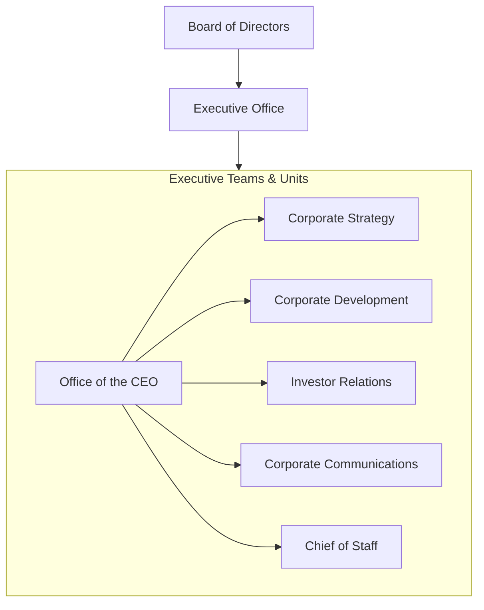
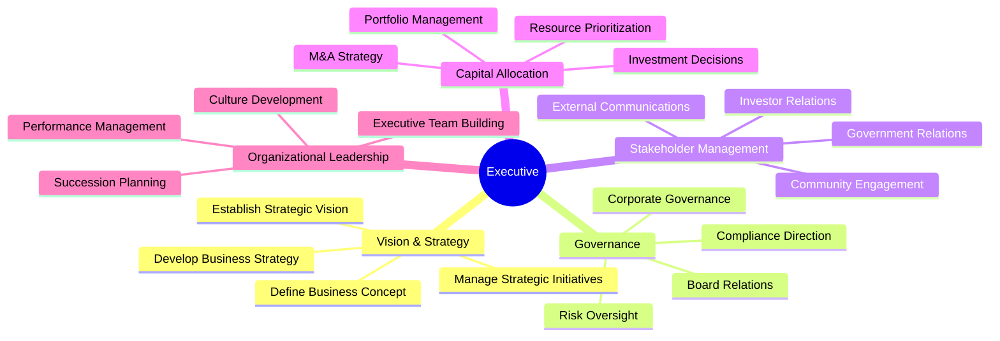
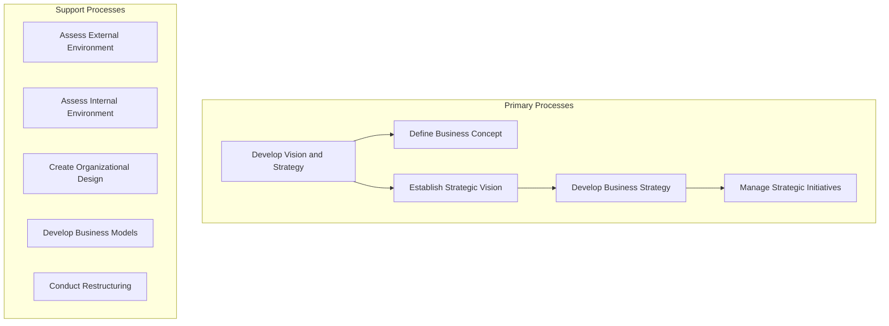
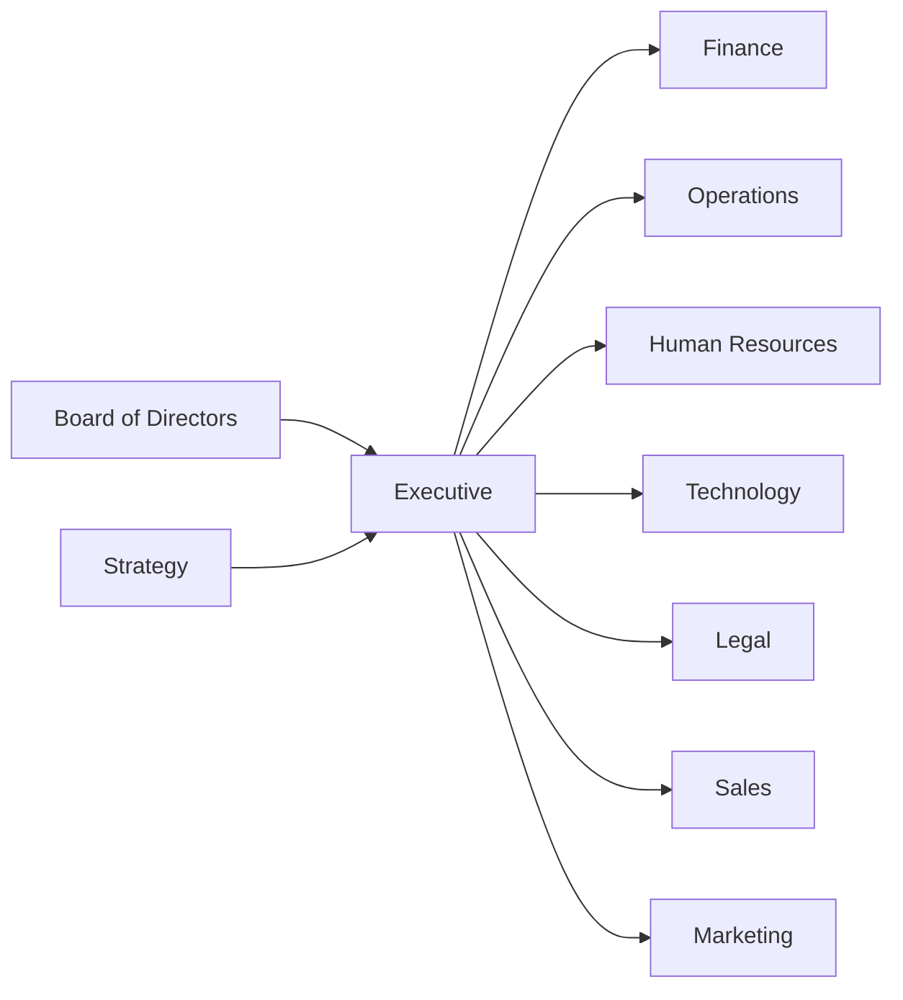

# Executive

> C-Suite and executive leadership functions responsible for organizational vision, strategy, and governance

## Overview

The Executive function encompasses the highest level of organizational leadership, including the CEO, C-Suite executives, and their support structures. This department is responsible for establishing organizational vision, developing and executing corporate strategy, managing stakeholder relationships, and ensuring effective governance across all business units. Executive leadership sets the tone for organizational culture, makes critical capital allocation decisions, and represents the organization to external stakeholders including investors, regulators, and the public.

## Department Structure

## Key Statistics

| Metric | Value |
|--------|-------|
| Function Code | APQC 10002 |
| Parent Function | Board of Directors |
| Process Group | [Develop Vision and Strategy](/processes/DevelopVisionAndStrategy) |
| Typical Headcount | 10-50 (varies by organization size) |

## Core Responsibilities

### Vision and Strategy

The Executive function establishes the organization's long-term direction by defining the business concept, articulating a strategic vision, and developing comprehensive business strategies that guide all organizational activities.

**Key Activities:**
- Assess the external environment including competitors, economic trends, and regulatory factors
- Survey market conditions and determine customer needs and wants
- Assess internal capabilities and core competencies
- Establish and communicate strategic vision to all stakeholders
- Develop and evaluate strategic options to achieve organizational mission

### Corporate Governance

Executives ensure proper governance structures are in place, maintain relationships with the Board of Directors, and oversee enterprise-wide risk management and compliance frameworks.

**Key Activities:**
- Conduct regular board meetings and reporting
- Oversee enterprise risk management programs
- Ensure regulatory and ethical compliance
- Establish governance policies and procedures
- Manage executive compensation structures

### Strategic Initiatives

The Executive team develops, selects, and oversees major strategic initiatives that drive organizational transformation and growth.

**Key Activities:**
- Identify and prioritize strategic initiatives
- Allocate resources to high-priority programs
- Monitor execution of strategic projects
- Evaluate M&A opportunities
- Develop partnership and alliance strategies

## Key Roles

| Role | Level | Description |
|------|-------|-------------|
| [Chief Executives](/occupations/ChiefExecutives) | C-Suite | Determine and formulate policies, provide overall direction |
| [Chief Sustainability Officers](/occupations/ChiefSustainabilityOfficers) | C-Suite | Communicate and coordinate sustainability initiatives |
| [General and Operations Managers](/occupations/GeneralAndOperationsManagers) | VP/Director | Plan, direct, or coordinate operations |
| [Management Analysts](/occupations/ManagementAnalysts) | Manager | Conduct organizational studies and evaluations |
| [Project Management Specialists](/occupations/ProjectManagementSpecialists) | Manager | Coordinate strategic initiative execution |

## Processes Owned

- [Develop Vision and Strategy](/processes/DevelopVisionAndStrategy) - Primary Owner
- [Define the Business Concept and Long-Term Vision](/processes/DefineTheBusinessConceptAndLongTermVision) - Primary Owner
- [Establish Strategic Vision](/processes/EstablishStrategicVision) - Primary Owner
- [Develop Business Strategy](/processes/DevelopBusinessStrategy) - Primary Owner
- [Develop and Measure Strategic Initiatives](/processes/DevelopAndMeasureStrategicInitiatives) - Primary Owner
- [Conduct Organization Restructuring Opportunities](/processes/ConductOrganizationRestructuringOpportunities) - Primary Owner
- [Develop and Maintain Business Models](/processes/DevelopAndMaintainBusinessModels) - Primary Owner

## Cross-Functional Relationships

### Upstream Dependencies
- [Board of Directors](../Board) - Governance oversight, strategic approval
- [Strategy](../Strategy) - Strategic analysis and recommendations

### Downstream Consumers
- [Finance](../Finance) - Financial planning guidance, capital allocation decisions
- [Operations](../Operations) - Operational priorities and resource allocation
- [Human Resources](../HR) - Workforce strategy and organizational design
- [Technology](../Technology) - Technology strategy and investment priorities
- [Legal](../Legal) - Compliance direction and governance policies
- [Sales](../Sales) - Revenue targets and market strategy
- [Marketing](../Marketing) - Brand strategy and market positioning

## Industry Variations

### Technology Companies

Technology executives focus heavily on innovation strategy, platform development, and rapid scaling while managing technical debt and talent acquisition in competitive markets.

**Specific Focus Areas:**
- Product roadmap and platform strategy
- Technical talent acquisition and retention
- Innovation and R&D investment priorities
- Platform ecosystem development

### Financial Services

Financial services executives must balance growth objectives with stringent regulatory requirements, risk management, and capital adequacy standards.

**Specific Focus Areas:**
- Regulatory compliance and capital management
- Risk appetite and tolerance frameworks
- Digital transformation initiatives
- Fiduciary responsibility oversight

### Healthcare

Healthcare executives navigate complex stakeholder relationships including patients, providers, payers, and regulators while managing quality of care and operational efficiency.

**Specific Focus Areas:**
- Clinical quality and patient safety
- Regulatory compliance (HIPAA, CMS)
- Payer relationships and reimbursement
- Community health obligations

## KPIs & Metrics

| Metric | Description | Target |
|--------|-------------|--------|
| Total Shareholder Return | Stock price appreciation plus dividends | Top quartile vs. peers |
| Revenue Growth | Year-over-year revenue increase | Industry benchmark +2% |
| ROIC | Return on invested capital | > Cost of capital |
| Employee Engagement | Annual engagement survey score | > 75% favorable |
| Strategic Initiative Completion | % of initiatives delivered on time/budget | > 80% |
| ESG Score | Environmental, social, governance rating | Top decile |

## Technology Stack

- **Enterprise Performance Management**: Anaplan, Workday Adaptive Planning, Oracle EPM
- **Board Portal**: Diligent, Nasdaq BoardVantage, OnBoard
- **Strategic Planning**: Cascade Strategy, ClearPoint Strategy
- **Executive Dashboards**: Tableau, Power BI, Domo
- **Communication**: Slack, Microsoft Teams, Zoom

---

*Source: APQC PCF 10002 + GS1 Functional Entity*
