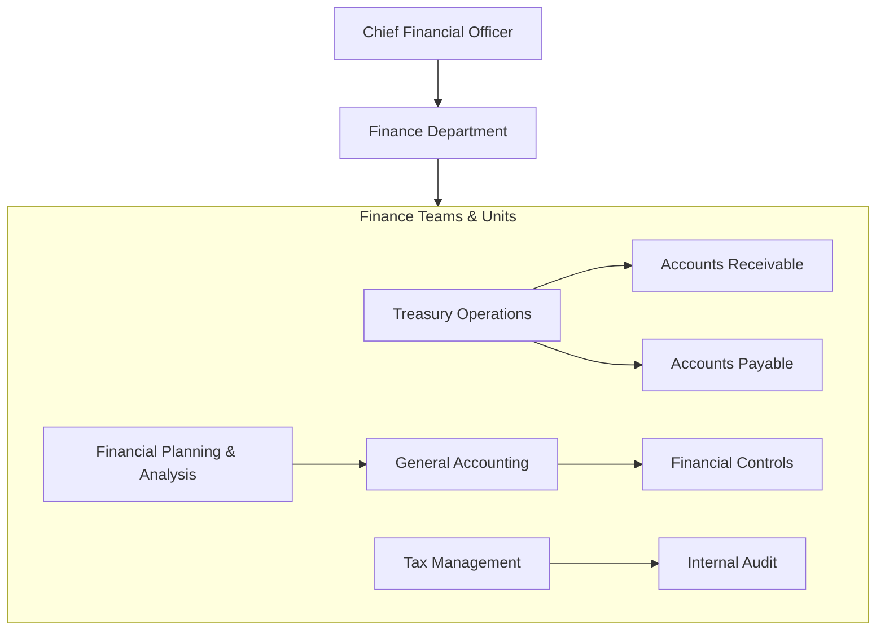
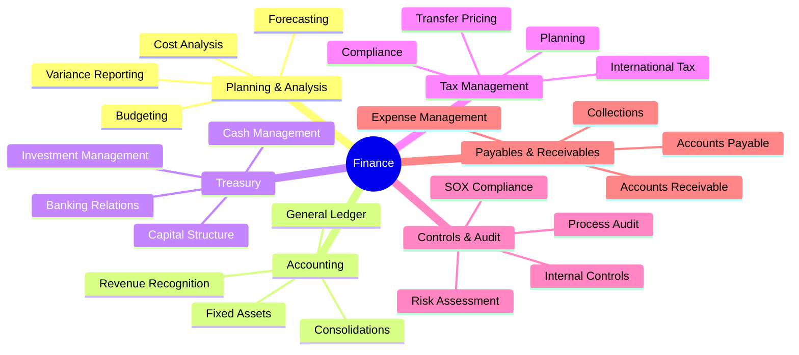
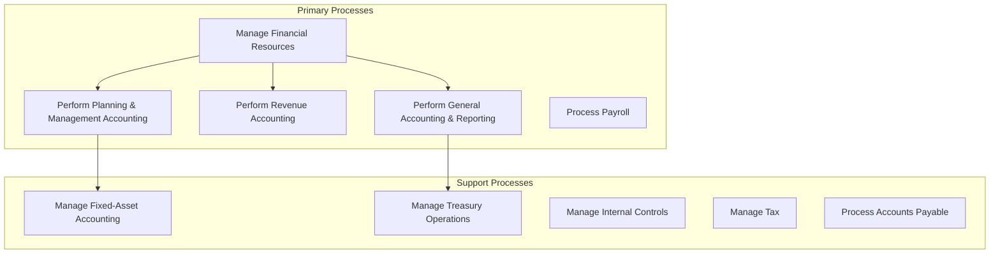
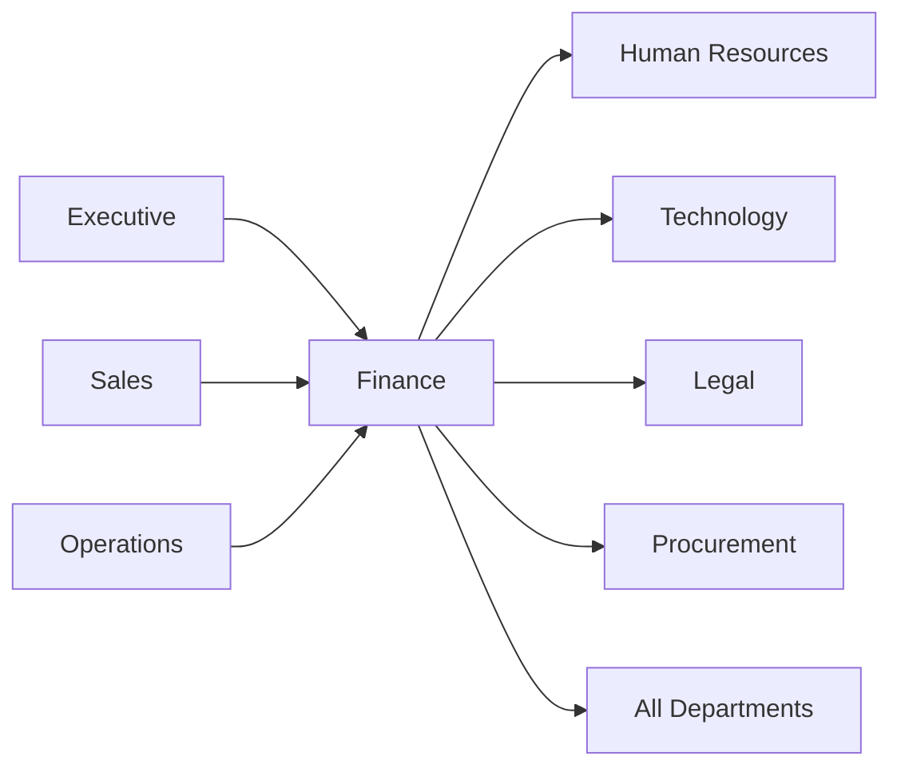

# Finance

> Financial management, accounting, treasury operations, and fiscal planning

## Overview

The Finance function is responsible for the stewardship of the organization's financial resources, ensuring fiscal health, regulatory compliance, and strategic financial planning. This department manages all aspects of financial operations including planning and management accounting, revenue accounting, general accounting and reporting, treasury operations, tax management, and internal controls. Finance provides critical decision-support data to executive leadership and ensures the organization maintains adequate capital, liquidity, and financial stability to achieve its strategic objectives.

## Department Structure

## Key Statistics

| Metric | Value |
|--------|-------|
| Function Code | APQC 17058 |
| Parent Function | [Executive](../Executive) |
| Process Group | [Manage Financial Resources](/processes/ManageFinancialResources) |
| Typical Headcount | 2-5% of total workforce |

## Core Responsibilities

### Financial Planning and Analysis

FP&A develops budgets, creates financial forecasts, and provides analytical support for strategic decision-making. This function translates business strategy into financial terms and monitors performance against plan.

**Key Activities:**
- Develop and maintain budget policies and procedures
- Prepare periodic budgets and financial plans
- Perform variance analysis against forecasts and budgets
- Create financial models for strategic initiatives
- Provide decision support to business units

### Accounting Operations

General accounting maintains the organization's books, ensures accurate financial reporting, and manages compliance with accounting standards (GAAP/IFRS).

**Key Activities:**
- Maintain general ledger and chart of accounts
- Perform month-end and year-end close procedures
- Prepare consolidated financial statements
- Manage fixed-asset accounting and depreciation
- Ensure compliance with accounting standards

### Treasury Operations

Treasury manages the organization's liquidity, cash positions, banking relationships, and capital structure to optimize financial flexibility and minimize risk.

**Key Activities:**
- Manage cash and liquidity positions
- Administer banking relationships
- Execute foreign exchange and hedging strategies
- Manage debt and capital structure
- Oversee investment of excess cash

## Key Roles

| Role | Level | Description |
|------|-------|-------------|
| [Financial Managers](/occupations/FinancialManagers) | Director/VP | Plan, direct, or coordinate financial activities |
| [Treasurers and Controllers](/occupations/TreasurersAndControllers) | Director | Direct financial activities including planning and investments |
| [Accountants and Auditors](/occupations/AccountantsAndAuditors) | Manager/Sr. | Examine and interpret accounting records |
| [Budget Analysts](/occupations/BudgetAnalysts) | Analyst | Examine budget estimates for accuracy and conformance |
| [Financial and Investment Analysts](/occupations/FinancialAndInvestmentAnalysts) | Analyst | Conduct quantitative financial analyses |
| [Credit Analysts](/occupations/CreditAnalysts) | Analyst | Analyze credit data and financial statements |
| [Financial Risk Specialists](/occupations/FinancialRiskSpecialists) | Sr. Analyst | Analyze exposure to credit and market risk |

## Processes Owned

- [Manage Financial Resources](/processes/ManageFinancialResources) - Primary Owner
- [Perform Planning and Management Accounting](/processes/PerformPlanningAndManagementAccounting) - Primary Owner
- [Develop and Maintain Budget Policies and Procedures](/processes/DevelopAndMaintainBudgetPoliciesAndProcedures) - Primary Owner
- [Prepare Periodic Budgets and Plans](/processes/PreparePeriodicBudgetsAndPlans) - Primary Owner
- [Perform Revenue Accounting](/processes/PerformRevenueAccounting) - Primary Owner
- [Perform General Accounting and Reporting](/processes/PerformGeneralAccountingAndReporting) - Primary Owner
- [Perform Fixed-Asset Accounting](/processes/PerformFixedAssetAccounting) - Primary Owner
- [Process Payroll](/processes/ProcessPayroll) - Primary Owner
- [Administer Payroll](/processes/AdministerPayroll) - Primary Owner

## Cross-Functional Relationships

### Upstream Dependencies
- [Executive](../Executive) - Strategic priorities, capital allocation decisions
- [Sales](../Sales) - Revenue data, sales forecasts, customer creditworthiness
- [Operations](../Operations) - Production costs, inventory data, capacity plans

### Downstream Consumers
- [Human Resources](../HR) - Payroll processing, benefits administration costs
- [Technology](../Technology) - IT budget allocation, project funding
- [Legal](../Legal) - Contract financial terms, regulatory filings
- [Procurement](../Procurement) - Vendor payments, procurement budgets
- All Departments - Budget allocations, expense reimbursements

## Industry Variations

### Banking and Financial Services

Financial services finance functions focus heavily on regulatory capital, risk-weighted assets, and complex trading operations while managing interest rate and credit risk.

**Specific Focus Areas:**
- Regulatory capital management (Basel III/IV)
- Asset-liability management
- Loan loss provisioning
- Trading desk P&L attribution

### Manufacturing

Manufacturing finance emphasizes cost accounting, inventory valuation, and capital-intensive asset management while supporting make-vs-buy decisions.

**Specific Focus Areas:**
- Product costing and margin analysis
- Inventory accounting (FIFO, LIFO, weighted average)
- Capital expenditure management
- Transfer pricing for global operations

### Healthcare

Healthcare finance navigates complex reimbursement models, payer mix management, and charity care while ensuring compliance with healthcare-specific regulations.

**Specific Focus Areas:**
- Revenue cycle management
- Payer contract analysis
- Cost reporting (Medicare/Medicaid)
- Charity care and bad debt provisions

### Technology/SaaS

Technology company finance focuses on subscription economics, customer lifetime value, and growth metrics while managing R&D capitalization and stock-based compensation.

**Specific Focus Areas:**
- ARR/MRR tracking and analysis
- Customer acquisition cost and LTV analysis
- R&D capitalization policies
- Stock-based compensation accounting

## KPIs & Metrics

| Metric | Description | Target |
|--------|-------------|--------|
| Days Sales Outstanding | Average collection period for receivables | < 45 days |
| Days Payable Outstanding | Average payment period for payables | 30-60 days |
| Budget Variance | Actual vs. budget deviation | < 5% |
| Close Cycle Time | Days to complete monthly close | < 5 business days |
| Working Capital Ratio | Current assets / current liabilities | 1.5 - 2.0 |
| Free Cash Flow | Operating cash flow minus CapEx | Positive, growing |
| Cost of Finance Function | Finance costs as % of revenue | < 1% |
| Audit Findings | Material weaknesses identified | Zero |

## Technology Stack

- **ERP Systems**: SAP S/4HANA, Oracle Cloud ERP, NetSuite, Microsoft Dynamics 365
- **Financial Planning**: Anaplan, Workday Adaptive Planning, Planful
- **Treasury Management**: Kyriba, GTreasury, FIS Integrity
- **Expense Management**: SAP Concur, Expensify, Brex
- **Accounts Payable**: Tipalti, Bill.com, Coupa
- **Tax Software**: Thomson Reuters ONESOURCE, Avalara, Vertex
- **Consolidation**: BlackLine, OneStream, Workiva
- **Analytics**: Tableau, Power BI, Alteryx

---

*Source: APQC PCF 17058 + GS1 Functional Entity*
