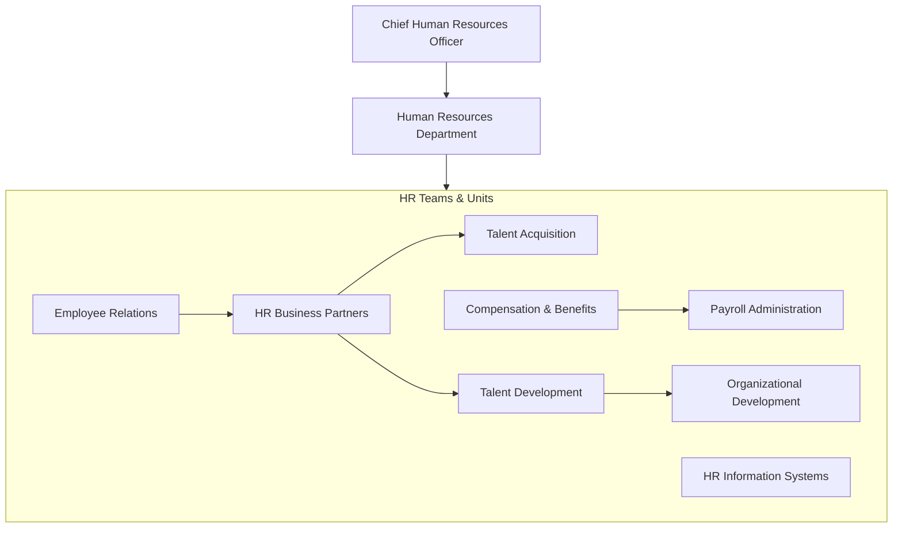
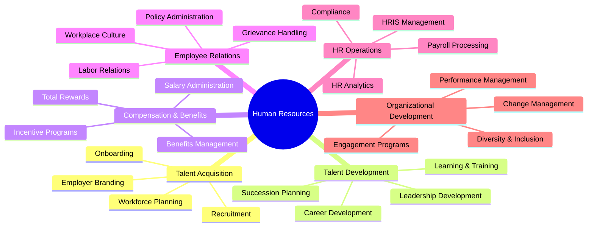
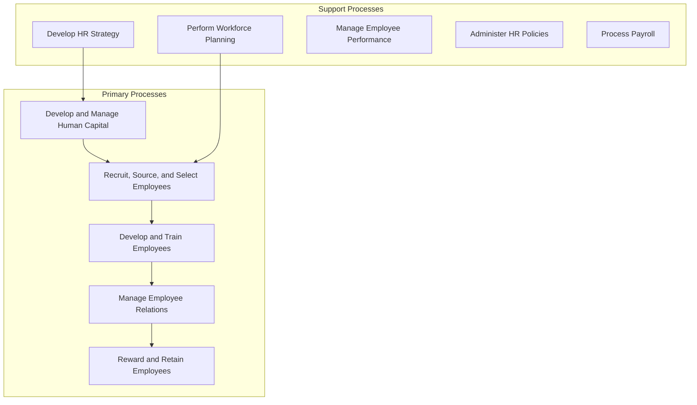
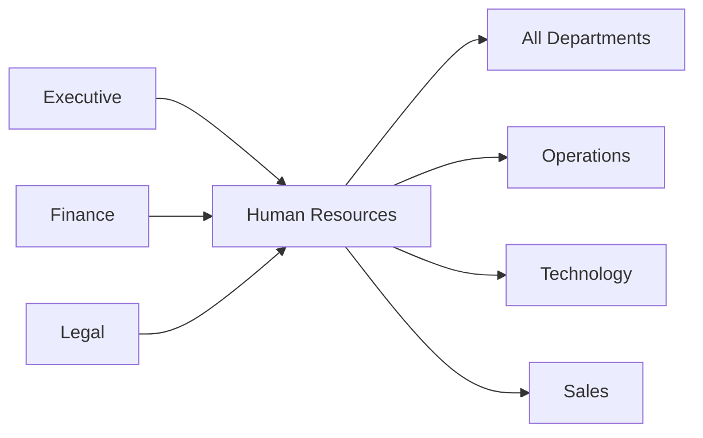

# Human Resources

> Talent management, employee development, compensation, and organizational effectiveness

## Overview

The Human Resources function is responsible for attracting, developing, and retaining the organization's workforce. This department manages all aspects of the employee lifecycle including workforce planning, recruitment, onboarding, training and development, performance management, compensation and benefits, employee relations, and separation. HR serves as a strategic partner to business leadership, ensuring the organization has the right talent, culture, and capabilities to execute its strategy. Modern HR also plays a critical role in organizational design, change management, and fostering an inclusive workplace culture.

## Department Structure

## Key Statistics

| Metric | Value |
|--------|-------|
| Function Code | APQC 10007 |
| Parent Function | [Executive](../Executive) |
| Process Group | [Develop and Manage Human Capital](/processes/DevelopAndManageHumanCapital) |
| Typical Headcount | 1-2% of total workforce (1:50-100 ratio) |

## Core Responsibilities

### Talent Acquisition

Talent Acquisition manages the recruitment and hiring process, from workforce planning through candidate selection and onboarding, ensuring the organization attracts and retains top talent.

**Key Activities:**
- Perform workforce planning and identify strategic HR needs
- Manage employee requisitions and job postings
- Determine recruitment methods and channels
- Recruit, screen, and select candidates
- Create and maintain employee onboarding programs

### Talent Development

Talent Development focuses on building employee capabilities through training programs, career development initiatives, and succession planning to ensure a skilled and engaged workforce.

**Key Activities:**
- Design talent development and acquisition programs
- Develop and train employees on required competencies
- Define employee development guidelines and career paths
- Manage employee skill and competency development
- Evaluate training effectiveness

### Compensation and Benefits

Compensation and Benefits designs and administers total rewards programs that attract and retain employees while maintaining internal equity and external competitiveness.

**Key Activities:**
- Develop compensation strategy and structures
- Plan and administer employee benefits
- Process payroll and manage time reporting
- Administer incentive and recognition programs
- Ensure compliance with compensation regulations

## Key Roles

| Role | Level | Description |
|------|-------|-------------|
| [Human Resources Managers](/occupations/HumanResourcesManagers) | Director/VP | Plan, direct, or coordinate HR activities |
| [Compensation and Benefits Managers](/occupations/CompensationAndBenefitsManagers) | Manager | Plan and direct compensation and benefits |
| [Training and Development Managers](/occupations/TrainingAndDevelopmentManagers) | Manager | Plan and direct training activities |
| [Human Resources Specialists](/occupations/HumanResourcesSpecialists) | Specialist | Recruit, screen, interview, or place individuals |
| [Training and Development Specialists](/occupations/TrainingAndDevelopmentSpecialists) | Specialist | Design and conduct training programs |
| [Compensation, Benefits, and Job Analysis Specialists](/occupations/CompensationBenefitsAndJobAnalysisSpecialists) | Analyst | Conduct compensation and job analysis programs |
| [Labor Relations Specialists](/occupations/LaborRelationsSpecialists) | Specialist | Resolve disputes and negotiate agreements |

## Processes Owned

- [Develop and Manage Human Capital](/processes/DevelopAndManageHumanCapital) - Primary Owner
- [Develop and Manage Human Resources Planning, Policies, and Strategies](/processes/DevelopAndManageHumanResourcesPlanningPoliciesAndStrategies) - Primary Owner
- [Identify Strategic HR Needs](/processes/IdentifyStrategicHrNeeds) - Primary Owner
- [Perform Workforce Planning](/processes/PerformWorkforcePlanning) - Primary Owner
- [Develop Compensation Strategy](/processes/DevelopCompensationStrategy) - Primary Owner
- [Recruit, Source, and Select Employees](/processes/RecruitSourceAndSelectEmployees) - Primary Owner
- [Manage Employee Onboarding, Training, and Development](/processes/ManageEmployeeOnboardingTrainingAndDevelopment) - Primary Owner
- [Manage Employee Performance](/processes/ManageEmployeePerformance) - Primary Owner
- [Manage Employee Relations](/processes/ManageEmployeeRelations) - Primary Owner
- [Plan Employee Benefits](/processes/PlanEmployeeBenefits) - Primary Owner
- [Administer Payroll](/processes/AdministerPayroll) - Shared with Finance

## Cross-Functional Relationships

### Upstream Dependencies
- [Executive](../Executive) - Workforce strategy, organizational design decisions
- [Finance](../Finance) - Headcount budgets, compensation budget, payroll funding
- [Legal](../Legal) - Employment law guidance, compliance requirements

### Downstream Consumers
- All Departments - Talent acquisition, training, HR policy guidance
- [Operations](../Operations) - Production workforce planning, skills training
- [Technology](../Technology) - Technical talent acquisition, IT skills development
- [Sales](../Sales) - Sales hiring, incentive plan administration

## Industry Variations

### Technology Companies

Technology HR focuses on competitive talent markets, specialized technical recruiting, and unique retention challenges while managing rapid scaling and organizational change.

**Specific Focus Areas:**
- Technical recruiting and assessment
- Stock-based compensation administration
- Agile/squad-based organization design
- Remote and distributed workforce management

### Healthcare

Healthcare HR manages credentialing, clinical staffing, and compliance with healthcare-specific employment regulations while addressing burnout and retention in clinical roles.

**Specific Focus Areas:**
- Credentialing and privileging
- Clinical staffing and scheduling
- Nurse and physician recruitment
- Compliance with healthcare regulations (HIPAA, CMS)

### Manufacturing

Manufacturing HR addresses union relations, shift-based workforce management, and safety training while managing a blend of skilled trades and production workers.

**Specific Focus Areas:**
- Union/labor relations and collective bargaining
- Skilled trades apprenticeship programs
- Safety training and compliance (OSHA)
- Multi-shift workforce scheduling

### Financial Services

Financial services HR manages extensive regulatory requirements, background screening, and licensing while competing for talent in specialized financial roles.

**Specific Focus Areas:**
- Licensing and registration (FINRA, state insurance)
- Extensive background screening
- Regulatory training requirements
- Compensation disclosure compliance

## KPIs & Metrics

| Metric | Description | Target |
|--------|-------------|--------|
| Time to Fill | Average days to fill open positions | < 45 days |
| Quality of Hire | New hire performance at 12 months | > 90% meets expectations |
| Employee Turnover | Annual voluntary turnover rate | < Industry benchmark |
| Employee Engagement | Annual engagement survey score | > 75% favorable |
| Training Hours | Average training hours per employee | > 40 hours/year |
| HR Cost per Employee | Total HR costs / total employees | < Industry benchmark |
| Diversity Metrics | Representation across demographics | Improvement year-over-year |
| Offer Acceptance Rate | Offers accepted / offers made | > 85% |

## Technology Stack

- **HRIS/HCM**: Workday, SAP SuccessFactors, Oracle HCM Cloud, ADP
- **Talent Acquisition**: Greenhouse, Lever, iCIMS, LinkedIn Recruiter
- **Learning Management**: Cornerstone OnDemand, Docebo, LinkedIn Learning
- **Performance Management**: Lattice, 15Five, Culture Amp, Workday
- **Compensation**: PayScale, Salary.com, Workday Advanced Compensation
- **Benefits Administration**: Benefitfocus, bswift, Businessolver
- **Payroll**: ADP, Paylocity, Ceridian Dayforce
- **Employee Engagement**: Culture Amp, Qualtrics, Glint
- **HR Analytics**: Visier, Tableau, Power BI

---

*Source: APQC PCF 10007 + GS1 Functional Entity*
