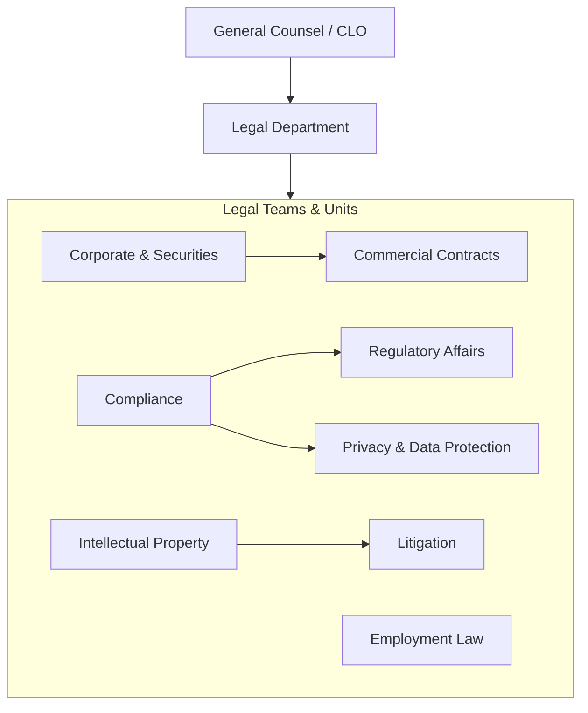
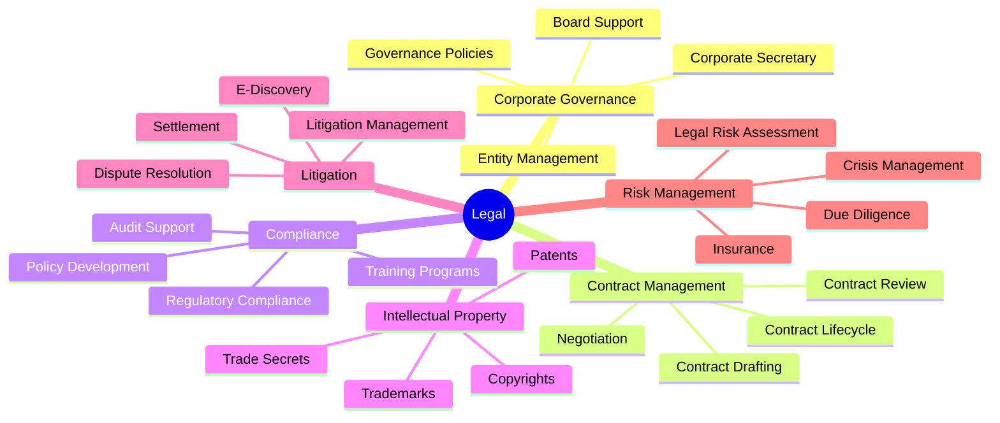
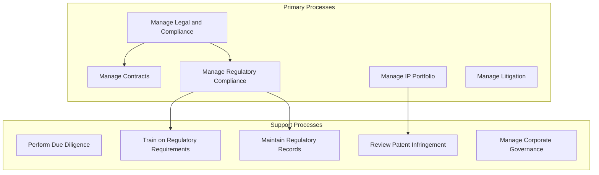
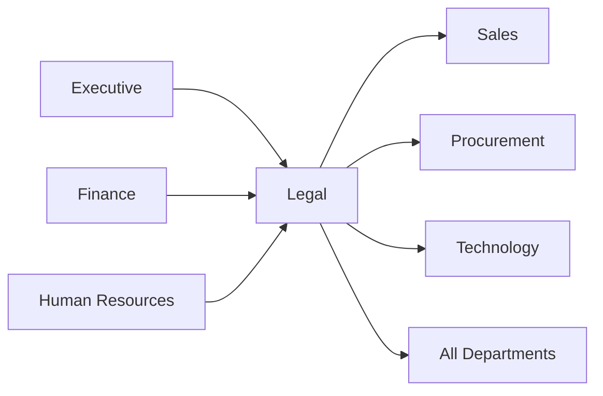

# Legal

> Legal counsel, compliance management, risk mitigation, and corporate governance

## Overview

The Legal function provides legal counsel, ensures regulatory compliance, manages corporate governance, and protects the organization from legal risk. This department handles contract management, intellectual property protection, litigation management, and regulatory affairs while advising leadership on legal implications of business decisions. Legal serves as both a protective shield against liability and a strategic enabler that helps structure deals, navigate regulations, and establish governance frameworks. Modern legal departments balance traditional legal services with proactive risk management and business partnership.

## Department Structure

## Key Statistics

| Metric | Value |
|--------|-------|
| Function Code | APQC 10010 |
| Parent Function | [Executive](../Executive) |
| Process Group | [Manage Legal and Compliance](/processes/ManageLegalAndCompliance) |
| Typical Headcount | 0.5-2% of total workforce |

## Core Responsibilities

### Corporate Governance

Corporate Governance supports the board of directors, manages corporate entities, maintains governance policies, and ensures the organization meets its fiduciary and legal obligations.

**Key Activities:**
- Provide board of directors support and meeting preparation
- Manage corporate entity structure and subsidiary governance
- Maintain corporate records and regulatory filings
- Develop and update governance policies and procedures
- Support securities law compliance and disclosures

### Contract Management

Contract Management drafts, negotiates, and manages the full lifecycle of commercial agreements, ensuring favorable terms and minimizing legal risk across all business relationships.

**Key Activities:**
- Draft and review commercial contracts and agreements
- Negotiate contract terms with customers, vendors, and partners
- Manage contract lifecycle and renewal processes
- Maintain contract repository and templates
- Advise business units on contractual obligations and risks

### Compliance and Regulatory Affairs

Compliance ensures the organization adheres to all applicable laws, regulations, and internal policies while managing relationships with regulatory bodies and responding to regulatory changes.

**Key Activities:**
- Monitor legal and regulatory environment for changes
- Develop compliance policies and procedures
- Train employees on appropriate regulatory requirements
- Maintain records for regulatory agencies
- Manage regulatory submission lifecycle and audits

## Key Roles

| Role | Level | Description |
|------|-------|-------------|
| [Lawyers](/occupations/Lawyers) | VP/Director | Represent clients and advise on legal transactions |
| [Compliance Managers](/occupations/ComplianceManagers) | Director | Coordinate activities to ensure compliance with standards |
| [Compliance Officers](/occupations/ComplianceOfficers) | Manager | Examine and investigate compliance with laws and regulations |
| [Regulatory Affairs Managers](/occupations/RegulatoryAffairsManagers) | Manager | Coordinate production activities for regulatory compliance |
| [Paralegals and Legal Assistants](/occupations/ParalegalsAndLegalAssistants) | Specialist | Assist lawyers by researching and preparing legal documents |
| [Title Examiners, Abstractors, and Searchers](/occupations/TitleExaminersAbstractorsAndSearchers) | Specialist | Search records and examine legal documents |

## Processes Owned

- [Manage Contracts](/processes/ManageContracts) - Primary Owner
- [Negotiate and Establish Contracts](/processes/NegotiateAndEstablishContracts) - Primary Owner
- [Manage Patents, Copyrights, and Regulatory Requirements](/processes/ManagePatentsCopyrightsAndRegulatoryRequirements) - Primary Owner
- [Conduct Mandatory and Elective Reviews](/processes/ConductMandatoryAndElectiveReviews) - Primary Owner
- [Train Employees on Appropriate Regulatory Requirements](/processes/TrainEmployeesOnAppropriateRegulatoryRequirements) - Primary Owner
- [Maintain Records for Regulatory Agencies](/processes/MaintainRecordsForRegulatoryAgencies) - Primary Owner
- [Manage Regulatory Submission Life Cycle](/processes/ManageRegulatorySubmissionLifeCycle) - Primary Owner
- [Perform Due Diligence](/processes/PerformDueDiligence) - Primary Owner
- [Review Infringement of Patents and Copyrights](/processes/ReviewInfringementOfPatentsAndCopyrights) - Primary Owner
- [Derive Regulatory Compliance Requirements](/processes/DeriveRegulatoryComplianceRequirements) - Primary Owner

## Cross-Functional Relationships

### Upstream Dependencies
- [Executive](../Executive) - Strategic direction, M&A decisions, governance priorities
- [Finance](../Finance) - Financial terms for contracts, audit support
- [Human Resources](../HR) - Employment matters, policy development

### Downstream Consumers
- [Sales](../Sales) - Customer contract support, negotiation assistance
- [Procurement](../Procurement) - Vendor contract review, supplier agreements
- [Technology](../Technology) - Data privacy compliance, software licensing
- All Departments - Legal advice, policy guidance, contract support

## Industry Variations

### Financial Services

Financial services legal navigates extensive regulatory requirements from multiple agencies while managing complex financial instruments and consumer protection obligations.

**Specific Focus Areas:**
- SEC, FINRA, and banking regulatory compliance
- Consumer financial protection (CFPB)
- Anti-money laundering (AML) and KYC
- Derivatives and trading documentation

### Healthcare/Pharmaceutical

Healthcare legal manages FDA compliance, HIPAA requirements, and complex reimbursement regulations while addressing liability concerns in patient care.

**Specific Focus Areas:**
- FDA regulatory submissions and approvals
- HIPAA privacy and security compliance
- Stark Law and Anti-Kickback Statute
- Clinical trial agreements and oversight

### Technology

Technology legal addresses rapidly evolving data privacy regulations, open source licensing, and intellectual property protection in fast-moving markets.

**Specific Focus Areas:**
- Data privacy (GDPR, CCPA, state laws)
- Open source license compliance
- Software licensing and SaaS agreements
- Patent portfolio management

### Manufacturing

Manufacturing legal manages product liability exposure, environmental compliance, and complex supply chain agreements across global operations.

**Specific Focus Areas:**
- Product liability and recalls
- Environmental compliance (EPA, OSHA)
- International trade and tariffs
- Supply chain risk management

## KPIs & Metrics

| Metric | Description | Target |
|--------|-------------|--------|
| Contract Cycle Time | Days from request to execution | < 14 days |
| Legal Spend | Outside counsel and litigation costs | Within budget |
| Contract Compliance | Contracts with compliant terms | > 99% |
| Regulatory Findings | Material compliance violations | Zero |
| Matter Resolution Time | Average time to close legal matters | Decreasing trend |
| Training Completion | Employee compliance training rate | > 95% |
| Litigation Win Rate | Favorable outcomes in disputes | > 80% |
| IP Portfolio Value | Patents and trademarks maintained | Growth trend |

## Technology Stack

- **Contract Lifecycle Management**: DocuSign CLM, Icertis, Ironclad, Agiloft
- **E-Signature**: DocuSign, Adobe Sign, PandaDoc
- **Legal Research**: Westlaw, LexisNexis, Bloomberg Law
- **Matter Management**: Clio, PracticePanther, Litify
- **E-Discovery**: Relativity, Logikcull, Disco
- **Compliance Management**: NAVEX Global, SAI360, LogicGate
- **IP Management**: Anaqua, CPA Global, Clarivate
- **Policy Management**: PolicyTech, PowerDMS, Convercent
- **Board Portal**: Diligent, BoardEffect, Nasdaq Boardvantage
- **Legal Analytics**: Lex Machina, Premonition, Ravel Law

---

*Source: APQC PCF 10010 + GS1 Functional Entity*
