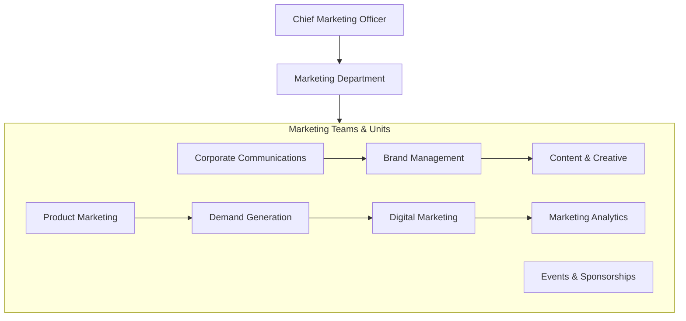
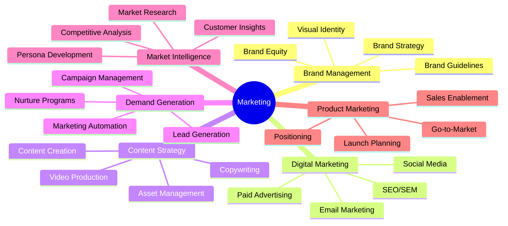
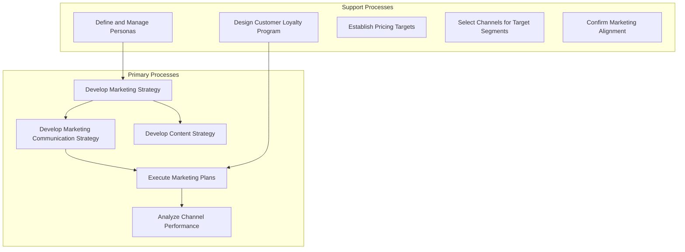
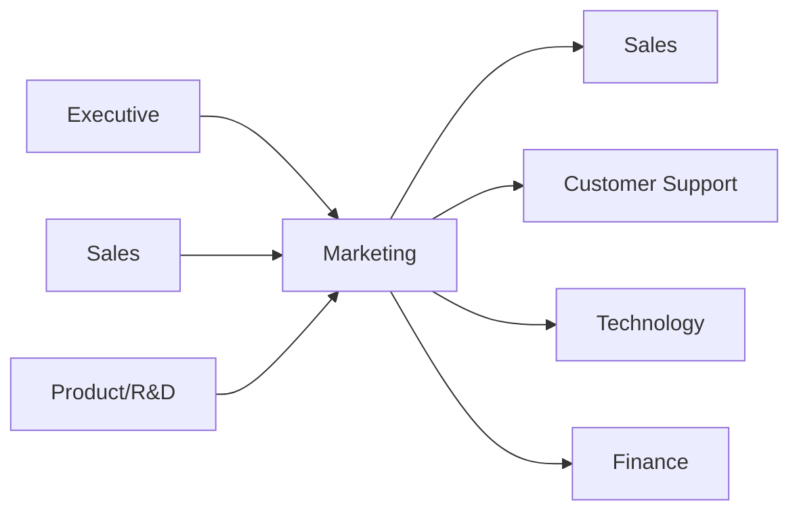

# Marketing

> Brand strategy, customer acquisition, market positioning, and demand generation

## Overview

The Marketing function is responsible for creating, communicating, and delivering value propositions that attract and retain customers. This department develops marketing strategies, manages brand identity, executes campaigns across multiple channels, and generates demand for the organization's products and services. Marketing bridges the gap between customer needs and business offerings through market research, customer segmentation, content creation, and integrated communications. Modern marketing organizations leverage data analytics and digital channels to personalize customer experiences and optimize marketing ROI while building long-term brand equity.

## Department Structure

## Key Statistics

| Metric | Value |
|--------|-------|
| Function Code | APQC 10004 |
| Parent Function | [Sales](../Sales) |
| Process Group | [Market and Sell Products and Services](/processes/industries/utilities/utilities_UtilityCompanies_MarketAndSellProductsAndServices) |
| Typical Headcount | 1-3% of total workforce |

## Core Responsibilities

### Brand Management

Brand Management develops and maintains the organization's brand identity, ensuring consistent representation across all touchpoints and building long-term brand equity in the marketplace.

**Key Activities:**
- Develop new branding and visual identity systems
- Align experience with brand values and business strategies
- Manage brand guidelines and compliance
- Monitor brand perception and health metrics
- Coordinate brand refresh and evolution initiatives

### Digital Marketing

Digital Marketing executes online marketing strategies across owned, earned, and paid channels to reach target audiences, drive engagement, and support conversion objectives.

**Key Activities:**
- Develop and execute omni-channel marketing strategies
- Manage search engine optimization and paid search programs
- Plan and execute social media marketing campaigns
- Design and implement email marketing programs
- Optimize digital customer journeys and conversion rates

### Demand Generation

Demand Generation creates and nurtures interest in the organization's offerings through integrated campaigns that drive qualified leads and support revenue growth.

**Key Activities:**
- Develop marketing communication strategy
- Create marketing budget and allocate resources
- Execute integrated marketing campaigns
- Manage marketing automation and lead scoring
- Track campaign performance and optimize ROI

## Key Roles

| Role | Level | Description |
|------|-------|-------------|
| [Marketing Managers](/occupations/Management/MarketingManagers) | Director/VP | Plan, direct, or coordinate marketing policies and programs |
| [Advertising and Promotions Managers](/occupations/Management/AdvertisingManagers) | Director | Direct advertising policies and collateral production |
| [Public Relations Managers](/occupations/Management/PublicRelationsManagers) | Director | Coordinate activities to create favorable public image |
| [Market Research Analysts](/occupations/Business/MarketResearchAnalystsAndMarketingSpecialists) | Analyst | Research market conditions and examine sales potential |
| [Public Relations Specialists](/occupations/ArtsMedia/PublicRelationsSpecialists) | Specialist | Promote public image and manage communications |
| [Advertising Sales Agents](/occupations/Sales/AdvertisingSalesAgents) | Specialist | Sell advertising space, time, or media |

## Processes Owned

- [Develop Marketing Strategy](/processes/industries/utilities/utilities_UtilityCompanies_DevelopMarketingStrategy) - Primary Owner
- [Develop Marketing Communication Strategy](/processes/industries/utilities/utilities_UtilityCompanies_DevelopMarketingCommunicationStrategy) - Primary Owner
- [Develop Content Strategy](/processes/industries/utilities/utilities_UtilityCompanies_DevelopContentStrategy) - Primary Owner
- [Create Marketing Budget](/processes/industries/utilities/utilities_UtilityCompanies_CreateMarketingBudget) - Primary Owner
- [Confirm Marketing Alignment to Business Strategy](/processes/industries/utilities/utilities_UtilityCompanies_ConfirmMarketingAlignmentToBusinessStrategy) - Primary Owner
- [Define and Manage Personas](/processes/industries/utilities/utilities_UtilityCompanies_DefineAndManagePersonas) - Primary Owner
- [Align Experience with Brand Values and Business Strategies](/processes/industries/utilities/utilities_UtilityCompanies_AlignExperienceWithBrandValuesAndBusinessStrategies) - Primary Owner
- [Develop New Branding](/processes/industries/utilities/utilities_UtilityCompanies_DevelopNewBranding) - Primary Owner
- [Design and Manage Customer Loyalty Program](/processes/industries/utilities/utilities_UtilityCompanies_DesignAndManageCustomerLoyaltyProgram) - Primary Owner
- [Analyze and Manage Channel Performance](/processes/industries/utilities/utilities_UtilityCompanies_AnalyzeAndManageChannelPerformance) - Primary Owner

## Cross-Functional Relationships

### Upstream Dependencies
- [Executive](../Executive) - Brand strategy direction, marketing budget approval
- [Sales](../Sales) - Revenue targets, customer feedback, sales enablement needs
- [Research & Development](../Research) - Product information, feature roadmaps, launch timelines

### Downstream Consumers
- [Sales](../Sales) - Qualified leads, sales collateral, competitive intelligence
- [Customer Support](../Support) - Customer communication templates, brand guidelines
- [Technology](../Technology) - MarTech requirements, website and digital platform needs
- [Finance](../Finance) - Marketing spend reporting, ROI analysis

## Industry Variations

### Technology/SaaS

Technology marketing focuses heavily on product-led growth, content marketing, and digital demand generation while managing rapid product evolution and competitive landscapes.

**Specific Focus Areas:**
- Product-led growth strategies
- Developer marketing and community building
- Content marketing and thought leadership
- Account-based marketing (ABM)

### Consumer Packaged Goods

CPG marketing emphasizes brand building, shopper marketing, and trade marketing while managing multiple product lines across diverse retail channels.

**Specific Focus Areas:**
- Shopper marketing and trade promotions
- Package design and shelf presence
- Category management partnerships
- Consumer insights and panel data

### Financial Services

Financial services marketing navigates regulatory constraints while building trust, communicating complex products, and differentiating in commoditized markets.

**Specific Focus Areas:**
- Regulatory compliance in advertising
- Trust and security messaging
- Product education and comparison
- Wealth management relationship marketing

### Healthcare/Pharmaceutical

Healthcare marketing operates within strict regulatory frameworks while communicating with multiple stakeholders including providers, payers, and patients.

**Specific Focus Areas:**
- HCP (Healthcare Professional) marketing
- DTC (Direct-to-Consumer) advertising compliance
- Medical affairs collaboration
- Patient education and support programs

## KPIs & Metrics

| Metric | Description | Target |
|--------|-------------|--------|
| Marketing Qualified Leads (MQLs) | Leads meeting qualification criteria | Growth YoY |
| Customer Acquisition Cost (CAC) | Total cost to acquire a customer | Decreasing trend |
| Marketing ROI | Revenue attributed to marketing / spend | > 5:1 |
| Brand Awareness | Aided and unaided brand recognition | Industry benchmark+ |
| Website Traffic | Unique visitors and sessions | Growth MoM |
| Conversion Rate | Visitors converting to leads/customers | > 2-5% |
| Email Open Rate | Percentage of emails opened | > 20% |
| Social Engagement | Likes, shares, comments per post | Growth trend |

## Technology Stack

- **Marketing Automation**: HubSpot, Marketo, Pardot, Eloqua
- **CRM Integration**: Salesforce, Microsoft Dynamics, HubSpot CRM
- **Analytics**: Google Analytics 4, Adobe Analytics, Mixpanel
- **SEO/SEM**: SEMrush, Ahrefs, Google Ads, Bing Ads
- **Social Media**: Sprout Social, Hootsuite, Buffer
- **Email Marketing**: Mailchimp, Klaviyo, Sendgrid
- **Content Management**: WordPress, Contentful, Drupal
- **DAM (Digital Asset Management)**: Bynder, Brandfolder, Widen
- **ABM Platforms**: Demandbase, 6sense, Terminus
- **Creative Tools**: Adobe Creative Cloud, Figma, Canva

---

*Source: APQC PCF 10004 + GS1 Functional Entity*
