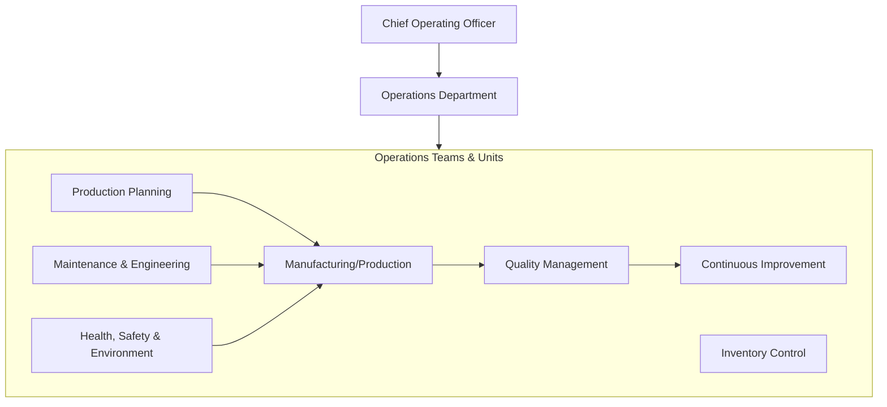
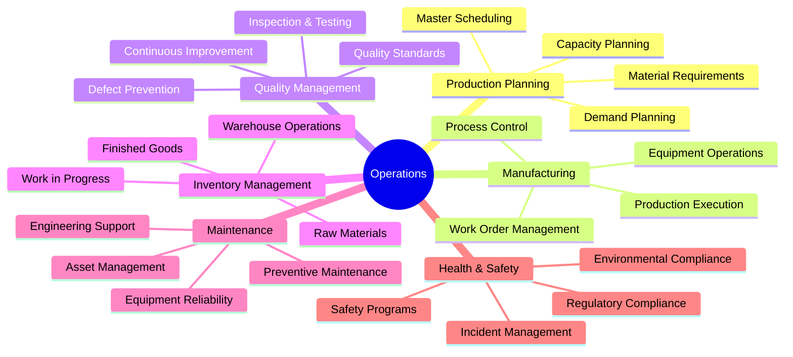
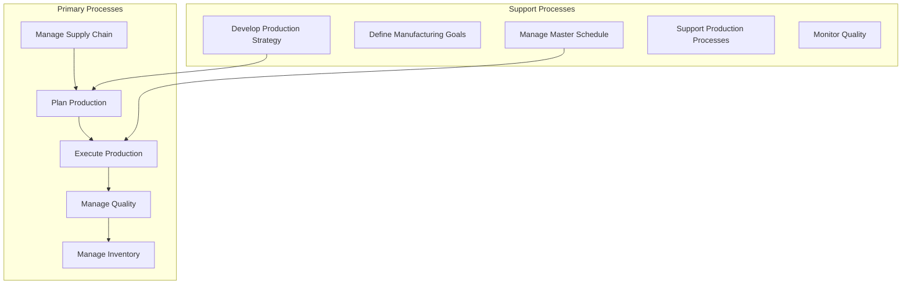
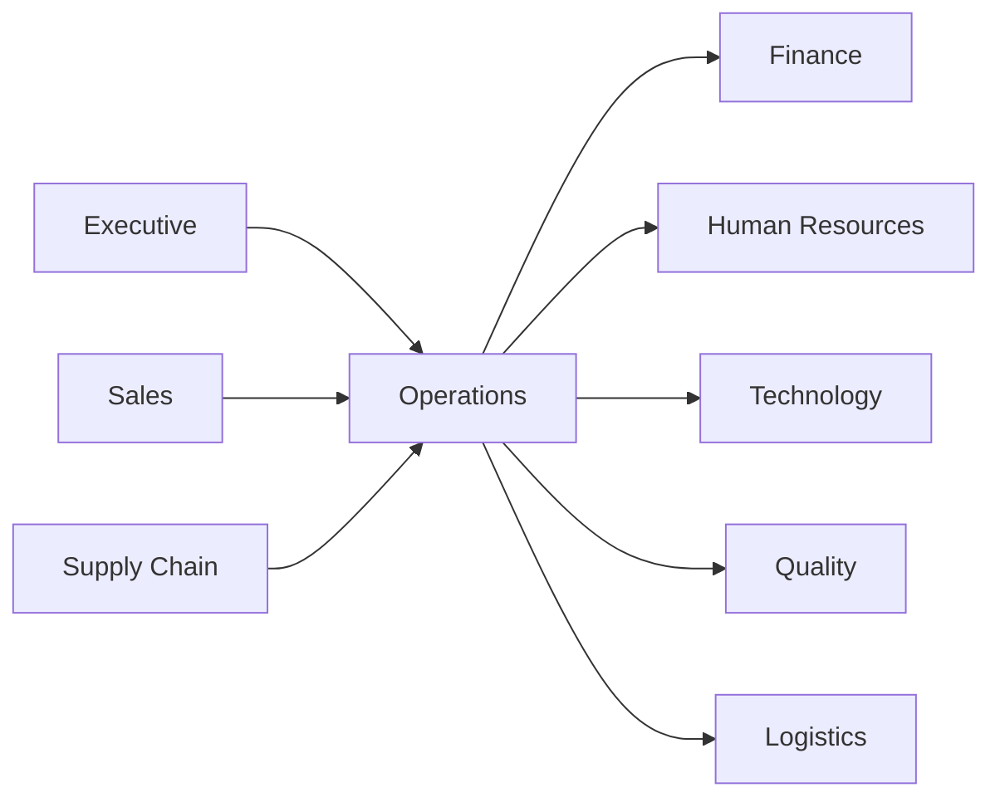

# Operations

> Operations, production management, quality control, and continuous improvement

## Overview

The Operations function is responsible for the efficient production and delivery of products and services. This department manages the end-to-end operational processes including production planning, manufacturing execution, quality management, inventory control, and continuous improvement initiatives. Operations translates strategic objectives into tangible outputs, ensuring that customer demand is met with the right quality, at the right cost, and at the right time. The function serves as the backbone of value creation, coordinating resources, processes, and technologies to achieve operational excellence.

## Department Structure

## Key Statistics

| Metric | Value |
|--------|-------|
| Function Code | APQC 10004/10005 |
| Parent Function | [Executive](../Executive) |
| Process Group | [Manage Supply Chain for Physical Products](/processes/ManageSupplyChainForPhysicalProducts) |
| Typical Headcount | 30-60% of total workforce (varies by industry) |

## Core Responsibilities

### Production Planning and Scheduling

Production planning ensures that manufacturing activities align with customer demand, available capacity, and material availability. This function creates and maintains the master production schedule.

**Key Activities:**
- Define manufacturing goals and production targets
- Create and manage master production schedule
- Model production network for simulation and optimization
- Develop production and materials strategies
- Define production workplace layout and infrastructure

### Manufacturing and Production

Manufacturing executes the production plan, transforming raw materials and components into finished products through controlled processes and skilled operations.

**Key Activities:**
- Execute production according to schedule and specifications
- Manage work orders and production sequencing
- Monitor production performance and efficiency
- Control process parameters and quality standards
- Coordinate with maintenance for equipment availability

### Quality Management

Quality management ensures products and services meet or exceed customer expectations and regulatory requirements through systematic inspection, testing, and continuous improvement.

**Key Activities:**
- Develop quality standards and procedures
- Establish quality targets and specifications
- Communicate quality specifications throughout operations
- Monitor quality of product delivered
- Implement corrective and preventive actions

## Key Roles

| Role | Level | Description |
|------|-------|-------------|
| [General and Operations Managers](/occupations/GeneralAndOperationsManagers) | Director/VP | Plan, direct, or coordinate operations |
| [Industrial Production Managers](/occupations/IndustrialProductionManagers) | Manager | Plan and coordinate manufacturing activities |
| [Quality Control Systems Managers](/occupations/QualityControlSystemsManagers) | Manager | Plan and direct quality assurance programs |
| [Industrial Engineers](/occupations/IndustrialEngineers) | Engineer | Design and optimize production systems |
| [Manufacturing Engineers](/occupations/ManufacturingEngineers) | Engineer | Design and improve manufacturing processes |
| [Logisticians](/occupations/Logisticians) | Analyst | Analyze and coordinate logistical functions |
| [Operations Research Analysts](/occupations/OperationsResearchAnalysts) | Analyst | Apply optimization methods to operations |

## Processes Owned

- [Manage Supply Chain for Physical Products](/processes/ManageSupplyChainForPhysicalProducts) - Primary Owner
- [Develop Production and Materials Strategies](/processes/DevelopProductionAndMaterialsStrategies) - Primary Owner
- [Define Manufacturing Goals](/processes/DefineManufacturingGoals) - Primary Owner
- [Define Production Process](/processes/DefineProductionProcess) - Primary Owner
- [Create and Manage Master Production Schedule](/processes/CreateAndManageMasterProductionSchedule) - Primary Owner
- [Define Production Balance and Control](/processes/DefineProductionBalanceAndControl) - Primary Owner
- [Develop Quality Standards and Procedures](/processes/DevelopQualityStandardsAndProcedures) - Primary Owner
- [Establish Quality Targets](/processes/EstablishQualityTargets) - Primary Owner
- [Monitor Quality of Product Delivered](/processes/MonitorQualityOfProductDelivered) - Primary Owner
- [Support Inventory and Production Processes](/processes/SupportInventoryAndProductionProcesses) - Primary Owner

## Cross-Functional Relationships

### Upstream Dependencies
- [Executive](../Executive) - Strategic priorities, capital investment decisions
- [Sales](../Sales) - Demand forecasts, customer orders, delivery requirements
- [Supply Chain](../SupplyChain) - Material availability, supplier lead times

### Downstream Consumers
- [Finance](../Finance) - Production costs, inventory valuations, capital expenditures
- [Human Resources](../HR) - Workforce requirements, skills training needs
- [Technology](../Technology) - Operational technology requirements, automation projects
- [Quality](../Quality) - Production quality data, inspection results
- [Logistics](../Logistics) - Finished goods for distribution

## Industry Variations

### Discrete Manufacturing

Discrete manufacturing operations focus on assembly lines, batch production, and managing complex bill of materials while maintaining flexibility for product variations.

**Specific Focus Areas:**
- Assembly line balancing and optimization
- Configure-to-order and engineer-to-order processes
- Work cell design and layout optimization
- MES (Manufacturing Execution System) integration

### Process Manufacturing

Process manufacturing handles continuous or batch production of liquids, chemicals, and consumables with emphasis on recipe management and process control.

**Specific Focus Areas:**
- Recipe and formula management
- Batch tracking and genealogy
- Process control and automation
- Regulatory compliance (FDA, EPA)

### Healthcare/Life Sciences

Healthcare operations manage patient flow, clinical services, and medical device manufacturing with strict regulatory oversight and quality requirements.

**Specific Focus Areas:**
- Patient throughput and capacity management
- Operating room scheduling and utilization
- Medical device validation and compliance
- Sterile processing and supply chain

### Technology/Software

Technology operations focus on software development lifecycle, DevOps practices, and cloud infrastructure management rather than physical production.

**Specific Focus Areas:**
- CI/CD pipeline management
- Infrastructure as code and automation
- Incident management and site reliability
- Capacity planning and scaling

## KPIs & Metrics

| Metric | Description | Target |
|--------|-------------|--------|
| OEE | Overall Equipment Effectiveness | > 85% |
| First Pass Yield | Products passing quality first time | > 95% |
| On-Time Delivery | Orders delivered when promised | > 98% |
| Inventory Turns | Annual COGS / average inventory | Industry benchmark |
| Cycle Time | Average time to complete production | Continuously reduce |
| Scrap Rate | Waste material as % of total | < 2% |
| Downtime | Unplanned equipment downtime | < 5% |
| Safety Incident Rate | Recordable incidents per 100 workers | Zero harm goal |

## Technology Stack

- **ERP/MRP**: SAP S/4HANA, Oracle Cloud SCM, Microsoft Dynamics 365
- **MES**: Siemens Opcenter, Rockwell FactoryTalk, AVEVA MES
- **Quality Management**: ETQ Reliance, MasterControl, Sparta TrackWise
- **Maintenance (CMMS)**: IBM Maximo, SAP Plant Maintenance, Fiix
- **Industrial IoT**: PTC ThingWorx, AWS IoT, Azure IoT Hub
- **Analytics/BI**: OSIsoft PI, Tableau, Power BI
- **Planning/Scheduling**: Kinaxis RapidResponse, Blue Yonder
- **Automation/SCADA**: Rockwell Automation, Siemens, Schneider Electric

---

*Source: APQC PCF 10004/10005 + GS1 Functional Entity*
