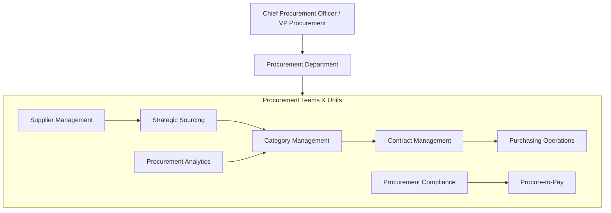
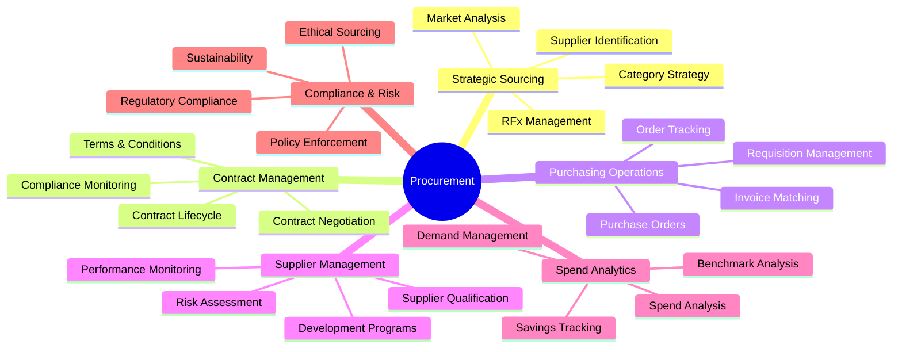
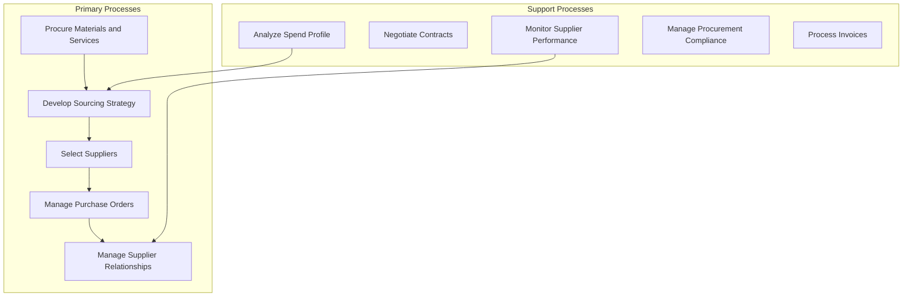
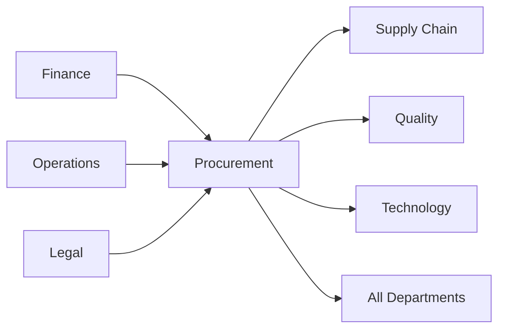

# Procurement

> Strategic sourcing, vendor management, contract negotiation, and purchasing operations

## Overview

The Procurement function is responsible for acquiring the goods, services, and materials that the organization needs to operate and deliver value to customers. This department manages the end-to-end procurement lifecycle from spend analysis and sourcing strategy through supplier selection, contract negotiation, purchase order management, and supplier performance monitoring. Procurement serves as the gatekeeper of organizational spend, balancing cost optimization with quality, risk management, and supplier relationship development.

Modern procurement organizations have evolved from transactional purchasing operations into strategic functions that drive competitive advantage through supplier innovation, category management, and total cost of ownership optimization. The function plays a critical role in sustainability initiatives, supply chain resilience, and regulatory compliance across increasingly complex global supply networks.

## Department Structure

## Key Statistics

| Metric | Value |
|--------|-------|
| Function Code | APQC 20022 |
| Parent Function | [Operations](../Operations) / [Finance](../Finance) |
| Process Group | [Procure Materials and Services](/processes/industries/utilities/utilities_UtilityCompanies_ProcureMaterialsAndServices) |
| Typical Headcount | 1-3% of total workforce |

## Core Responsibilities

### Strategic Sourcing

Strategic Sourcing develops category strategies, identifies optimal suppliers, and negotiates agreements that maximize value while minimizing risk and total cost of ownership.

**Key Activities:**
- Analyze organizational spend profile and identify sourcing opportunities
- Develop category strategies based on market intelligence
- Conduct supplier market analysis and benchmarking
- Manage RFI, RFP, and RFQ processes
- Negotiate contracts and establish pricing frameworks

### Purchasing Operations

Purchasing Operations manages the day-to-day procurement transactions, ensuring timely and accurate processing of requisitions, purchase orders, and payments.

**Key Activities:**
- Process purchase requisitions and create purchase orders
- Manage order tracking and delivery confirmation
- Perform three-way matching (PO, receipt, invoice)
- Handle exceptions and resolve procurement issues
- Maintain procurement catalogs and approved vendor lists

### Supplier Management

Supplier Management develops and maintains productive supplier relationships through performance monitoring, risk assessment, and collaborative improvement initiatives.

**Key Activities:**
- Qualify and onboard new suppliers
- Monitor supplier performance against KPIs
- Conduct supplier risk assessments and audits
- Execute supplier development and improvement programs
- Manage supplier diversity and sustainability programs

## Key Roles

| Role | Level | Description |
|------|-------|-------------|
| [Purchasing Managers](/occupations/Management/PurchasingManagers) | Director/VP | Plan, direct, or coordinate purchasing activities |
| [Supply Chain Managers](/occupations/Management/SupplyChainManagers) | Director | Direct purchasing, warehousing, and distribution |
| [Purchasing Agents](/occupations/Business/PurchasingAgentsExceptWholesaleRetailAndFarmProducts) | Specialist | Purchase materials, equipment, and supplies |
| [Wholesale and Retail Buyers](/occupations/Business/WholesaleAndRetailBuyersExceptFarmProducts) | Buyer | Buy merchandise for resale |
| [Procurement Clerks](/occupations/Administrative/ProcurementClerks) | Clerk | Compile information and draw up purchase orders |
| [Logisticians](/occupations/Business/Logisticians) | Analyst | Analyze and coordinate logistical functions |
| [Cost Estimators](/occupations/Business/Financial/CostEstimators) | Analyst | Prepare cost estimates for products and projects |

## Processes Owned

- [Procure Materials and Services](/processes/industries/utilities/utilities_UtilityCompanies_ProcureMaterialsAndServices) - Primary Owner
- [Analyze Organization's Spend Profile](/processes/industries/utilities/utilities_UtilityCompanies_AnalyzeOrganizationsSpendProfile) - Primary Owner
- [Select Suppliers and Develop/Maintain Contracts](/processes/industries/utilities/utilities_UtilityCompanies_SelectSuppliersAndDevelopmaintainContracts) - Primary Owner
- [Negotiate and Establish Contracts](/processes/industries/utilities/utilities_UtilityCompanies_NegotiateAndEstablishContracts) - Shared with Legal
- [Monitor Material Specifications](/processes/industries/utilities/utilities_UtilityCompanies_MonitorMaterialSpecifications) - Primary Owner
- [Collaborate with Supplier and Contract Manufacturers](/processes/industries/utilities/utilities_UtilityCompanies_CollaborateWithSupplierAndContractManufacturers) - Primary Owner
- [Support Inventory and Production Processes](/processes/industries/utilities/utilities_UtilityCompanies_SupportInventoryAndProductionProcesses) - Shared with Operations
- [Process Accounts Payable](/processes/industries/utilities/utilities_UtilityCompanies_ProcessAccountsPayable) - Shared with Finance

## Cross-Functional Relationships

### Upstream Dependencies
- [Finance](../Finance) - Procurement budgets, payment processing, cost targets
- [Operations](../Operations) - Material requirements, production schedules, specifications
- [Legal](../Legal) - Contract templates, compliance guidance, risk assessment

### Downstream Consumers
- [Supply Chain](../SupplyChain) - Supplier materials, purchase order status, lead times
- [Quality](../Quality) - Supplier quality data, material certifications
- [Technology](../Technology) - Software licensing, IT hardware, SaaS procurement
- All Departments - Goods and services acquisition, vendor management

## Industry Variations

### Manufacturing

Manufacturing procurement manages complex bill-of-materials sourcing, direct material purchasing, and supplier quality requirements while balancing cost with supply continuity.

**Specific Focus Areas:**
- Direct material sourcing and commodity management
- Supplier quality management and audits
- Just-in-time and Kanban replenishment
- Make-vs-buy analysis

### Healthcare

Healthcare procurement navigates group purchasing organizations, FDA-regulated supplies, and complex formulary management while ensuring patient safety and product traceability.

**Specific Focus Areas:**
- Group purchasing organization (GPO) management
- Medical device and pharmaceutical sourcing
- Regulatory compliance (FDA, GMP)
- Product traceability and recall management

### Technology

Technology procurement manages software licensing, cloud services, and IT hardware while addressing rapid technology changes and complex vendor ecosystems.

**Specific Focus Areas:**
- Software licensing and SaaS agreements
- Cloud services procurement and optimization
- IT asset lifecycle management
- Vendor consolidation and rationalization

### Public Sector

Public sector procurement adheres to strict regulatory requirements, competitive bidding mandates, and transparency obligations while promoting socioeconomic objectives.

**Specific Focus Areas:**
- Competitive bidding and RFP compliance
- Small/disadvantaged business programs
- Transparency and audit requirements
- Government-specific contract vehicles (GSA, IDIQ)

## KPIs & Metrics

| Metric | Description | Target |
|--------|-------------|--------|
| Cost Savings | Negotiated savings vs. baseline | 5-10% annually |
| Spend Under Management | Managed spend / total spend | > 80% |
| Supplier On-Time Delivery | Deliveries received on schedule | > 95% |
| Purchase Order Cycle Time | Requisition to PO issuance | < 2 business days |
| Contract Compliance | Purchases through approved contracts | > 90% |
| Supplier Defect Rate | Defective materials from suppliers | < 1% |
| Maverick Spend | Off-contract or unapproved purchases | < 10% |
| Procurement ROI | Savings generated / procurement costs | > 5:1 |

## Technology Stack

- **Procurement Suites**: Coupa, SAP Ariba, Jaggaer, GEP SMART
- **Source-to-Pay**: Ivalua, Zycus, Basware
- **Spend Analytics**: SpendHQ, Sievo, Coupa Business Spend Management
- **Contract Management**: Icertis, DocuSign CLM, Agiloft
- **Supplier Management**: SAP Ariba Supplier Management, HICX, Avetta
- **Catalog Management**: Coupa, SAP Ariba, Punchout catalogs
- **P2P Automation**: Basware, Medius, Chrome River
- **Supplier Risk**: Dun & Bradstreet, RapidRatings, Resilinc

---

*Source: APQC PCF 20022 + GS1 Functional Entity*
