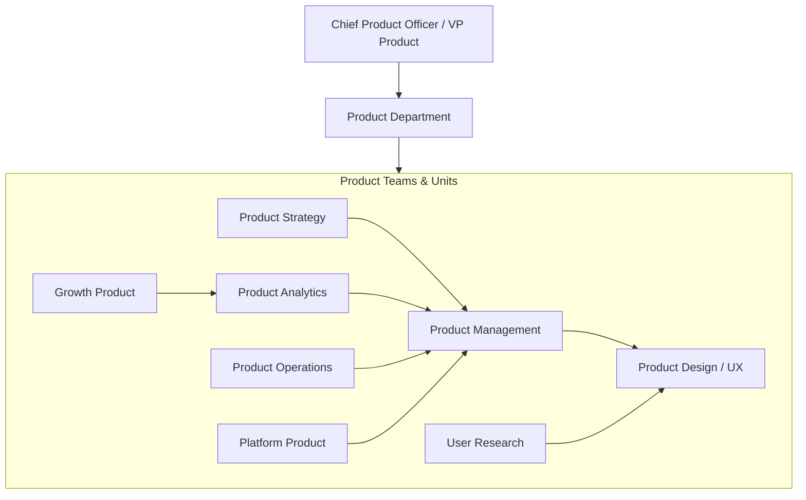
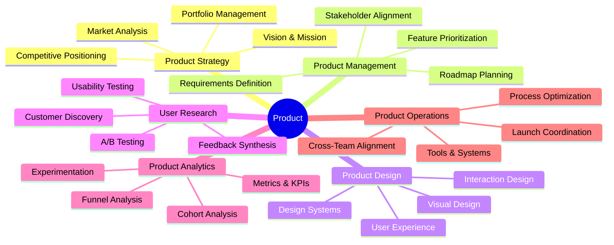
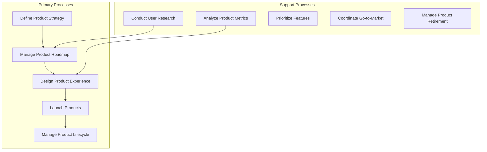
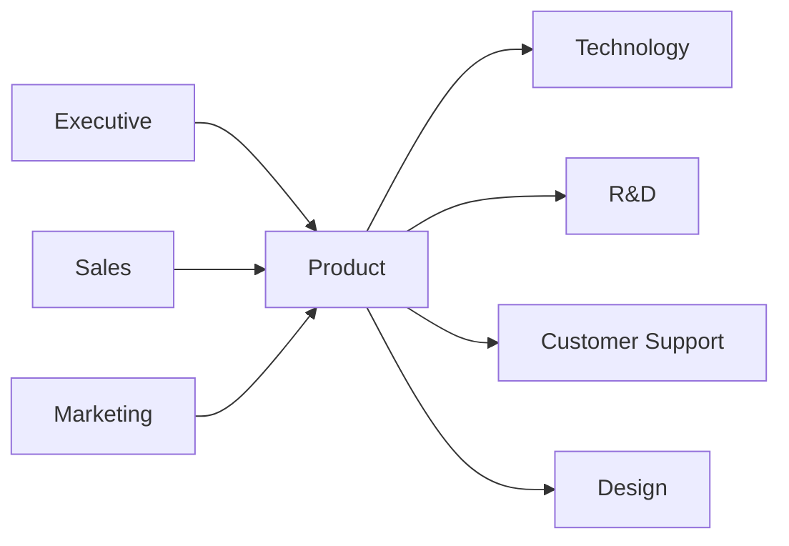

# Product

> Product management, product strategy, product design, and product operations

## Overview

The Product function is responsible for defining, developing, and managing the organization's product portfolio to maximize customer value and business outcomes. This department owns the product vision, roadmap, and lifecycle from concept through retirement, serving as the critical intersection between customer needs, business objectives, and technical capabilities. Product management translates market opportunities and customer feedback into product strategies and feature priorities that guide engineering and design teams.

Modern product organizations operate as the connective tissue between business and technology, using data-driven decision-making, user research, and rapid experimentation to identify product-market fit and drive growth. The function has expanded beyond traditional product management to encompass product design, product analytics, product operations, and growth product management, reflecting the increasing importance of product-led strategies across industries.

## Department Structure

## Key Statistics

| Metric | Value |
|--------|-------|
| Function Code | APQC 10003 |
| Parent Function | [Executive](../Executive) |
| Process Group | [Develop and Manage Products and Services](/processes/industries/utilities/utilities_UtilityCompanies_DevelopAndManageProductsAndServices) |
| Typical Headcount | 2-8% of total workforce (technology companies) |

## Core Responsibilities

### Product Strategy

Product Strategy defines the long-term vision and direction for the product portfolio, identifying market opportunities, competitive positioning, and investment priorities.

**Key Activities:**
- Define product vision, mission, and strategic objectives
- Conduct market analysis and competitive intelligence
- Develop product portfolio strategy and investment allocation
- Identify new product opportunities and market segments
- Establish product lifecycle management approach

### Product Management

Product Management translates strategy into actionable plans, owning the product roadmap and working cross-functionally to deliver features and capabilities that drive customer and business value.

**Key Activities:**
- Develop and maintain product roadmap and release plans
- Prioritize features based on customer value and business impact
- Write product requirements and user stories
- Coordinate with engineering, design, and stakeholders
- Manage product launches and go-to-market activities

### Product Design

Product Design creates intuitive, effective user experiences through research-informed design, prototyping, and iterative testing that ensure products meet user needs and expectations.

**Key Activities:**
- Conduct user research and usability studies
- Design user interfaces and interaction patterns
- Create prototypes and validate design concepts
- Develop and maintain design systems and guidelines
- Collaborate with engineering on design implementation

## Key Roles

| Role | Level | Description |
|------|-------|-------------|
| [Marketing Managers](/occupations/Management/MarketingManagers) | Director/VP | Plan, direct, or coordinate product marketing programs |
| [General and Operations Managers](/occupations/Management/OperationsManagers) | Director | Plan and direct product operations activities |
| [Market Research Analysts and Marketing Specialists](/occupations/Business/MarketResearchAnalystsAndMarketingSpecialists) | Analyst | Research market conditions for product decisions |
| [Software Developers](/occupations/Technology/SoftwareDevelopers) | Engineer | Design and develop product features |
| [Web Developers and Digital Interface Designers](/occupations/Technology/WebDevelopersAndDigitalInterfaceDesigners) | Designer | Design digital product interfaces |
| [Management Analysts](/occupations/Business/Operations/ManagementAnalysts) | Analyst | Conduct product operations studies and optimization |
| [Data Scientists](/occupations/Technology/DataScientists) | Analyst | Analyze product usage data and build models |

## Processes Owned

- [Develop and Manage Products and Services](/processes/industries/utilities/utilities_UtilityCompanies_DevelopAndManageProductsAndServices) - Primary Owner
- [Govern and Manage Product/Service Development Program](/processes/industries/utilities/utilities_UtilityCompanies_GovernAndManageProductserviceDevelopmentProgram) - Primary Owner
- [Generate and Define New Product/Service Ideas](/processes/industries/utilities/utilities_UtilityCompanies_GenerateAndDefineNewProductserviceIdeas) - Primary Owner
- [Gather New Product/Service Ideas and Requirements](/processes/industries/utilities/utilities_UtilityCompanies_GatherNewProductserviceIdeasAndRequirements) - Primary Owner
- [Formulate New Product/Service Concepts](/processes/industries/utilities/utilities_UtilityCompanies_FormulateNewProductserviceConcepts) - Primary Owner
- [Develop User Experience Design Specifications](/processes/industries/utilities/utilities_UtilityCompanies_DevelopUserExperienceDesignSpecifications) - Primary Owner
- [Identify Product/Service Bundling Opportunities](/processes/industries/utilities/utilities_UtilityCompanies_IdentifyProductserviceBundlingOpportunities) - Primary Owner
- [Introduce New Products/Services](/processes/industries/utilities/utilities_UtilityCompanies_IntroduceNewProductsservices) - Primary Owner
- [Develop Plan for New Product/Service Development and Introduction/Launch](/processes/industries/utilities/utilities_UtilityCompanies_DevelopPlanForNewProductserviceDevelopmentAndIntroductionlaunch) - Primary Owner

## Cross-Functional Relationships

### Upstream Dependencies
- [Executive](../Executive) - Product strategy direction, investment priorities
- [Sales](../Sales) - Customer feedback, feature requests, competitive intelligence
- [Marketing](../Marketing) - Market research, positioning, go-to-market strategy

### Downstream Consumers
- [Technology](../Technology) - Product requirements, feature specifications, technical constraints
- [Research & Development](../Research) - Product concepts, development priorities, validation criteria
- [Customer Support](../Support) - Product documentation, feature changes, known issues
- [Sales](../Sales) - Product roadmap, feature availability, competitive positioning

## Industry Variations

### Technology/SaaS

Technology product management drives product-led growth through rapid iteration, data-driven experimentation, and platform strategy while managing complex feature ecosystems and developer APIs.

**Specific Focus Areas:**
- Product-led growth and self-serve onboarding
- Platform and API product management
- Feature flagging and progressive rollout
- Usage-based pricing optimization

### Consumer Products

Consumer product management focuses on physical product design, packaging, and merchandising while managing complex supply chains and retail channel requirements.

**Specific Focus Areas:**
- Physical product design and packaging
- Shelf presence and merchandising strategy
- Regulatory compliance (safety, labeling)
- Manufacturing feasibility and cost management

### Financial Services

Financial product management navigates regulatory requirements while developing innovative financial products and digital banking experiences.

**Specific Focus Areas:**
- Regulatory product compliance
- Risk-adjusted product design
- Digital banking and fintech innovation
- Customer journey across financial products

### Healthcare/MedTech

Healthcare product management ensures patient safety and regulatory approval while developing medical devices and health technology solutions.

**Specific Focus Areas:**
- FDA regulatory pathway management
- Clinical validation and evidence generation
- Patient safety and human factors engineering
- Interoperability and data exchange standards

## KPIs & Metrics

| Metric | Description | Target |
|--------|-------------|--------|
| Product Adoption | Users actively using core features | Growth MoM |
| Feature Usage Rate | % of users engaging with new features | > 30% |
| Time to Market | Concept to launch duration | Decreasing trend |
| Net Promoter Score | Product loyalty and satisfaction | > 50 |
| Customer Retention | Users continuing product usage | > 90% |
| Revenue per Product | Revenue attributed to each product | Growth YoY |
| Roadmap Delivery | Features delivered vs. planned | > 80% |
| Experimentation Velocity | A/B tests run per quarter | Growth trend |

## Technology Stack

- **Product Management**: Productboard, Aha!, Jira Product Discovery, Asana
- **Roadmapping**: Productboard, Aha!, Airfocus, Roadmunk
- **User Research**: UserTesting, Maze, Lookback, Dovetail
- **Product Analytics**: Amplitude, Mixpanel, Heap, Pendo
- **A/B Testing**: Optimizely, LaunchDarkly, Split.io, VWO
- **Design Tools**: Figma, Sketch, Adobe XD, InVision
- **Prototyping**: Figma, Principle, ProtoPie, Framer
- **Customer Feedback**: Canny, UserVoice, Productboard, Intercom
- **Feature Flagging**: LaunchDarkly, Split.io, Flagsmith
- **Collaboration**: Notion, Confluence, Miro, FigJam

---

*Source: APQC PCF 10003 + GS1 Functional Entity*
