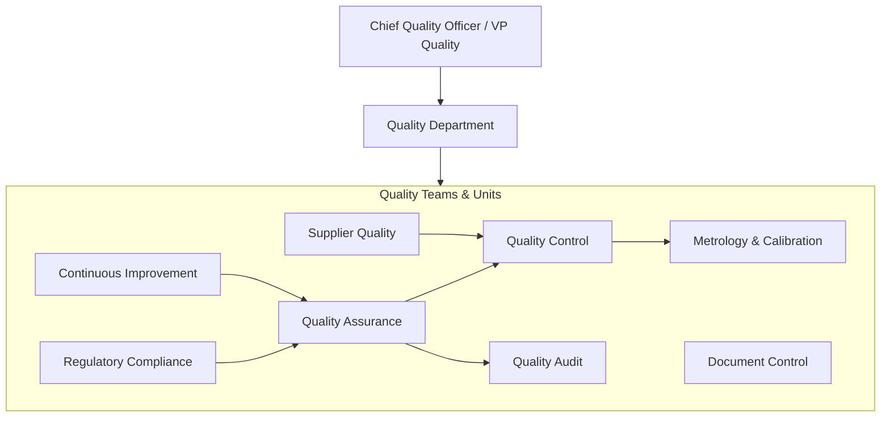
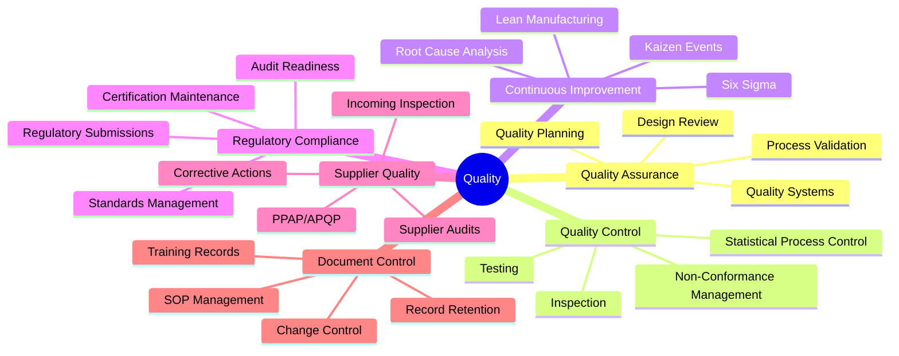
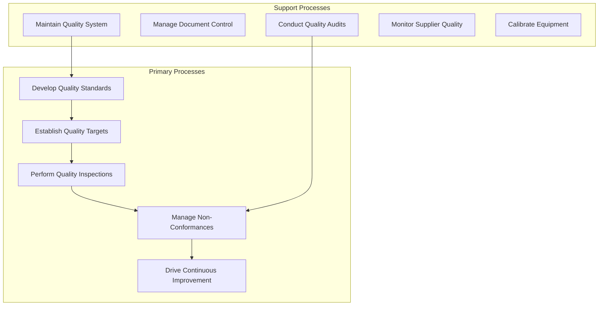
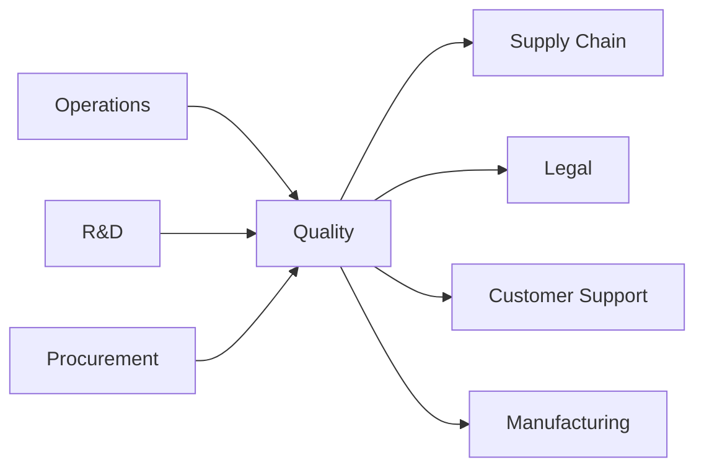

# Quality

> Quality assurance, quality control, continuous improvement, and regulatory compliance

## Overview

The Quality function is responsible for ensuring that products, services, and processes meet or exceed customer expectations, regulatory requirements, and internal standards. This department establishes quality management systems, performs inspections and testing, manages corrective and preventive actions, and drives continuous improvement across the organization. Quality serves as the guardian of organizational standards, balancing regulatory compliance with operational efficiency.

Modern quality organizations have evolved beyond inspection-based approaches to embrace proactive quality management, statistical process control, and enterprise-wide quality culture. The function plays an increasingly strategic role in customer satisfaction, brand reputation, and competitive differentiation while managing the complexity of global regulatory landscapes and supply chain quality requirements.

## Department Structure

## Key Statistics

| Metric | Value |
|--------|-------|
| Function Code | APQC 10005 |
| Parent Function | [Operations](../Operations) |
| Process Group | [Develop Quality Standards and Procedures](/processes/industries/utilities/utilities_UtilityCompanies_DevelopQualityStandardsAndProcedures) |
| Typical Headcount | 2-5% of total workforce (manufacturing-heavy industries) |

## Core Responsibilities

### Quality Assurance

Quality Assurance develops and maintains the quality management system, establishes standards, and ensures processes are designed and validated to consistently produce conforming outputs.

**Key Activities:**
- Develop quality standards and procedures
- Establish quality targets and specifications
- Validate manufacturing and service processes
- Conduct management reviews of quality performance
- Maintain quality management system certifications (ISO 9001, etc.)

### Quality Control

Quality Control performs inspection, testing, and measurement activities to verify that products and services conform to established specifications and requirements.

**Key Activities:**
- Perform incoming, in-process, and final inspections
- Execute testing protocols and record results
- Manage non-conforming material disposition
- Maintain calibration of measurement equipment
- Apply statistical process control methods

### Continuous Improvement

Continuous Improvement drives organizational performance through systematic problem-solving, waste elimination, and process optimization using Lean, Six Sigma, and other methodologies.

**Key Activities:**
- Facilitate root cause analysis and corrective actions
- Lead Lean and Six Sigma improvement projects
- Coordinate Kaizen events and rapid improvement workshops
- Track improvement project benefits and sustainability
- Develop continuous improvement culture and training

## Key Roles

| Role | Level | Description |
|------|-------|-------------|
| [Quality Control Systems Managers](/occupations/Management/QualityControlSystemsManagers) | Director/VP | Plan, direct, or coordinate quality assurance programs |
| [Industrial Production Managers](/occupations/Management/IndustrialProductionManagers) | Manager | Plan and coordinate manufacturing quality activities |
| [Industrial Engineers](/occupations/Architecture/IndustrialEngineers) | Engineer | Design systems for managing industrial production quality |
| [Inspectors, Testers, Sorters, Samplers, and Weighers](/occupations/Production/InspectorsTestersAndSorters) | Inspector | Inspect, test, sort, sample, or weigh nonagricultural products |
| [Compliance Officers](/occupations/Business/Operations/ComplianceOfficers) | Specialist | Examine and investigate compliance with regulations |
| [Operations Research Analysts](/occupations/Technology/OperationsResearchAnalysts) | Analyst | Apply optimization methods to quality processes |
| [Management Analysts](/occupations/Business/Operations/ManagementAnalysts) | Analyst | Conduct quality system studies and evaluations |

## Processes Owned

- [Develop Quality Standards and Procedures](/processes/industries/utilities/utilities_UtilityCompanies_DevelopQualityStandardsAndProcedures) - Primary Owner
- [Establish Quality Targets](/processes/industries/utilities/utilities_UtilityCompanies_EstablishQualityTargets) - Primary Owner
- [Communicate Quality Specifications](/processes/industries/utilities/utilities_UtilityCompanies_CommunicateQualitySpecifications) - Primary Owner
- [Monitor Quality of Product Delivered](/processes/industries/utilities/utilities_UtilityCompanies_MonitorQualityOfProductDelivered) - Primary Owner
- [Conduct Mandatory and Elective Reviews](/processes/industries/utilities/utilities_UtilityCompanies_ConductMandatoryAndElectiveReviews) - Shared with Legal
- [Derive Regulatory Compliance Requirements](/processes/industries/utilities/utilities_UtilityCompanies_DeriveRegulatoryComplianceRequirements) - Shared with Legal
- [Monitor Material Specifications](/processes/industries/utilities/utilities_UtilityCompanies_MonitorMaterialSpecifications) - Shared with Procurement

## Cross-Functional Relationships

### Upstream Dependencies
- [Operations](../Operations) - Production data, process parameters, equipment status
- [Research & Development](../Research) - Product specifications, design requirements, test protocols
- [Procurement](../Procurement) - Supplier certifications, material specifications, incoming materials

### Downstream Consumers
- [Supply Chain](../SupplyChain) - Supplier quality data, material acceptance/rejection decisions
- [Legal](../Legal) - Regulatory compliance documentation, audit results
- [Customer Support](../Support) - Product quality data, defect analysis, warranty information
- Manufacturing - Quality specifications, inspection results, corrective actions

## Industry Variations

### Pharmaceutical/Life Sciences

Pharma quality manages stringent GMP requirements, validation protocols, and regulatory inspections while ensuring product safety and efficacy throughout the product lifecycle.

**Specific Focus Areas:**
- Good Manufacturing Practice (GMP) compliance
- Process validation and qualification (IQ/OQ/PQ)
- FDA inspection readiness and CAPA management
- Stability testing and shelf-life determination

### Automotive

Automotive quality implements IATF 16949 standards, manages advanced product quality planning (APQP), and ensures zero-defect production across complex supply chains.

**Specific Focus Areas:**
- IATF 16949 certification and maintenance
- Advanced Product Quality Planning (APQP)
- Production Part Approval Process (PPAP)
- Failure Mode and Effects Analysis (FMEA)

### Food and Beverage

Food quality manages HACCP programs, food safety certifications, and allergen controls while ensuring compliance with FDA and USDA requirements.

**Specific Focus Areas:**
- Hazard Analysis Critical Control Points (HACCP)
- Food Safety Modernization Act (FSMA) compliance
- Allergen management and labeling
- SQF/BRC/FSSC 22000 certifications

### Aerospace and Defense

Aerospace quality enforces AS9100 standards, manages flight-critical component traceability, and ensures compliance with defense contract quality requirements.

**Specific Focus Areas:**
- AS9100 certification and maintenance
- First Article Inspection (FAI)
- Nondestructive testing and evaluation
- NADCAP accreditation management

## KPIs & Metrics

| Metric | Description | Target |
|--------|-------------|--------|
| First Pass Yield | Products passing quality on first attempt | > 95% |
| Cost of Quality | Prevention + appraisal + failure costs | < 3% of revenue |
| Customer Complaints | External quality complaints per period | Decreasing trend |
| Defect Rate (DPMO) | Defects per million opportunities | < 3.4 (Six Sigma) |
| CAPA Closure Time | Average days to close corrective actions | < 30 days |
| Audit Findings | Major nonconformances per audit | Zero major findings |
| Supplier Quality Rating | Percentage of conforming supplier deliveries | > 99% |
| On-Time Quality Release | Products released on schedule | > 98% |

## Technology Stack

- **Quality Management Systems (QMS)**: ETQ Reliance, MasterControl, Veeva Vault Quality, Sparta TrackWise
- **Statistical Process Control**: Minitab, JMP, InfinityQS
- **Document Management**: MasterControl, Documentum, Qualio
- **Audit Management**: SAI360, Gensuite, Intelex
- **CAPA Management**: ETQ Reliance, TrackWise, AssurX
- **Inspection/Testing**: LIMS (LabWare, Starlims), Hexagon metrology
- **Supplier Quality**: SAP Ariba, Coupa, QualityOne
- **Analytics**: Power BI, Tableau, Minitab Workspace

---

*Source: APQC PCF 10005 + GS1 Functional Entity*
