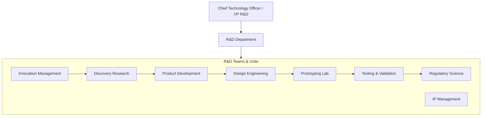
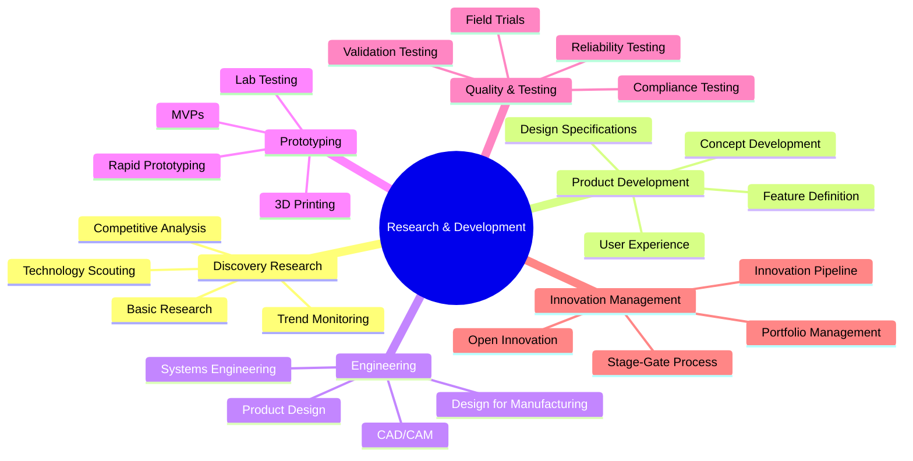
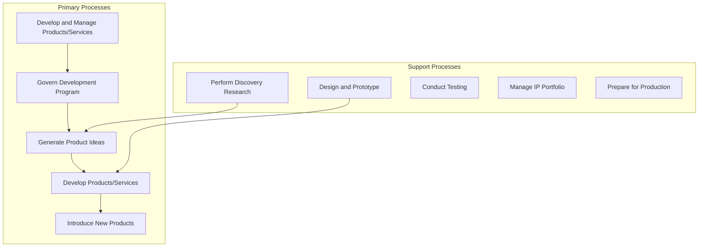
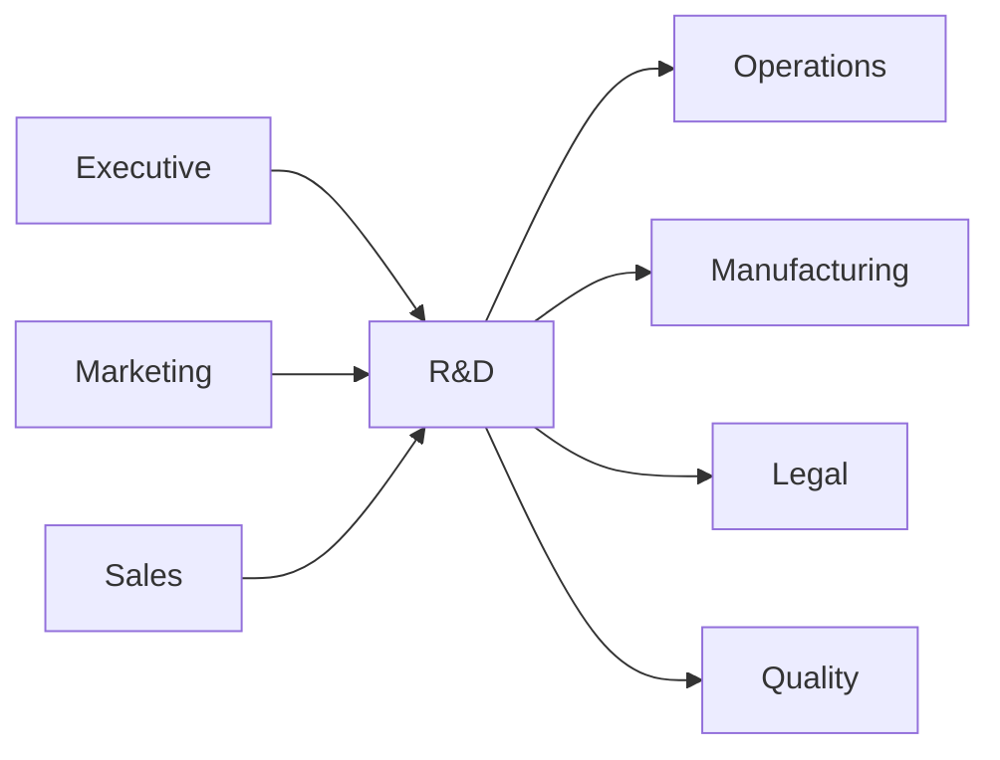

# Research & Development

> Product innovation, technology research, design engineering, and new product development

## Overview

The Research & Development function drives innovation by developing new products, services, and technologies that create competitive advantage and meet evolving customer needs. This department manages the full product development lifecycle from discovery research through design, prototyping, testing, and launch. R&D balances exploratory research with focused development, translating scientific discoveries and market insights into commercially viable offerings. Modern R&D organizations embrace agile methodologies, cross-functional collaboration, and open innovation models while maintaining rigorous quality and regulatory compliance throughout the development process.

## Department Structure

## Key Statistics

| Metric | Value |
|--------|-------|
| Function Code | APQC 10003 |
| Parent Function | [Executive](../Executive) |
| Process Group | [Develop and Manage Products and Services](/processes/industries/utilities/utilities_UtilityCompanies_DevelopAndManageProductsAndServices) |
| Typical Headcount | 5-15% of total workforce (varies significantly by industry) |

## Core Responsibilities

### Discovery Research

Discovery Research explores new technologies, materials, and approaches that could form the basis for future products and services, staying ahead of market and technology trends.

**Key Activities:**
- Perform discovery research on emerging technologies
- Monitor and track emerging technology capabilities
- Identify opportunities for innovation
- Gather new product/service ideas and requirements
- Collaborate with external research partners

### Product Development

Product Development transforms concepts into detailed specifications and designs, managing the development process from idea through launch readiness.

**Key Activities:**
- Govern and manage product/service development program
- Generate and define new product/service ideas
- Formulate new product/service concepts
- Develop product/service design specifications
- Develop user experience design specifications

### Testing and Validation

Testing and Validation ensures products meet quality standards, regulatory requirements, and customer expectations through rigorous testing protocols and feedback incorporation.

**Key Activities:**
- Conduct in-house product/service testing and evaluate feasibility
- Test prototype and refine based on feedback
- Conduct mandatory and elective reviews
- Evaluate new product/service inputs and requirements
- Prepare for production/service delivery

## Key Roles

| Role | Level | Description |
|------|-------|-------------|
| [Natural Sciences Managers](/occupations/Management/NaturalSciencesManagers) | Director/VP | Plan, direct, or coordinate activities in sciences and R&D |
| [Architectural and Engineering Managers](/occupations/Management/ArchitecturalAndEngineeringManagers) | Director | Plan, direct, or coordinate engineering and R&D activities |
| [Clinical Research Coordinators](/occupations/Management/ClinicalResearchCoordinators) | Manager | Plan, direct, or coordinate clinical research projects |
| [Industrial Engineers](/occupations/Architecture/IndustrialEngineers) | Engineer | Design systems for managing industrial production |
| [Mechanical Engineers](/occupations/Architecture/MechanicalEngineers) | Engineer | Plan and design tools, engines, and mechanical equipment |
| [Industrial Production Managers](/occupations/Management/IndustrialProductionManagers) | Manager | Coordinate work activities for manufacturing products |
| [Quality Control Systems Managers](/occupations/Management/QualityControlSystemsManagers) | Manager | Plan, direct, or coordinate quality assurance programs |
| [Computer and Information Research Scientists](/occupations/Technology/ComputerResearchScientists) | Scientist | Conduct research into fundamental computer science |

## Processes Owned

- [Develop and Manage Products and Services](/processes/industries/utilities/utilities_UtilityCompanies_DevelopAndManageProductsAndServices) - Primary Owner
- [Govern and Manage Product/Service Development Program](/processes/industries/utilities/utilities_UtilityCompanies_GovernAndManageProductserviceDevelopmentProgram) - Primary Owner
- [Perform Discovery Research](/processes/industries/utilities/utilities_UtilityCompanies_PerformDiscoveryResearch) - Primary Owner
- [Generate and Define New Product/Service Ideas](/processes/industries/utilities/utilities_UtilityCompanies_GenerateAndDefineNewProductserviceIdeas) - Primary Owner
- [Gather New Product/Service Ideas and Requirements](/processes/industries/utilities/utilities_UtilityCompanies_GatherNewProductserviceIdeasAndRequirements) - Primary Owner
- [Formulate New Product/Service Concepts](/processes/industries/utilities/utilities_UtilityCompanies_FormulateNewProductserviceConcepts) - Primary Owner
- [Develop Products and Services](/processes/industries/utilities/utilities_UtilityCompanies_DevelopProductsAndServices) - Primary Owner
- [Design and Prototype Products and Services](/processes/industries/utilities/utilities_UtilityCompanies_DesignAndPrototypeProductsAndServices) - Primary Owner
- [Develop Product/Service Design Specifications](/processes/industries/utilities/utilities_UtilityCompanies_DevelopProductserviceDesignSpecifications) - Primary Owner
- [Develop User Experience Design Specifications](/processes/industries/utilities/utilities_UtilityCompanies_DevelopUserExperienceDesignSpecifications) - Primary Owner
- [Conduct In-House Product/Service Testing and Evaluate Feasibility](/processes/02-Products/2.3-DevelopProductsServices/2.3.1-DesignPrototypeProductsServices/ConductInhouseProductserviceTestingAndEvaluateFeasibility) - Primary Owner
- [Identify Product/Service Bundling Opportunities](/processes/industries/utilities/utilities_UtilityCompanies_IdentifyProductserviceBundlingOpportunities) - Primary Owner
- [Introduce New Products/Services](/processes/industries/utilities/utilities_UtilityCompanies_IntroduceNewProductsservices) - Primary Owner
- [Prepare for Production/Service Delivery](/processes/industries/utilities/utilities_UtilityCompanies_PrepareForProductionserviceDelivery) - Primary Owner
- [Develop Plan for New Product/Service Development and Introduction/Launch](/processes/industries/utilities/utilities_UtilityCompanies_DevelopPlanForNewProductserviceDevelopmentAndIntroductionlaunch) - Primary Owner

## Cross-Functional Relationships

### Upstream Dependencies
- [Executive](../Executive) - R&D strategy, innovation priorities, budget allocation
- [Marketing](../Marketing) - Market research, customer insights, competitive intelligence
- [Sales](../Sales) - Customer feedback, market requirements, feature requests

### Downstream Consumers
- [Operations](../Operations) - Production specifications, manufacturing readiness
- Manufacturing - Design for manufacturing, production processes
- [Legal](../Legal) - Patent applications, IP protection, regulatory filings
- Quality - Quality specifications, testing protocols, compliance requirements

## Industry Variations

### Pharmaceutical/Biotechnology

Pharma R&D manages long development cycles, extensive clinical trials, and stringent regulatory requirements while balancing pipeline investment with success probabilities.

**Specific Focus Areas:**
- Clinical trial design and execution
- FDA/EMA regulatory submissions
- Drug discovery and screening
- Pharmacovigilance and safety monitoring

### Technology/Software

Tech R&D emphasizes rapid iteration, user-centered design, and continuous delivery while managing technical debt and platform evolution.

**Specific Focus Areas:**
- Agile and DevOps methodologies
- User experience research
- Platform architecture evolution
- Open source contribution and utilization

### Manufacturing/Industrial

Manufacturing R&D focuses on product engineering, materials science, and design for manufacturing while balancing innovation with production efficiency.

**Specific Focus Areas:**
- Computer-aided design/engineering (CAD/CAE)
- Materials testing and selection
- Design for manufacturing (DFM)
- Product lifecycle management

### Consumer Products

Consumer R&D combines market research with product design to create products that meet consumer preferences while managing cost and manufacturability.

**Specific Focus Areas:**
- Consumer insights and testing
- Packaging innovation
- Sensory evaluation (food/cosmetics)
- Sustainability and eco-design

### Automotive/Aerospace

Auto/Aero R&D manages complex systems engineering, safety certification, and long development cycles while incorporating emerging technologies like electrification and autonomy.

**Specific Focus Areas:**
- Systems engineering and integration
- Safety and crashworthiness testing
- Certification and homologation
- Supplier development and integration

## KPIs & Metrics

| Metric | Description | Target |
|--------|-------------|--------|
| R&D as % of Revenue | R&D investment intensity | Industry benchmark |
| Time to Market | Concept to launch duration | Decreasing trend |
| New Product Revenue | Revenue from products <3 years old | > 20-30% |
| Patent Filings | New patents filed annually | Growth trend |
| Project Success Rate | Projects reaching market | > 40-60% |
| Development Cost Variance | Actual vs. budgeted costs | < 10% |
| First Pass Yield | Products passing initial testing | > 90% |
| Innovation Pipeline Value | NPV of development pipeline | Growth trend |

## Technology Stack

- **PLM (Product Lifecycle Management)**: Siemens Teamcenter, PTC Windchill, Dassault ENOVIA
- **CAD/CAE**: AutoCAD, SolidWorks, CATIA, ANSYS, Fusion 360
- **Project Management**: Jira, Asana, Monday.com, Microsoft Project
- **Requirements Management**: Jama Connect, Polarion, IBM DOORS
- **Collaboration**: Confluence, SharePoint, Notion
- **Lab Management**: LIMS (Labware, Starlims, LabVantage)
- **Simulation**: MATLAB, Simulink, COMSOL
- **IP Management**: Anaqua, CPA Global, PatSnap
- **Clinical Trial Management**: Medidata, Veeva Vault, Oracle Clinical
- **Prototyping**: 3D printing software, CNC programming tools

---

*Source: APQC PCF 10003 + GS1 Functional Entity*
