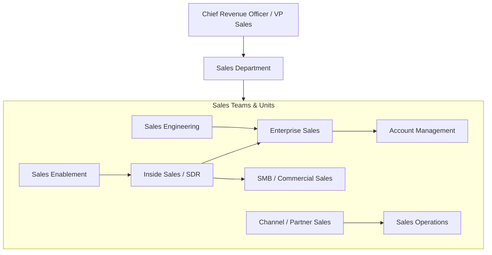
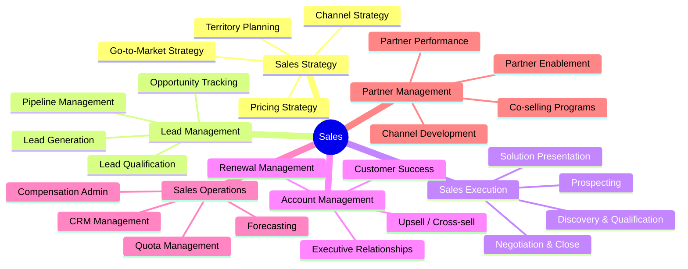
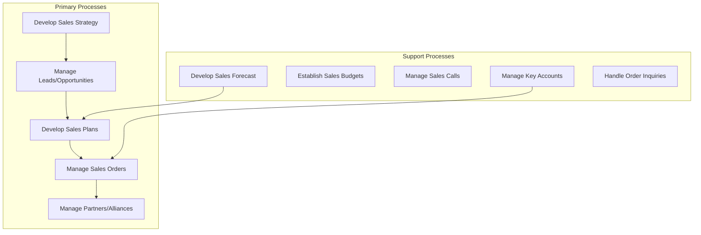
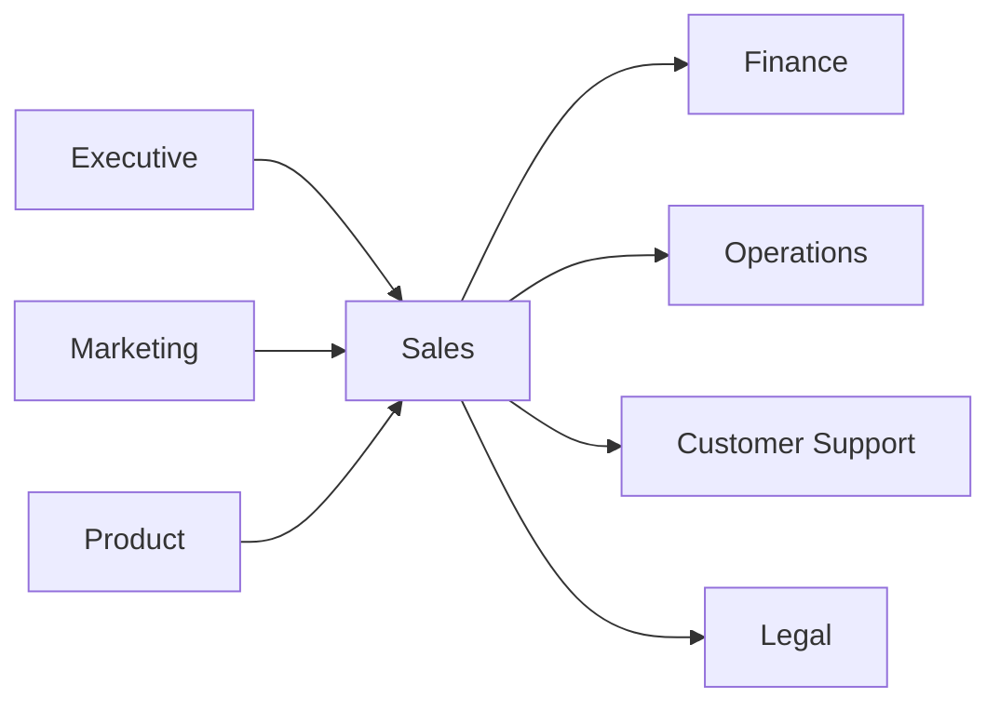

# Sales

> Revenue generation, customer acquisition, account management, and sales operations

## Overview

The Sales function is responsible for generating revenue by acquiring new customers and expanding relationships with existing accounts. This department manages the end-to-end sales process from lead generation through deal closure and ongoing account management. Sales translates market opportunity into tangible revenue, serving as the primary interface between the organization and its customers. The function balances new business development with customer retention, manages sales channels and partnerships, and provides critical market intelligence that informs product development and corporate strategy.

## Department Structure

## Key Statistics

| Metric | Value |
|--------|-------|
| Function Code | APQC 10004 |
| Parent Function | [Executive](../Executive) |
| Process Group | [Market and Sell Products and Services](/processes/MarketAndSellProductsAndServices) |
| Typical Headcount | 10-25% of total workforce (varies by business model) |

## Core Responsibilities

### Sales Strategy and Planning

Sales Strategy develops the go-to-market approach, territory design, and channel strategy that align sales efforts with market opportunity and corporate objectives.

**Key Activities:**
- Develop sales strategy and go-to-market approach
- Create strategic and tactical sales plans by customer segment
- Establish overall sales budgets and targets
- Define sales resource allocation across territories
- Develop sales partner and alliance relationships

### Lead and Opportunity Management

Lead Management qualifies potential customers, manages the sales pipeline, and ensures consistent progress of opportunities through the sales cycle.

**Key Activities:**
- Manage leads and opportunities in the pipeline
- Identify and qualify leads through scoring models
- Validate and qualify leads/opportunities
- Manage opportunity pipeline and sales forecasts
- Track competitive positioning and win/loss analysis

### Sales Execution

Sales Execution manages the direct customer engagement process from initial contact through deal closure, ensuring a consistent and effective customer experience.

**Key Activities:**
- Perform sales calls and customer presentations
- Perform pre-sales activities including proposals and pricing
- Manage customer sales calls and negotiations
- Develop solution and delivery approach
- Record outcome of sales process and close deals

## Key Roles

| Role | Level | Description |
|------|-------|-------------|
| [Sales Managers](/occupations/SalesManagers) | Director/VP | Plan, direct, or coordinate sales activities |
| [General and Operations Managers](/occupations/GeneralAndOperationsManagers) | Director | Plan and coordinate regional operations |
| [Market Research Analysts and Marketing Specialists](/occupations/MarketResearchAnalystsAndMarketingSpecialists) | Analyst | Research market conditions and opportunities |
| [Business Operations Specialists](/occupations/BusinessOperationsSpecialists) | Analyst | Support sales operations and analytics |
| [Project Management Specialists](/occupations/ProjectManagementSpecialists) | Manager | Coordinate complex sales engagements |
| [Management Analysts](/occupations/ManagementAnalysts) | Consultant | Provide sales process optimization |

## Processes Owned

- [Market and Sell Products and Services](/processes/MarketAndSellProductsAndServices) - Shared with Marketing
- [Develop Sales Forecast](/processes/DevelopSalesForecast) - Primary Owner
- [Generate Sales Forecast](/processes/GenerateSalesForecast) - Primary Owner
- [Develop Sales Partner/Alliance Relationships](/processes/DevelopSalesPartnerallianceRelationships) - Primary Owner
- [Create Strategic and Tactical Sales Plans by Customer](/processes/CreateStrategicAndTacticalSalesPlansByCustomer) - Primary Owner
- [Establish Overall Sales Budgets](/processes/EstablishOverallSalesBudgets) - Primary Owner
- [Develop and Manage Sales Plans](/processes/DevelopAndManageSalesPlans) - Primary Owner
- [Manage Leads/Opportunities](/processes/ManageLeadsopportunities) - Primary Owner
- [Manage Opportunity Pipeline](/processes/ManageOpportunityPipeline) - Primary Owner
- [Manage Customer Sales Calls](/processes/ManageCustomerSalesCalls) - Primary Owner
- [Manage Sales Orders](/processes/ManageSalesOrders) - Primary Owner
- [Manage Sales Partners and Alliances](/processes/ManageSalesPartnersAndAlliances) - Primary Owner

## Cross-Functional Relationships

### Upstream Dependencies
- [Executive](../Executive) - Revenue targets, strategic priorities
- [Marketing](../Marketing) - Qualified leads, marketing campaigns, brand positioning
- [Product](../Product) - Product roadmap, feature availability, competitive positioning

### Downstream Consumers
- [Finance](../Finance) - Revenue recognition, sales commissions, forecasts
- [Operations](../Operations) - Demand forecasts, delivery commitments
- [Customer Support](../Support) - Customer handoff, account information
- [Legal](../Legal) - Contract review, compliance requirements

## Industry Variations

### Enterprise Software (B2B SaaS)

Enterprise software sales focuses on complex, consultative selling with long sales cycles, multiple stakeholders, and emphasis on customer success and expansion.

**Specific Focus Areas:**
- Multi-threaded stakeholder engagement
- Proof of concept and pilot programs
- Annual contract value (ACV) optimization
- Net revenue retention and expansion

### Manufacturing/Industrial

Manufacturing sales manages technical selling, distributor relationships, and long-term customer partnerships with emphasis on total cost of ownership.

**Specific Focus Areas:**
- Technical specification selling
- Distributor and channel management
- Long-term contract negotiation
- Application engineering support

### Financial Services

Financial services sales navigates regulatory requirements, complex product suites, and relationship-based selling while managing compliance and suitability requirements.

**Specific Focus Areas:**
- Regulatory compliance (know your customer)
- Fiduciary and suitability requirements
- Relationship-based wealth management
- Cross-selling across product lines

### Retail/Consumer

Retail sales focuses on high-volume, transactional selling with emphasis on store operations, visual merchandising, and omnichannel customer experience.

**Specific Focus Areas:**
- Store-level performance management
- Visual merchandising and promotion execution
- Omnichannel customer engagement
- Seasonal and promotional planning

## KPIs & Metrics

| Metric | Description | Target |
|--------|-------------|--------|
| Revenue Attainment | Actual revenue vs. quota | > 100% of target |
| Win Rate | Opportunities won / total opportunities | > 25% (varies by segment) |
| Average Deal Size | Average revenue per closed deal | Growing YoY |
| Sales Cycle Length | Average days from opportunity to close | Industry benchmark |
| Pipeline Coverage | Pipeline value / quota remaining | 3-4x coverage |
| Customer Acquisition Cost | Total sales cost / new customers | Decreasing trend |
| Net Revenue Retention | Expansion - churn on existing base | > 110% (SaaS) |
| Sales Productivity | Revenue per sales rep | Growing YoY |

## Technology Stack

- **CRM**: Salesforce, Microsoft Dynamics 365, HubSpot
- **Sales Engagement**: Outreach, Salesloft, Gong, Chorus
- **Configure-Price-Quote (CPQ)**: Salesforce CPQ, DealHub, PandaDoc
- **Sales Intelligence**: ZoomInfo, LinkedIn Sales Navigator, 6sense
- **Revenue Operations**: Clari, InsightSquared, People.ai
- **Contract Management**: DocuSign, Ironclad, ContractPodAi
- **Forecasting**: Clari, Aviso, BoostUp
- **Compensation Management**: Xactly, CaptivateIQ, Spiff
- **Conversation Intelligence**: Gong, Chorus, ExecVision

---

*Source: APQC PCF 10004 + GS1 Functional Entity*
