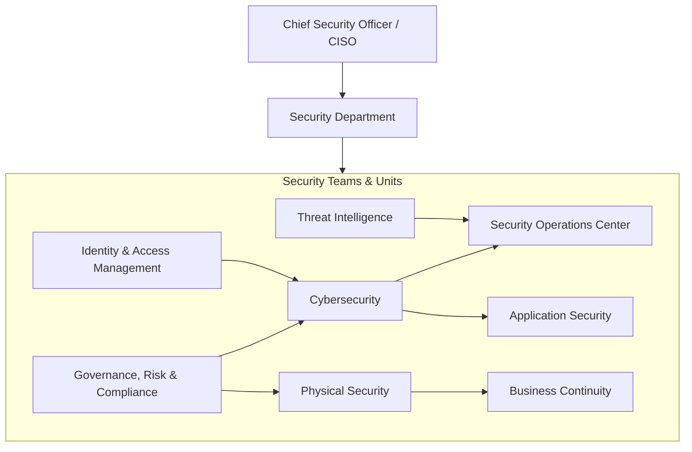
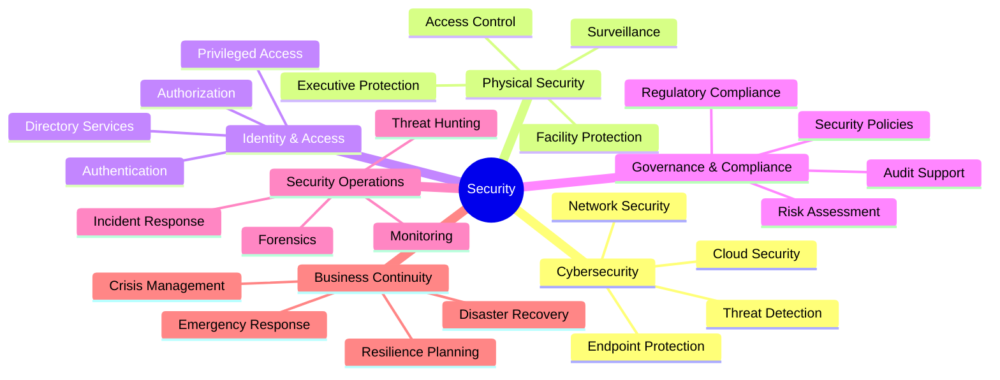
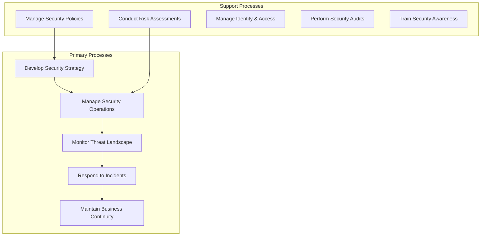
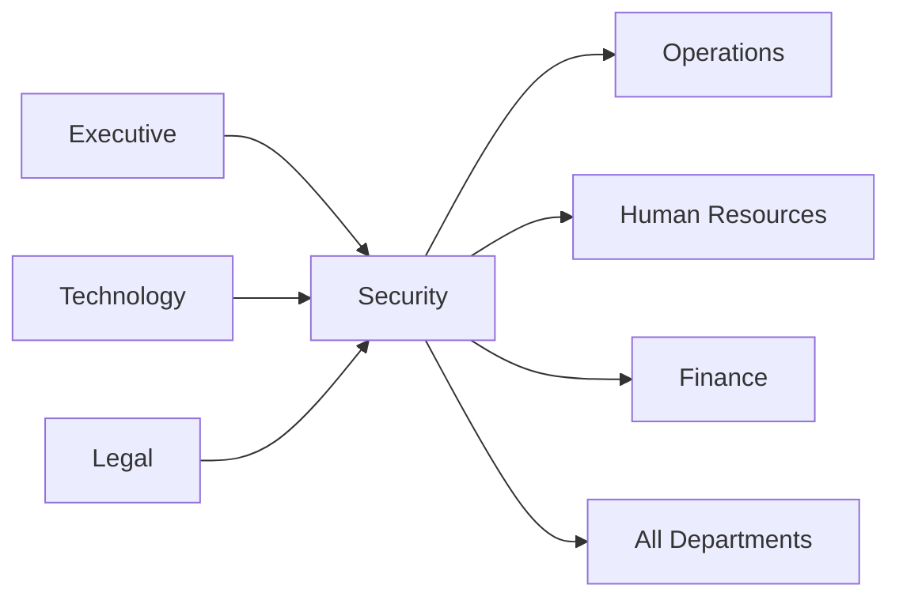

# Security

> Physical security, cybersecurity, risk protection, and business continuity

## Overview

The Security function is responsible for protecting the organization's people, assets, information, and infrastructure from physical and cyber threats. This department manages security strategy, threat detection, incident response, access control, and business continuity planning across both physical and digital domains. Security serves as the organization's defense layer, balancing risk mitigation with operational enablement to protect business value without impeding productivity.

Modern security organizations operate in an increasingly complex threat landscape that spans physical facilities, digital infrastructure, cloud environments, and the intersection of physical and cyber domains. The function has evolved from reactive guard-and-gate operations into a strategic capability that enables digital transformation, supports regulatory compliance, and protects organizational reputation. Security teams leverage advanced analytics, automation, and intelligence-driven approaches to anticipate and respond to evolving threats across global operations.

## Department Structure

## Key Statistics

| Metric | Value |
|--------|-------|
| Function Code | APQC 10009 |
| Parent Function | [Technology](../Technology) |
| Process Group | [Develop and Manage IT Security, Privacy, and Data Protection](/processes/08-IT/8.3-DevelopManageITResilience/8.3.5-DevelopManageITSecurity/index) |
| Typical Headcount | 1-3% of total workforce |

## Core Responsibilities

### Cybersecurity

Cybersecurity protects the organization's digital assets, networks, and data from cyber threats through layered defenses, monitoring, and incident response capabilities.

**Key Activities:**
- Develop IT compliance, risk, and security strategy
- Create and maintain IT security policies, standards, and procedures
- Review and monitor application and infrastructure security controls
- Analyze IT security threat impact and respond to breaches
- Manage vulnerability assessment and penetration testing programs

### Physical Security

Physical Security protects the organization's people, facilities, and physical assets through access control, surveillance, and security personnel management.

**Key Activities:**
- Design and manage facility access control systems
- Operate surveillance and monitoring systems
- Coordinate security personnel and guard services
- Manage visitor management and badge systems
- Plan and execute emergency evacuation procedures

### Security Operations

Security Operations provides continuous monitoring, detection, and response to security events and incidents across both physical and digital domains.

**Key Activities:**
- Monitor security alerts and events across all platforms
- Investigate and respond to security incidents
- Conduct digital forensics and evidence preservation
- Perform threat hunting and proactive detection
- Manage security information and event management (SIEM) systems

## Key Roles

| Role | Level | Description |
|------|-------|-------------|
| [Computer and Information Systems Managers](/occupations/Management/ComputerAndInformationSystemsManagers) | Director/VP | Plan, direct, or coordinate security activities |
| [Information Security Analysts](/occupations/Technology/InformationSecurityAnalysts) | Sr. Analyst | Plan and implement security measures for IT systems |
| [Computer Network Architects](/occupations/Technology/ComputerNetworkArchitects) | Architect | Design secure computer and information networks |
| [Network and Computer Systems Administrators](/occupations/Technology/NetworkAndComputerSystemsAdministrators) | Administrator | Maintain and secure network systems |
| [Compliance Officers](/occupations/Business/Operations/ComplianceOfficers) | Specialist | Examine compliance with security regulations |
| [Protective Service Workers](/occupations/ProtectiveService/SecurityGuards) | Officer | Guard, patrol, and monitor premises for security |
| [Emergency Management Directors](/occupations/Management/EmergencyManagementDirectors) | Director | Plan and direct disaster response and crisis management |

## Processes Owned

- [Develop IT Compliance, Risk, and Security Strategy](/processes/08-IT/8.3-DevelopManageITResilience/8.3.1-DevelopITComplianceRisk/index) - Primary Owner
- [Develop and Manage IT Security, Privacy, and Data Protection](/processes/08-IT/8.3-DevelopManageITResilience/8.3.5-DevelopManageITSecurity/index) - Primary Owner
- [Create and Maintain IT Security Policies, Standards, and Procedures](/processes/industries/utilities/utilities_UtilityCompanies_CreateAndMaintainITSecurityPoliciesStandardsAndProcedures) - Primary Owner
- [Review and Monitor Application and Infrastructure Security Controls](/processes/industries/utilities/utilities_UtilityCompanies_ReviewAndMonitorApplicationAndInfrastructureSecurityControls) - Primary Owner
- [Analyze IT Security Threat Impact](/processes/industries/utilities/utilities_UtilityCompanies_AnalyzeITSecurityThreatImpact) - Primary Owner
- [Support Integration of Identity and Authorization Policies](/processes/industries/utilities/utilities_UtilityCompanies_SupportIntegrationOfIdentityAndAuthorizationPolicies) - Primary Owner
- [Develop and Manage IT Business Resilience](/processes/industries/utilities/utilities_UtilityCompanies_DevelopAndManageITBusinessResilience) - Primary Owner

## Cross-Functional Relationships

### Upstream Dependencies
- [Executive](../Executive) - Security strategy direction, risk appetite, budget approval
- [Technology](../Technology) - IT infrastructure, network architecture, system access
- [Legal](../Legal) - Regulatory requirements, data privacy obligations, compliance mandates

### Downstream Consumers
- [Operations](../Operations) - Operational technology security, facility access
- [Human Resources](../HR) - Background checks, employee security training, termination protocols
- [Finance](../Finance) - Fraud prevention, transaction security, financial controls
- All Departments - Security awareness, access management, incident reporting

## Industry Variations

### Financial Services

Financial services security manages extensive regulatory requirements, fraud prevention, and protection of financial transactions while maintaining availability of critical banking systems.

**Specific Focus Areas:**
- PCI-DSS and payment security compliance
- Anti-fraud and transaction monitoring
- SOX and regulatory audit support
- Trading system integrity and resilience

### Healthcare

Healthcare security protects patient information under HIPAA, manages medical device security, and ensures physical safety in clinical environments with open-access requirements.

**Specific Focus Areas:**
- HIPAA security rule compliance
- Medical device cybersecurity
- Patient and staff physical safety
- Emergency management for clinical facilities

### Critical Infrastructure

Critical infrastructure security protects operational technology, industrial control systems, and national security assets while managing convergence of IT and OT environments.

**Specific Focus Areas:**
- NERC CIP and ICS/SCADA security
- IT/OT convergence security
- Supply chain security for critical components
- Insider threat detection programs

### Technology/Cloud

Technology security manages cloud-native architectures, DevSecOps integration, and protection of customer data at scale while enabling rapid development velocity.

**Specific Focus Areas:**
- Cloud security posture management
- DevSecOps and shift-left security
- Zero trust architecture implementation
- API and application security at scale

## KPIs & Metrics

| Metric | Description | Target |
|--------|-------------|--------|
| Mean Time to Detect (MTTD) | Time from breach to detection | < 24 hours |
| Mean Time to Respond (MTTR) | Time from detection to containment | < 4 hours |
| Security Incidents | Significant security events per period | Decreasing trend |
| Phishing Click Rate | Employees clicking simulated phishing | < 3% |
| Vulnerability Remediation | Critical vulnerabilities patched on time | > 95% in 30 days |
| Security Training Completion | Employees completing awareness training | > 95% |
| System Availability | Uptime of security-critical systems | > 99.99% |
| Audit Findings | Material security audit findings | Zero critical findings |

## Technology Stack

- **SIEM**: Splunk, Microsoft Sentinel, IBM QRadar, Elastic Security
- **Endpoint Protection**: CrowdStrike, SentinelOne, Microsoft Defender, Carbon Black
- **Network Security**: Palo Alto Networks, Fortinet, Zscaler, Cisco
- **Identity & Access**: Okta, Microsoft Entra ID, SailPoint, CyberArk
- **Cloud Security**: Wiz, Orca, Prisma Cloud, Lacework
- **Vulnerability Management**: Tenable, Qualys, Rapid7, Snyk
- **Physical Security**: Genetec, Verkada, Lenel, Honeywell
- **Incident Response**: Palo Alto XSOAR, Swimlane, TheHive
- **GRC**: ServiceNow GRC, Archer, OneTrust, LogicGate
- **Email Security**: Proofpoint, Mimecast, Abnormal Security

---

*Source: APQC PCF 10009 + GS1 Functional Entity*
