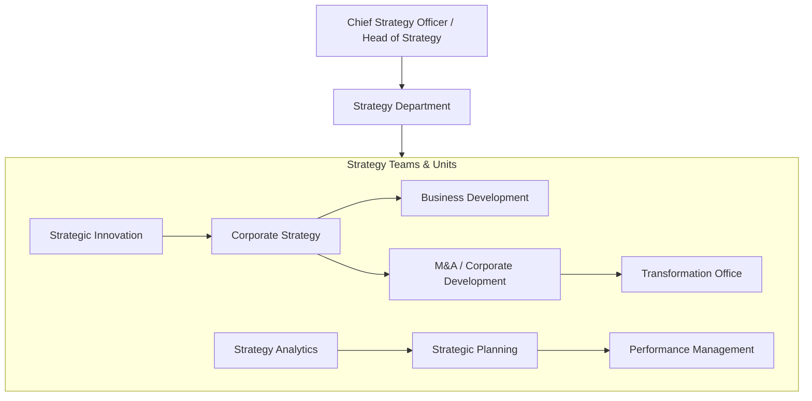
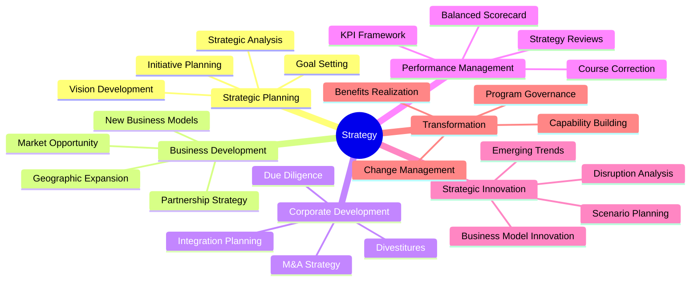
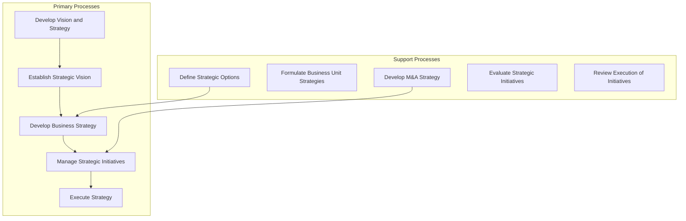
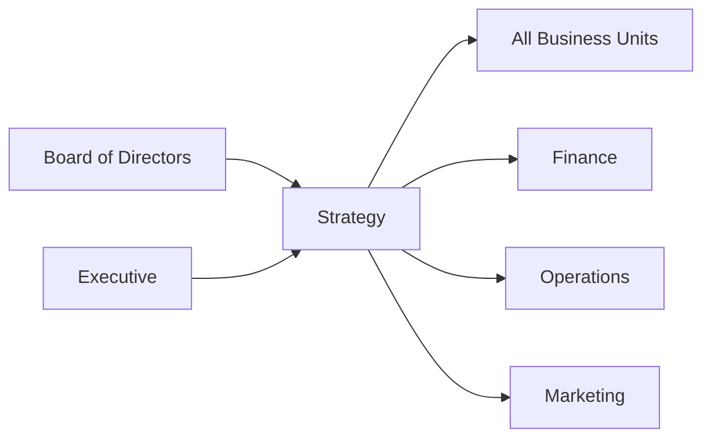

# Strategy

> Strategic planning, business development, corporate development, and performance management

## Overview

The Strategy function is responsible for defining the organization's long-term direction, developing strategic plans, and ensuring alignment between business activities and corporate objectives. This department conducts market analysis, evaluates strategic options, manages the planning process, and monitors strategy execution. Strategy serves as a critical bridge between executive vision and operational reality, translating high-level goals into actionable initiatives. Modern strategy organizations balance traditional long-range planning with agile approaches that enable rapid response to market changes while maintaining focus on sustainable competitive advantage.

## Department Structure

## Key Statistics

| Metric | Value |
|--------|-------|
| Function Code | APQC 10002 |
| Parent Function | [Executive](../Executive) |
| Process Group | [Develop Vision and Strategy](/processes/industries/utilities/utilities_UtilityCompanies_DevelopVisionAndStrategy) |
| Typical Headcount | 0.5-1% of total workforce |

## Core Responsibilities

### Strategic Planning

Strategic Planning develops the organization's vision, mission, and strategic objectives while managing the annual planning cycle and ensuring alignment across business units.

**Key Activities:**
- Establish strategic vision and define organizational direction
- Define strategic options and assess impact of each option
- Set/develop long-term enterprise strategy
- Formulate business unit strategies aligned with corporate strategy
- Develop and measure strategic initiatives

### Business Development

Business Development identifies and pursues growth opportunities through new markets, partnerships, and business models that expand the organization's reach and capabilities.

**Key Activities:**
- Identify alliance opportunities and partnership strategies
- Develop partner/alliance strategy for growth
- Evaluate shared services and global support options
- Identify under-served and saturated market segments
- Develop customer experience strategy

### Corporate Development (M&A)

Corporate Development manages mergers, acquisitions, divestitures, and strategic investments that reshape the organization's portfolio and accelerate strategic objectives.

**Key Activities:**
- Develop merger/demerger/acquisition/exit strategy
- Perform due diligence on potential targets
- Evaluate restructuring opportunities
- Plan and execute integration activities
- Manage strategic investment portfolio

## Key Roles

| Role | Level | Description |
|------|-------|-------------|
| [Chief Executives](/occupations/Management/ChiefExecutives) | C-Suite | Determine and formulate policies and overall direction |
| [General and Operations Managers](/occupations/Management/OperationsManagers) | VP/Director | Plan, direct, or coordinate operations activities |
| [Management Analysts](/occupations/Business/Operations/ManagementAnalysts) | Manager/Analyst | Conduct organizational studies and design systems |
| [Financial and Investment Analysts](/occupations/Business/FinancialAndInvestmentAnalysts) | Analyst | Conduct quantitative analyses of financial data |
| [Business Intelligence Analysts](/occupations/Technology/BusinessIntelligenceAnalysts) | Analyst | Produce market intelligence and identify data patterns |
| [Budget Analysts](/occupations/Business/Financial/BudgetAnalysts) | Analyst | Examine budget estimates and analyze reports |
| [Project Management Specialists](/occupations/Business/ProjectManagementSpecialists) | Specialist | Analyze and coordinate schedule, timeline, and budget |

## Processes Owned

- [Develop Vision and Strategy](/processes/industries/utilities/utilities_UtilityCompanies_DevelopVisionAndStrategy) - Primary Owner
- [Establish Strategic Vision](/processes/industries/utilities/utilities_UtilityCompanies_EstablishStrategicVision) - Primary Owner
- [Define the Strategic Vision](/processes/industries/utilities/utilities_UtilityCompanies_DefineTheStrategicVision) - Primary Owner
- [Set/Develop Long-Term Enterprise Strategy](/processes/01-Strategy/1.2-DevelopBusinessStrategy/1.2.2-DefineEvaluateStrategicOptions/SetDevelopLongtermEnterpriseStrategy) - Primary Owner
- [Formulate Business Unit Strategies](/processes/industries/utilities/utilities_UtilityCompanies_FormulateBusinessUnitStrategies) - Primary Owner
- [Refine Business Unit Strategies in Support of Organizational Strategy](/processes/01-Strategy/1.2-DevelopBusinessStrategy/1.2.7-FormulateBusinessUnitStrategies/RefineBusinessUnitStrategiesInSupportOfOrganizationalStrategy) - Primary Owner
- [Develop and Measure Strategic Initiatives](/processes/01-Strategy/1.3-DevelopMeasureStrategicInitiatives/index) - Primary Owner
- [Develop Strategic Initiatives](/processes/industries/utilities/utilities_UtilityCompanies_DevelopStrategicInitiatives) - Primary Owner
- [Evaluate Strategic Initiatives](/processes/industries/utilities/utilities_UtilityCompanies_EvaluateStrategicInitiatives) - Primary Owner
- [Prioritize Strategic Initiatives](/processes/industries/utilities/utilities_UtilityCompanies_PrioritizeStrategicInitiatives) - Primary Owner
- [Execute Strategic Initiatives](/processes/industries/utilities/utilities_UtilityCompanies_ExecuteStrategicInitiatives) - Primary Owner
- [Review Execution of Strategic Initiatives](/processes/01-Strategy/1.3-DevelopMeasureStrategicInitiatives/ReviewExecutionOfStrategicInitiatives) - Primary Owner
- [Develop Partner/Alliance Strategy](/processes/industries/utilities/utilities_UtilityCompanies_DevelopPartnerallianceStrategy) - Primary Owner
- [Develop Merger/Demerger/Acquisition/Exit Strategy](/processes/industries/utilities/utilities_UtilityCompanies_DevelopMergerdemergeracquisitionexitStrategy) - Primary Owner
- [Develop Innovation Strategy](/processes/industries/utilities/utilities_UtilityCompanies_DevelopInnovationStrategy) - Primary Owner
- [Develop Sustainability Strategy](/processes/industries/utilities/utilities_UtilityCompanies_DevelopSustainabilityStrategy) - Primary Owner
- [Develop Customer Experience Strategy](/processes/industries/utilities/utilities_UtilityCompanies_DevelopCustomerExperienceStrategy) - Primary Owner
- [Identify Organizational Objectives](/processes/01-Strategy/1.2-DevelopBusinessStrategy/1.2.6-DevelopSetOrganizationalObjectives/IdentifyOrganizationalObjectives) - Primary Owner
- [Assess and Analyze Impact of Each Option](/processes/industries/utilities/utilities_UtilityCompanies_AssessAndAnalyzeImpactOfEachOption) - Primary Owner
- [Communicate Strategic Initiatives to Business Units and Stakeholders](/processes/industries/utilities/utilities_UtilityCompanies_CommunicateStrategicInitiativesToBusinessUnitsAndStakeholders) - Primary Owner
- [Establish Business Model Governance](/processes/industries/utilities/utilities_UtilityCompanies_EstablishBusinessModelGovernance) - Primary Owner

## Cross-Functional Relationships

### Upstream Dependencies
- Board of Directors - Strategic mandate, governance oversight, major investment approval
- [Executive](../Executive) - Strategic direction, resource allocation priorities

### Downstream Consumers
- All Business Units - Strategic priorities, resource allocation, performance targets
- [Finance](../Finance) - Strategic plan financial modeling, investment analysis
- [Operations](../Operations) - Operational strategy alignment, transformation programs
- [Marketing](../Marketing) - Market strategy, competitive positioning

## Industry Variations

### Private Equity / Portfolio Companies

PE-backed strategy emphasizes value creation plans, operational improvement, and exit preparation while managing aggressive timelines and stakeholder expectations.

**Specific Focus Areas:**
- 100-day value creation plans
- Operational improvement initiatives
- Add-on acquisition strategy
- Exit preparation and timing

### Technology/High Growth

Tech strategy balances rapid scaling with sustainable unit economics while navigating platform dynamics, network effects, and disruptive competitors.

**Specific Focus Areas:**
- Platform and ecosystem strategy
- Hypergrowth planning
- Competitive moat development
- Technology and talent acquisition

### Financial Services

Financial services strategy addresses regulatory constraints, digital transformation, and evolving customer expectations while managing risk and capital requirements.

**Specific Focus Areas:**
- Regulatory strategy and compliance
- Digital transformation roadmap
- Customer experience modernization
- Risk-adjusted growth planning

### Healthcare

Healthcare strategy navigates complex stakeholder ecosystems, reimbursement dynamics, and regulatory requirements while addressing quality and access imperatives.

**Specific Focus Areas:**
- Value-based care transformation
- Payer-provider alignment
- Population health strategy
- Digital health integration

### Manufacturing/Industrial

Manufacturing strategy balances operational excellence with market responsiveness while managing global supply chains and technology transitions.

**Specific Focus Areas:**
- Operational excellence programs
- Industry 4.0/digital transformation
- Supply chain resilience
- Sustainability and ESG strategy

## KPIs & Metrics

| Metric | Description | Target |
|--------|-------------|--------|
| Strategic Objective Achievement | Progress on key strategic goals | > 80% on track |
| Revenue from Strategic Initiatives | Revenue from new strategic programs | Growth trend |
| Market Share | Position relative to competitors | Maintain or grow |
| M&A Success Rate | Deals achieving synergy targets | > 70% |
| Strategy Awareness | Employee understanding of strategy | > 80% |
| Planning Cycle Time | Time to complete annual planning | < 8 weeks |
| Initiative ROI | Return on strategic investments | > hurdle rate |
| Transformation Milestones | Major program achievements | On schedule |

## Technology Stack

- **Strategy Management**: Cascade, Workboard, AchieveIt, ClearPoint
- **Financial Modeling**: Microsoft Excel, Anaplan, Adaptive Insights
- **Market Intelligence**: CB Insights, PitchBook, Crunchbase, Gartner
- **Data Analytics**: Tableau, Power BI, ThoughtSpot, Looker
- **OKR/Goal Management**: Lattice, 15Five, Ally.io, Gtmhub
- **Project/Portfolio Management**: Planview, Clarity PPM, Monday.com
- **M&A Due Diligence**: Datasite, Intralinks, Firmex
- **Collaboration**: Miro, Mural, Microsoft Teams, Notion
- **Scenario Planning**: Quantified Strategies, Inavero, Strategy&
- **Executive Dashboards**: Domo, Sisense, Klipfolio

---

*Source: APQC PCF 10002 + GS1 Functional Entity*
