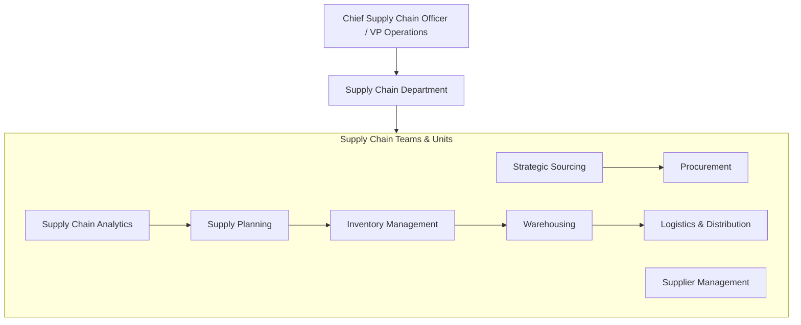
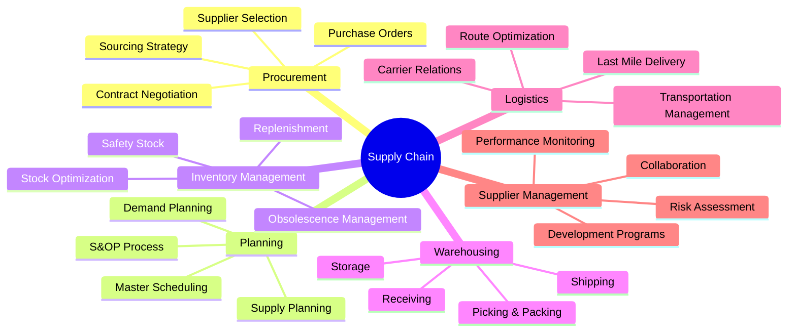
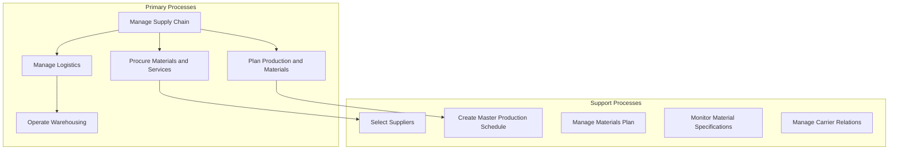
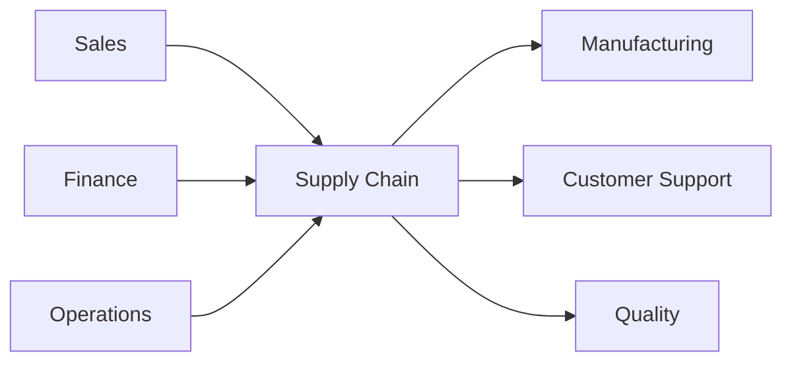

# Supply Chain

> End-to-end supply chain management, logistics, procurement, and distribution

## Overview

The Supply Chain function is responsible for the end-to-end flow of goods, materials, and information from suppliers through production to customers. This department manages procurement, inventory, warehousing, logistics, and distribution to ensure products are available where and when needed at optimal cost. Supply Chain balances efficiency with resilience, managing supplier relationships, optimizing inventory levels, and coordinating complex logistics networks. Modern supply chain organizations leverage data analytics, automation, and digital technologies to improve visibility, agility, and sustainability across increasingly global and complex supply networks.

## Department Structure

## Key Statistics

| Metric | Value |
|--------|-------|
| Function Code | APQC 20022 |
| Parent Function | [Operations](../Operations) |
| Process Group | [Manage Supply Chain for Physical Products](/processes/ManageSupplyChainForPhysicalProducts) |
| Typical Headcount | 3-8% of total workforce (manufacturing-heavy industries) |

## Core Responsibilities

### Procurement

Procurement manages the acquisition of materials, goods, and services required for business operations, ensuring quality, cost-effectiveness, and supply continuity.

**Key Activities:**
- Analyze organization's spend profile and sourcing needs
- Select suppliers and develop/maintain contracts
- Negotiate and establish contracts with favorable terms
- Process purchase orders and manage order lifecycle
- Support inventory and production processes

### Supply Planning

Supply Planning coordinates demand forecasting, inventory planning, and production scheduling to ensure optimal supply-demand balance across the network.

**Key Activities:**
- Develop production and materials strategies
- Create and manage master production schedule
- Plan for and align supply chain resources
- Create materials plan and manage requirements
- Generate constrained plan based on capacity and supply

### Logistics and Distribution

Logistics and Distribution manages the physical movement and storage of goods from suppliers through the distribution network to end customers.

**Key Activities:**
- Translate customer service requirements into logistics requirements
- Plan, source, and manage inbound material flow
- Operate warehousing and distribution facilities
- Manage transportation and carrier relationships
- Process and audit carrier invoices and documents

## Key Roles

| Role | Level | Description |
|------|-------|-------------|
| [Supply Chain Managers](/occupations/SupplyChainManagers) | Director/VP | Direct production, purchasing, warehousing, and distribution activities |
| [Purchasing Managers](/occupations/PurchasingManagers) | Director | Plan, direct, or coordinate purchasing activities |
| [Transportation, Storage, and Distribution Managers](/occupations/TransportationStorageAndDistributionManagers) | Director | Plan, direct, or coordinate transportation and distribution |
| [Logisticians](/occupations/Logisticians) | Manager | Analyze and coordinate logistical functions |
| [Logistics Engineers](/occupations/LogisticsEngineers) | Engineer | Design operational solutions for transportation and routing |
| [Logistics Analysts](/occupations/LogisticsAnalysts) | Analyst | Analyze product delivery and supply chain processes |
| [Purchasing Agents](/occupations/PurchasingAgentsExceptWholesaleRetailAndFarmProducts) | Specialist | Purchase materials, equipment, and supplies |
| [Procurement Clerks](/occupations/ProcurementClerks) | Clerk | Compile information and draw up purchase orders |
| [Shipping, Receiving, and Inventory Clerks](/occupations/ShippingReceivingAndInventoryClerks) | Clerk | Verify and maintain records on shipments and inventory |

## Processes Owned

- [Manage Supply Chain for Physical Products](/processes/ManageSupplyChainForPhysicalProducts) - Primary Owner
- [Plan for and Align Supply Chain Resources](/processes/PlanForAndAlignSupplyChainResources) - Primary Owner
- [Develop Production and Materials Strategies](/processes/DevelopProductionAndMaterialsStrategies) - Primary Owner
- [Procure Materials and Services](/processes/ProcureMaterialsAndServices) - Primary Owner
- [Analyze Organization's Spend Profile](/processes/AnalyzeOrganizationsSpendProfile) - Primary Owner
- [Select Suppliers and Develop/Maintain Contracts](/processes/SelectSuppliersAndDevelopmaintainContracts) - Primary Owner
- [Create Materials Plan](/processes/CreateMaterialsPlan) - Primary Owner
- [Create and Manage Master Production Schedule](/processes/CreateAndManageMasterProductionSchedule) - Primary Owner
- [Define Production Network and Supply Constraints](/processes/DefineProductionNetworkAndSupplyConstraints) - Primary Owner
- [Monitor Material Specifications](/processes/MonitorMaterialSpecifications) - Primary Owner
- [Collaborate with Supplier and Contract Manufacturers](/processes/CollaborateWithSupplierAndContractManufacturers) - Primary Owner
- [Support Inventory and Production Processes](/processes/SupportInventoryAndProductionProcesses) - Primary Owner
- [Translate Customer Service Requirements into Logistics Requirements](/processes/TranslateCustomerServiceRequirementsIntoLogisticsRequirements) - Primary Owner
- [Process and Audit Carrier Invoices and Documents](/processes/ProcessAndAuditCarrierInvoicesAndDocuments) - Primary Owner

## Cross-Functional Relationships

### Upstream Dependencies
- [Sales](../Sales) - Demand forecasts, customer orders, delivery commitments
- [Finance](../Finance) - Procurement budgets, working capital, cost targets
- [Operations](../Operations) - Production plans, capacity constraints, quality requirements

### Downstream Consumers
- Manufacturing - Raw materials, components, production schedules
- [Customer Support](../Support) - Order status, delivery tracking, returns processing
- Quality - Supplier quality data, material specifications, inspection results

## Industry Variations

### Manufacturing

Manufacturing supply chain focuses on raw material procurement, production scheduling, and managing complex bill-of-materials while balancing JIT efficiency with supply continuity.

**Specific Focus Areas:**
- Bill of materials management
- Production scheduling and MRP
- Supplier quality management
- JIT/Kanban systems

### Retail

Retail supply chain emphasizes distribution center operations, omnichannel fulfillment, and seasonal demand management while optimizing store replenishment.

**Specific Focus Areas:**
- Omnichannel fulfillment
- Store replenishment optimization
- Seasonal inventory planning
- Reverse logistics and returns

### Healthcare/Pharmaceutical

Healthcare supply chain manages temperature-sensitive products, regulatory compliance, and traceability while ensuring product integrity and patient safety.

**Specific Focus Areas:**
- Cold chain management
- FDA/regulatory compliance
- Serialization and traceability
- Controlled substance tracking

### Food and Beverage

Food supply chain handles perishable goods, food safety requirements, and complex freshness management while minimizing waste and spoilage.

**Specific Focus Areas:**
- Perishable inventory management
- Food safety compliance (FSMA)
- Freshness and shelf-life optimization
- Farm-to-table traceability

### Technology/Electronics

Technology supply chain manages rapid product lifecycles, component availability, and global sourcing complexity while navigating geopolitical supply risks.

**Specific Focus Areas:**
- Component lifecycle management
- Contract manufacturing coordination
- Global sourcing risk management
- Rapid product introduction

## KPIs & Metrics

| Metric | Description | Target |
|--------|-------------|--------|
| On-Time Delivery | Orders delivered when promised | > 95% |
| Perfect Order Rate | Orders complete, accurate, and on-time | > 90% |
| Inventory Turns | Annual COGS / Average Inventory | Industry benchmark+ |
| Days Inventory Outstanding | Average days of inventory on hand | < 30-60 days |
| Supply Chain Cost | Total SC cost as % of revenue | < 5-10% |
| Supplier On-Time Delivery | Supplier deliveries on schedule | > 98% |
| Fill Rate | Orders shipped complete from stock | > 95% |
| Freight Cost per Unit | Transportation cost efficiency | Decreasing trend |
| Warehouse Accuracy | Pick and ship accuracy rate | > 99.5% |

## Technology Stack

- **ERP/Supply Chain**: SAP S/4HANA, Oracle SCM Cloud, Microsoft Dynamics 365
- **Procurement**: Coupa, SAP Ariba, Jaggaer, GEP SMART
- **Transportation Management (TMS)**: Oracle TMS, SAP TM, Manhattan TMS, BluJay
- **Warehouse Management (WMS)**: Manhattan WMS, Blue Yonder, SAP EWM, Korber
- **Demand Planning**: Kinaxis, Blue Yonder, o9 Solutions, RELEX
- **Supplier Management**: SAP Ariba Supplier Management, HICX, Avetta
- **Inventory Optimization**: Blue Yonder, E2open, Kinaxis
- **Supply Chain Visibility**: FourKites, project44, Transporeon
- **Procurement Analytics**: Spend HQ, Sievo, SpendHQ
- **Collaboration**: Infor Nexus, TradeGlobal, GT Nexus

---

*Source: APQC PCF 20022 + GS1 Functional Entity*
