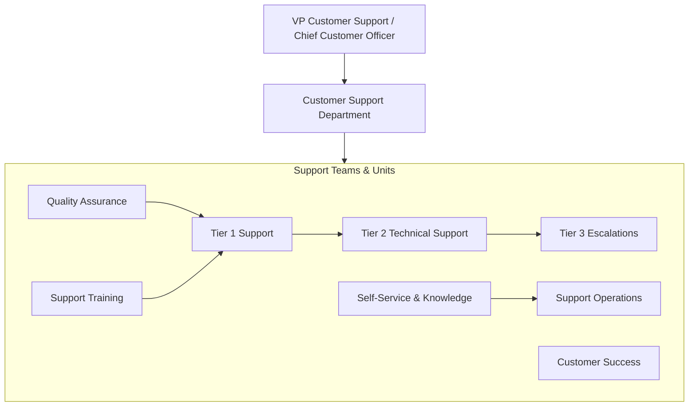
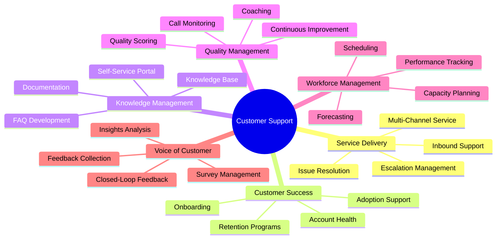
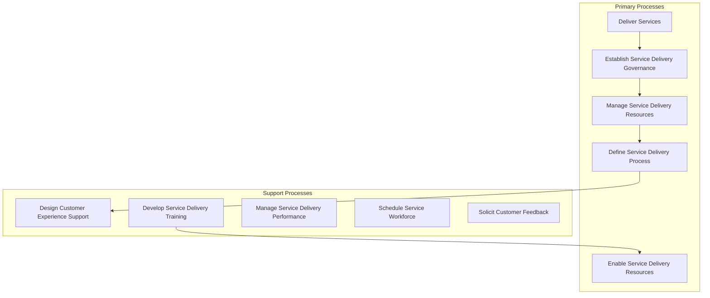
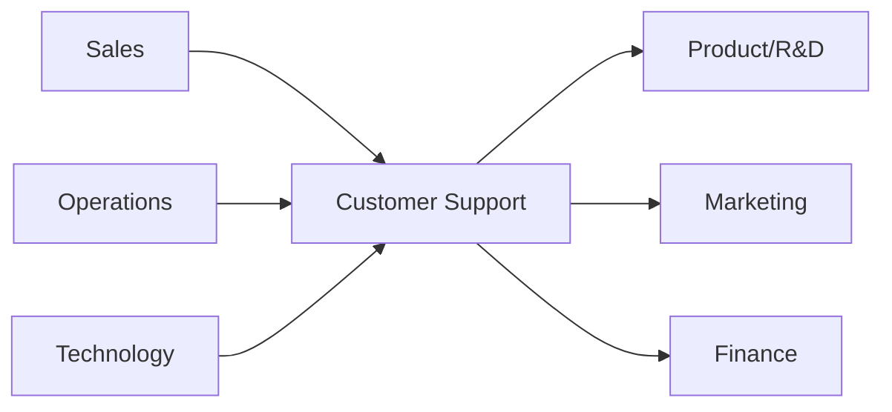

# Customer Support

> Customer service excellence, issue resolution, and customer experience management

## Overview

The Customer Support function is responsible for delivering exceptional service experiences that resolve customer issues, answer inquiries, and build long-term customer loyalty. This department manages multi-channel customer interactions including phone, email, chat, and self-service while ensuring consistent service quality and efficient resolution. Customer Support serves as the primary touchpoint for post-sale customer relationships, gathering valuable feedback that informs product improvements and business decisions. Modern support organizations balance efficient issue resolution with proactive customer success initiatives that reduce churn and increase customer lifetime value.

## Department Structure

## Key Statistics

| Metric | Value |
|--------|-------|
| Function Code | APQC 20025 |
| Parent Function | [Operations](../Operations) |
| Process Group | [Deliver Services](/processes/DeliverServices) |
| Typical Headcount | 2-10% of total workforce (varies by industry) |

## Core Responsibilities

### Service Delivery

Service Delivery manages the day-to-day customer interactions across all channels, ensuring timely and effective resolution of customer inquiries, issues, and requests.

**Key Activities:**
- Establish service delivery governance and strategies
- Manage service delivery performance and SLAs
- Schedule customer service workforce effectively
- Define service delivery processes and procedures
- Solicit feedback from customer on service delivery satisfaction

### Customer Success

Customer Success proactively engages with customers to ensure they achieve their desired outcomes, driving adoption, satisfaction, and long-term retention.

**Key Activities:**
- Design customer experience support structure
- Develop customer experience roadmap and capabilities
- Manage customer onboarding and adoption programs
- Monitor customer health scores and engagement
- Execute retention and expansion initiatives

### Knowledge Management

Knowledge Management creates and maintains the information resources that enable both customers and support agents to quickly find answers and resolve issues.

**Key Activities:**
- Develop and maintain knowledge base content
- Create self-service portal and FAQ resources
- Analyze search patterns and content gaps
- Train support teams on knowledge resources
- Measure knowledge article effectiveness

## Key Roles

| Role | Level | Description |
|------|-------|-------------|
| [Administrative Services Managers](/occupations/AdministrativeServicesManagers) | Director | Plan and coordinate administrative support services |
| [First-Line Supervisors of Office and Administrative Support Workers](/occupations/FirstLineSupervisorsOfOfficeAndAdministrativeSupportWorkers) | Manager | Directly supervise and coordinate support workers |
| [Customer Service Representatives](/occupations/CustomerServiceRepresentatives) | Representative | Interact with customers to provide information and resolve complaints |
| [Computer User Support Specialists](/occupations/ComputerUserSupportSpecialists) | Specialist | Provide technical assistance to computer users |
| [Computer Network Support Specialists](/occupations/ComputerNetworkSupportSpecialists) | Specialist | Troubleshoot and maintain network systems |

## Processes Owned

- [Deliver Services](/processes/DeliverServices) - Primary Owner
- [Establish Service Delivery Governance and Strategies](/processes/EstablishServiceDeliveryGovernanceAndStrategies) - Primary Owner
- [Establish Service Delivery Governance](/processes/EstablishServiceDeliveryGovernance) - Primary Owner
- [Manage Service Delivery Performance](/processes/ManageServiceDeliveryPerformance) - Primary Owner
- [Manage Service Delivery Development and Direction](/processes/ManageServiceDeliveryDevelopmentAndDirection) - Primary Owner
- [Define Service Delivery Goals](/processes/DefineServiceDeliveryGoals) - Primary Owner
- [Define Service Delivery Process](/processes/DefineServiceDeliveryProcess) - Primary Owner
- [Manage Service Delivery Resources](/processes/ManageServiceDeliveryResources) - Primary Owner
- [Enable Service Delivery Resources](/processes/EnableServiceDeliveryResources) - Primary Owner
- [Develop Service Delivery Training Plan](/processes/DevelopServiceDeliveryTrainingPlan) - Primary Owner
- [Schedule Customer Service Work Force](/processes/ScheduleCustomerServiceWorkForce) - Primary Owner
- [Design Customer Experience Support Structure](/processes/DesignCustomerExperienceSupportStructure) - Primary Owner
- [Solicit Feedback from Customer on Service Delivery Satisfaction](/processes/SolicitFeedbackFromCustomerOnServiceDeliverySatisfaction) - Primary Owner

## Cross-Functional Relationships

### Upstream Dependencies
- [Sales](../Sales) - Customer expectations, contract terms, handoff information
- [Operations](../Operations) - Product/service delivery status, issue context
- [Technology](../Technology) - Support systems, tools, and technical infrastructure

### Downstream Consumers
- [Research & Development](../Research) - Customer feedback, bug reports, feature requests
- [Marketing](../Marketing) - Customer testimonials, satisfaction data, case studies
- [Finance](../Finance) - Support costs, customer value analysis

## Industry Variations

### Technology/SaaS

Technology support emphasizes technical troubleshooting, self-service enablement, and customer success management to drive product adoption and reduce churn.

**Specific Focus Areas:**
- Technical troubleshooting and debugging
- Product adoption and feature utilization
- Integration support and API assistance
- Community forums and developer support

### Telecommunications

Telecom support handles high volume interactions across billing, technical issues, and service changes while managing complex account structures and regulatory requirements.

**Specific Focus Areas:**
- Network and connectivity troubleshooting
- Billing dispute resolution
- Service provisioning and changes
- Regulatory compliance (FCC, accessibility)

### Financial Services

Financial services support requires strict compliance with regulations while handling sensitive financial matters and maintaining detailed audit trails.

**Specific Focus Areas:**
- Account and transaction inquiries
- Fraud prevention and dispute resolution
- Regulatory compliance (CFPB, TCPA)
- Secure communication requirements

### Retail/E-commerce

Retail support manages order-related inquiries, returns processing, and product questions while handling seasonal volume fluctuations.

**Specific Focus Areas:**
- Order status and tracking
- Returns and refund processing
- Product information and recommendations
- Peak season scalability

### Healthcare

Healthcare support navigates HIPAA requirements while assisting patients and providers with complex healthcare processes and insurance matters.

**Specific Focus Areas:**
- HIPAA-compliant communication
- Insurance and billing inquiries
- Appointment scheduling and referrals
- Patient portal assistance

## KPIs & Metrics

| Metric | Description | Target |
|--------|-------------|--------|
| First Contact Resolution (FCR) | Issues resolved on first interaction | > 70% |
| Average Handle Time (AHT) | Average duration of support interactions | Industry benchmark |
| Customer Satisfaction (CSAT) | Post-interaction satisfaction score | > 4.5/5.0 |
| Net Promoter Score (NPS) | Customer loyalty and advocacy metric | > 50 |
| Average Response Time | Time to first response | < 1 hour (email), < 30s (chat) |
| Service Level | Calls answered within target time | > 80% in 20 seconds |
| Customer Effort Score (CES) | Ease of getting help | > 4.0/5.0 |
| Ticket Backlog | Open tickets awaiting resolution | Decreasing trend |
| Self-Service Rate | Issues resolved via self-service | > 30% |

## Technology Stack

- **Contact Center Platform**: Genesys, Five9, NICE, Talkdesk, Amazon Connect
- **Help Desk/Ticketing**: Zendesk, Freshdesk, ServiceNow, Intercom
- **Knowledge Management**: Guru, Confluence, Notion, Document360
- **Live Chat**: Intercom, Drift, LiveChat, Olark
- **Chatbots/AI**: Ada, Forethought, Ultimate.ai, IBM Watson
- **Workforce Management**: NICE WFM, Verint, Calabrio, Assembled
- **Quality Management**: MaestroQA, Playvox, Scorebuddy
- **Customer Success**: Gainsight, ChurnZero, Totango, ClientSuccess
- **Survey/Feedback**: Medallia, Qualtrics, SurveyMonkey, Delighted
- **Analytics**: Looker, Tableau, Power BI, Custom dashboards

---

*Source: APQC PCF 20025 + GS1 Functional Entity*
