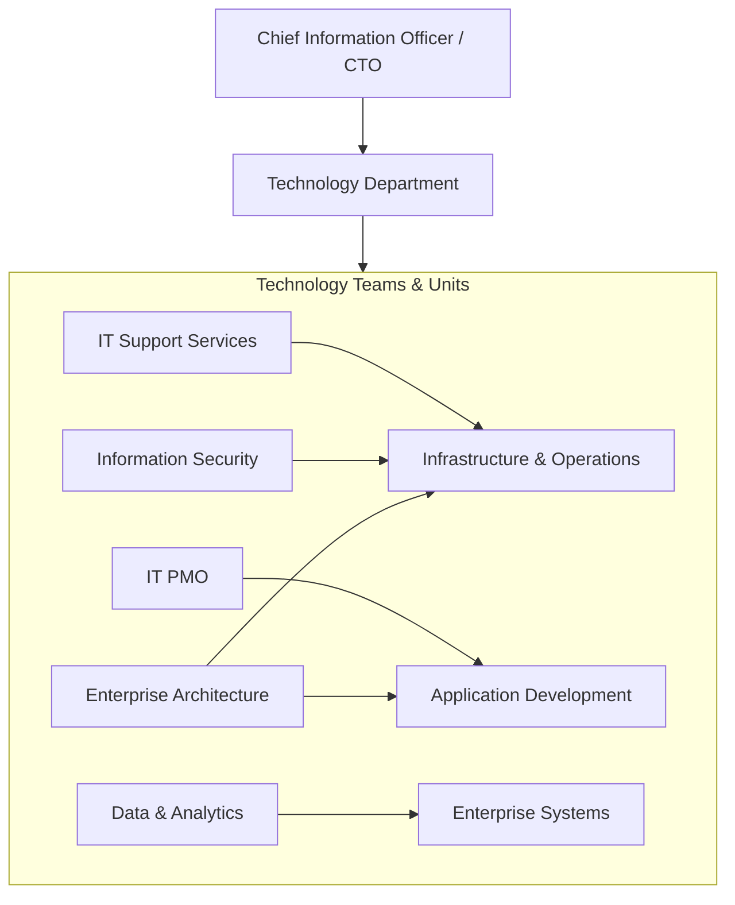
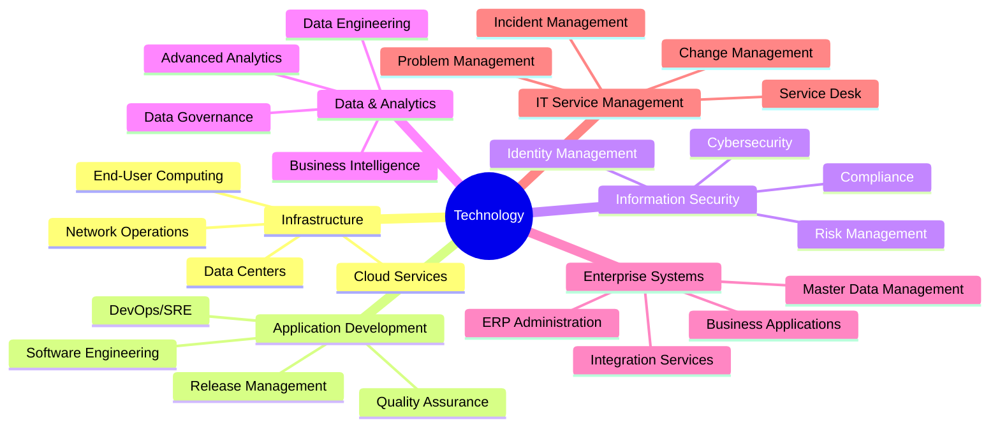
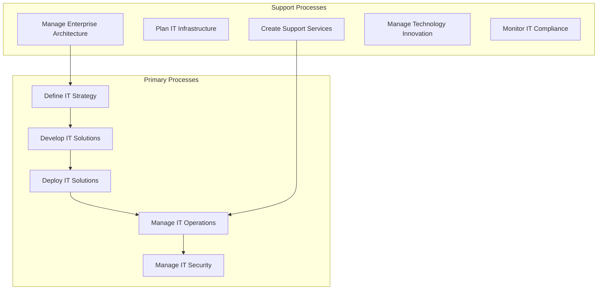
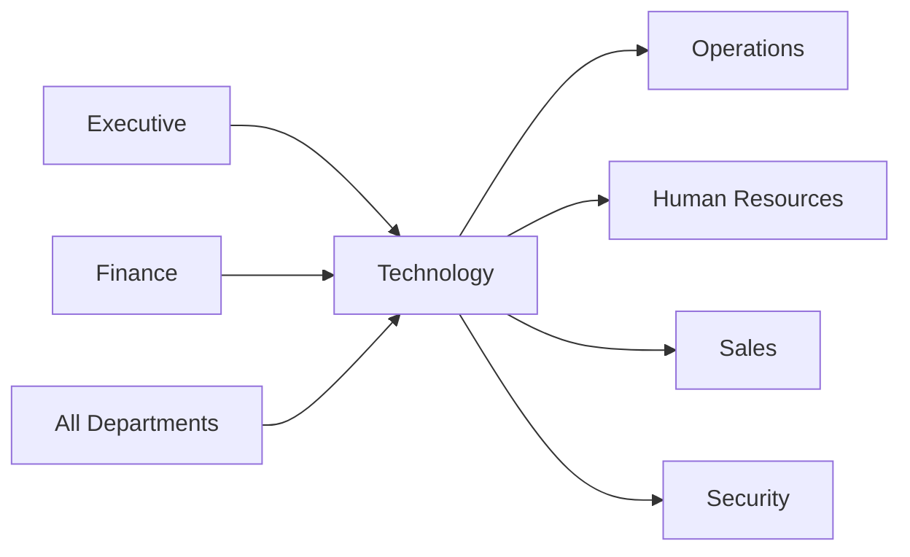

# Technology

> Information technology, digital infrastructure, software development, and enterprise systems

## Overview

The Technology function (commonly known as IT or Information Technology) is responsible for the organization's digital infrastructure, enterprise systems, software development, and technology services. This department manages the technology portfolio that enables business operations, drives digital transformation, and protects information assets. Modern IT organizations balance operational excellence in maintaining critical systems with innovation initiatives that create competitive advantage. The function serves both as a service provider to internal customers and as a strategic partner enabling business capabilities through technology.

## Department Structure

## Key Statistics

| Metric | Value |
|--------|-------|
| Function Code | APQC 10009 |
| Parent Function | [Executive](../Executive) |
| Process Group | [Manage Enterprise Information](/processes/ManageEnterpriseInformation) |
| Typical Headcount | 3-8% of total workforce (varies by industry) |

## Core Responsibilities

### Infrastructure and Operations

Infrastructure manages the technology foundation including networks, servers, cloud services, and end-user computing environments that support all business operations.

**Key Activities:**
- Develop and manage infrastructure resource planning
- Assess IT infrastructure business objectives
- Balance operational workloads across available infrastructure
- Monitor and track emerging technology capabilities
- Manage cloud and on-premises environments

### Application Development

Application Development builds and maintains software solutions, manages the software development lifecycle, and ensures quality through testing and continuous improvement.

**Key Activities:**
- Identify, deploy, and support development methodologies and tools
- Implement technology solutions and software changes
- Distribute software components and manage releases
- Confirm hardware/software operational status
- Manage application lifecycle and technical debt

### Information Security

Information Security protects the organization's digital assets, manages cybersecurity threats, ensures compliance with regulations, and maintains identity and access management.

**Key Activities:**
- Develop IT compliance, risk, and security strategy
- Create and maintain IT security policies, standards, and procedures
- Review and monitor application and infrastructure security controls
- Analyze IT security threat impact and respond to breaches
- Support integration of identity and authorization policies

## Key Roles

| Role | Level | Description |
|------|-------|-------------|
| [Computer and Information Systems Managers](/occupations/Management/ComputerAndInformationSystemsManagers) | Director/VP | Plan, direct, or coordinate IT activities |
| [Information Technology Project Managers](/occupations/Technology/InformationTechnologyProjectManagers) | Manager | Plan and manage IT projects |
| [Computer Network Architects](/occupations/Technology/ComputerNetworkArchitects) | Architect | Design computer and information networks |
| [Database Architects](/occupations/Technology/DatabaseArchitects) | Architect | Design database and data warehouse systems |
| [Information Security Analysts](/occupations/Technology/InformationSecurityAnalysts) | Sr. Analyst | Plan and implement security measures |
| [Software Developers](/occupations/Technology/SoftwareDevelopers) | Engineer | Design, develop, and test software |
| [Network and Computer Systems Administrators](/occupations/Technology/NetworkAndComputerSystemsAdministrators) | Administrator | Install, configure, and maintain systems |
| [Computer User Support Specialists](/occupations/Technology/ComputerUserSupportSpecialists) | Support | Provide technical assistance to users |
| [Data Scientists](/occupations/Technology/DataScientists) | Analyst | Develop analytics applications and models |

## Processes Owned

- [Define Business Technology and Governance Strategy](/processes/industries/utilities/utilities_UtilityCompanies_DefineBusinessTechnologyAndGovernanceStrategy) - Primary Owner
- [Create and Publish Enterprise Architecture Principles](/processes/industries/utilities/utilities_UtilityCompanies_CreateAndPublishEnterpriseArchitecturePrinciples) - Primary Owner
- [Define and Manage Technology Innovation](/processes/industries/utilities/utilities_UtilityCompanies_DefineAndManageTechnologyInnovation) - Primary Owner
- [Develop IT Compliance, Risk, and Security Strategy](/processes/08-IT/8.3-DevelopManageITResilience/8.3.1-DevelopITComplianceRisk/index) - Primary Owner
- [Develop and Manage IT Security, Privacy, and Data Protection](/processes/08-IT/8.3-DevelopManageITResilience/8.3.5-DevelopManageITSecurity/index) - Primary Owner
- [Implement Technology Solutions](/processes/industries/utilities/utilities_UtilityCompanies_ImplementTechnologySolutions) - Primary Owner
- [Develop and Manage Infrastructure Resource Planning](/processes/industries/utilities/utilities_UtilityCompanies_DevelopAndManageInfrastructureResourcePlanning) - Primary Owner
- [Create and Manage Support Services/Solutions](/processes/industries/utilities/utilities_UtilityCompanies_CreateAndManageSupportServicessolutions) - Primary Owner
- [Define and Develop Service Support Strategy](/processes/industries/utilities/utilities_UtilityCompanies_DefineAndDevelopServiceSupportStrategy) - Primary Owner
- [Provide Service Support Tools and Technology](/processes/industries/utilities/utilities_UtilityCompanies_ProvideServiceSupportToolsAndTechnology) - Primary Owner

## Cross-Functional Relationships

### Upstream Dependencies
- [Executive](../Executive) - Technology strategy, digital transformation priorities
- [Finance](../Finance) - IT budget allocation, capital expenditure approval
- All Departments - Business requirements, technology demand

### Downstream Consumers
- [Operations](../Operations) - Manufacturing systems, operational technology
- [Human Resources](../HR) - HRIS systems, collaboration tools
- [Sales](../Sales) - CRM systems, sales enablement tools
- [Security](../Security) - Physical security systems integration
- All Departments - Enterprise systems, productivity tools, IT support

## Industry Variations

### Financial Services

Financial services IT manages highly regulated environments with emphasis on trading systems, payment processing, and extensive security and compliance requirements.

**Specific Focus Areas:**
- Real-time trading system performance
- Payment system availability (99.999%)
- Regulatory compliance (SOX, PCI-DSS, GDPR)
- Fraud detection and prevention systems

### Healthcare

Healthcare IT manages electronic health records, clinical systems, and medical devices while ensuring HIPAA compliance and system interoperability.

**Specific Focus Areas:**
- Electronic Health Records (EHR) management
- Medical device integration and security
- HIPAA compliance and PHI protection
- Healthcare interoperability (HL7, FHIR)

### Manufacturing

Manufacturing IT supports operational technology (OT), industrial control systems, and the convergence of IT/OT while enabling Industry 4.0 initiatives.

**Specific Focus Areas:**
- Industrial IoT and sensor networks
- IT/OT convergence and security
- Manufacturing Execution Systems (MES)
- Digital twin and simulation technologies

### Retail

Retail IT manages omnichannel commerce platforms, point-of-sale systems, and customer data while handling seasonal demand variability.

**Specific Focus Areas:**
- E-commerce platform scalability
- Point-of-sale system reliability
- Customer data platform integration
- Inventory and fulfillment systems

## KPIs & Metrics

| Metric | Description | Target |
|--------|-------------|--------|
| System Availability | Uptime of critical systems | > 99.9% |
| Incident Response Time | Mean time to respond to incidents | < 15 minutes (P1) |
| Mean Time to Resolve | Average time to resolve incidents | < 4 hours (P1) |
| Change Success Rate | Changes deployed without issues | > 95% |
| Security Incidents | Significant security events | Zero breaches |
| IT Cost as % of Revenue | Total IT spend / total revenue | 2-8% (industry dependent) |
| Project Delivery | Projects delivered on time/budget | > 80% |
| User Satisfaction | IT satisfaction survey score | > 4.0/5.0 |

## Technology Stack

- **Cloud Platforms**: AWS, Microsoft Azure, Google Cloud Platform
- **Infrastructure as Code**: Terraform, Ansible, Puppet, Chef
- **Container Orchestration**: Kubernetes, Docker, OpenShift
- **CI/CD**: Jenkins, GitLab CI, GitHub Actions, Azure DevOps
- **Monitoring**: Datadog, Splunk, New Relic, Dynatrace
- **ITSM**: ServiceNow, Jira Service Management, BMC Remedy
- **Security**: CrowdStrike, Palo Alto Networks, Okta, SailPoint
- **Collaboration**: Microsoft 365, Slack, Zoom, Google Workspace
- **ERP Integration**: SAP, Oracle, MuleSoft, Informatica
- **Data Platform**: Snowflake, Databricks, Apache Spark

---

*Source: APQC PCF 10009 + GS1 Functional Entity*
