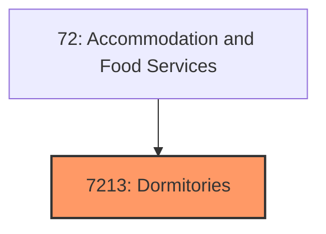
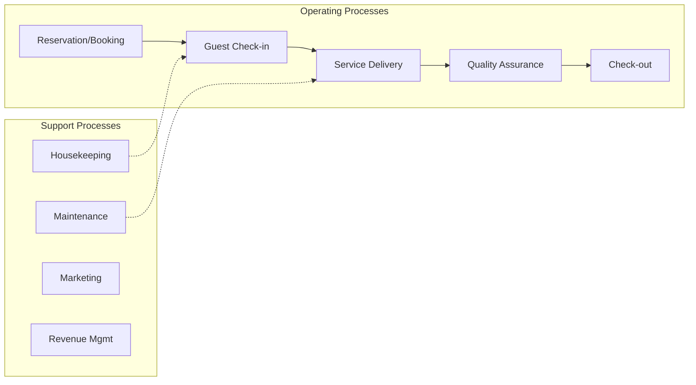

# Dormitories

> Establishments primarily engaged in dormitories.

## Overview

Dormitories represents an important category within the Accommodation and Food Services sector (NAICS 72).

## Industry Hierarchy

## Key Statistics

| Metric | Value |
|--------|-------|
| NAICS Code | 7213 |
| Level | Industry Group |
| Child Industries | 0 |

## Related Occupations

- [Food Service Managers](/occupations/Management/FoodServiceManagers) - Plan and direct food service activities
- [Lodging Managers](/occupations/Management/LodgingManagers) - Plan and direct hotel operations
- [Chefs and Head Cooks](/occupations/FoodService/ChefsAndHeadCooks) - Direct food preparation activities
- [Waiters and Waitresses](/occupations/FoodService/WaitersAndWaitresses) - Take orders and serve food

## Core Business Processes

## Industry Value Chain

## Regulatory Environment

- **FDA** (Food and Drug Administration) - Enforces food safety standards in restaurants
- **State Health Departments** - Inspect and license food service establishments
- **TTB** (Alcohol and Tobacco Tax and Trade Bureau) - Regulates alcohol service
- **Local Health and Fire Codes** - Govern facility safety and sanitation

## Technology & Innovation

- **Contactless Hospitality** - Mobile check-in, digital keys, and automated service kiosks
- **Restaurant Technology** - Online ordering, kitchen automation, and delivery platform integration
- **AI Revenue Management** - Dynamic pricing, demand forecasting, and personalized marketing
- **Sustainability Tech** - Food waste reduction systems, energy management, and eco-friendly operations

## Industry Outlook

The accommodation and food services sector has rebounded with strong travel demand and evolving consumer dining preferences. Technology adoption in ordering, delivery, and kitchen operations is accelerating. Labor challenges drive investment in automation and employee retention, while sustainability practices and local sourcing increasingly influence consumer choice and business strategy.

---

*Source: NAICS 7213 - Dormitories*
