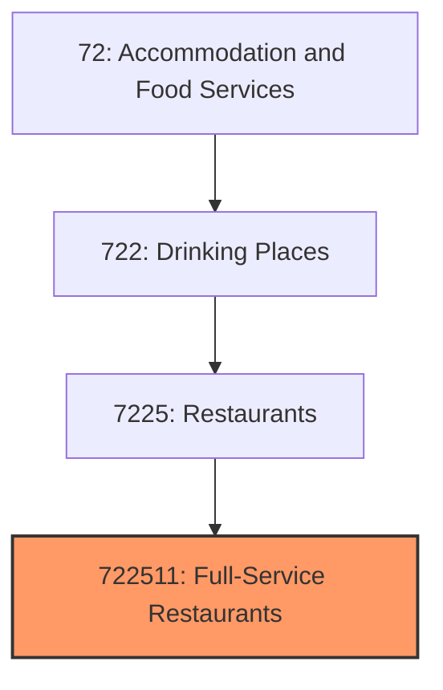
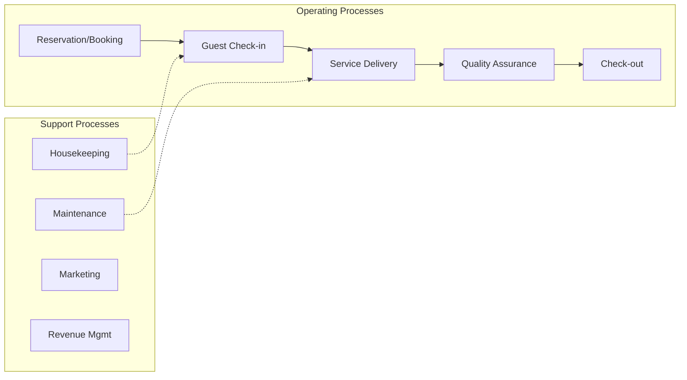

# Full-Service Restaurants

> This U.

## Overview

Full-Service Restaurants represents a specialized segment within the Accommodation and Food Services sector (NAICS 72).

This U.S. industry comprises establishments primarily engaged in providing food services to patrons who order and are served while seated (i.e., waiter/waitress service) and pay after eating. These establishments may provide this type of food service to patrons in combination with selling alcoholic beverages, providing carryout services, or presenting live nontheatrical entertainment. Cross-References. Establishments primarily engaged in--

## Industry Hierarchy

## Key Statistics

| Metric | Value |
|--------|-------|
| NAICS Code | 722511 |
| Level | National Industry |
| Child Industries | 0 |

## Related Occupations

See the [occupations directory](/occupations) for roles commonly found in this industry.

## Core Business Processes

## Industry Value Chain

```mermaid
graph LR
    subgraph Inputs["Inputs"]
        I1["Resources"]
        I2["Expertise"]
        I3["Technology"]
    end

    subgraph Primary["Primary Activities"]
        A1["Inbound Logistics"]
        A2["Core Operations"]
        A3["Quality Assurance"]
        A4["Outbound/Delivery"]
    end

    subgraph Outputs["Products/Services"]
        O1["Products"]
        O2["Services"]
        O3["Solutions"]
    end

    subgraph Customers["Markets"]
        C1["Businesses"]
        C2["Consumers"]
        C3["Government"]
        C4["Institutions"]
    end

    Inputs --> Primary --> Outputs --> Customers
```

---

*Source: NAICS 722511 - Full-Service Restaurants*
