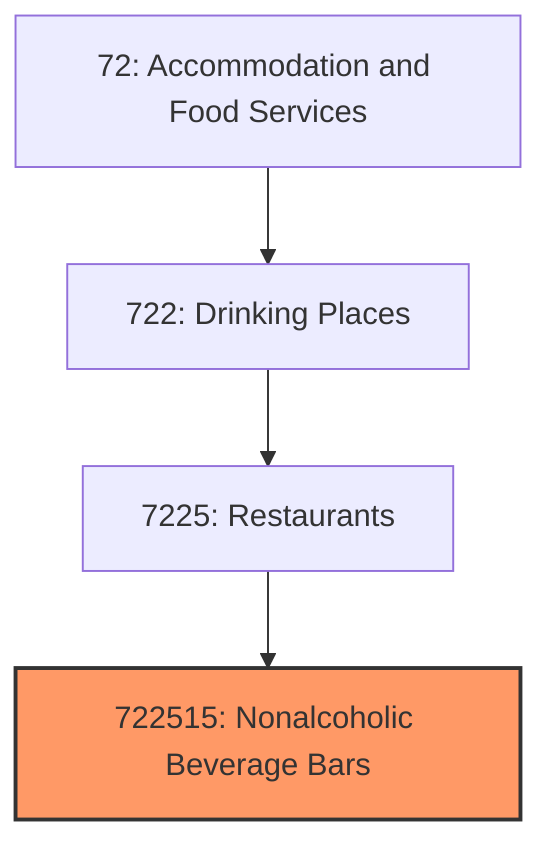
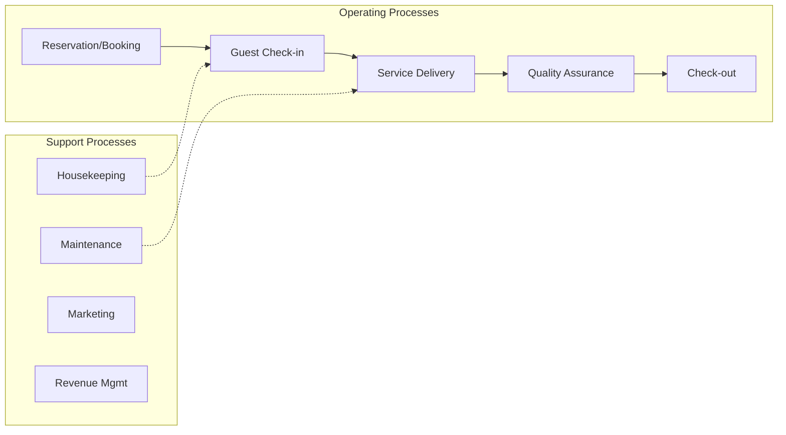

# Nonalcoholic Beverage Bars

> This U.

## Overview

Nonalcoholic Beverage Bars represents a specialized segment within the Accommodation and Food Services sector (NAICS 72).

This U.S. industry comprises establishments primarily engaged in (1) preparing and/or serving a specialty snack, such as ice cream, frozen yogurt, cookies, or popcorn, or (2) serving nonalcoholic beverages, such as coffee, juices, or sodas for consumption on or near the premises. These establishments may carry and sell a combination of snack, nonalcoholic beverage, and other related products (e.g., coffee beans, mugs, coffee makers) but generally promote and sell a unique snack or nonalcoholic beverage. Illustrative Examples: Beverage bars, nonalcoholic, fixed location Doughnut shops, on premise baking and carryout service Bagel shops, on premise baking and carryout service Pretzel shops, on premise baking and carryout service Cookie shops, on premise baking and carryout service Coffee shops, on premise brewing Ice cream parlors Juice bars, nonalcoholic, fixed location Cross-References. Establishments primarily engaged in--

## Industry Hierarchy

## Key Statistics

| Metric | Value |
|--------|-------|
| NAICS Code | 722515 |
| Level | National Industry |
| Child Industries | 0 |

## Related Occupations

See the [occupations directory](/occupations) for roles commonly found in this industry.

## Core Business Processes

## Industry Value Chain

```mermaid
graph LR
    subgraph Inputs["Inputs"]
        I1["Resources"]
        I2["Expertise"]
        I3["Technology"]
    end

    subgraph Primary["Primary Activities"]
        A1["Inbound Logistics"]
        A2["Core Operations"]
        A3["Quality Assurance"]
        A4["Outbound/Delivery"]
    end

    subgraph Outputs["Products/Services"]
        O1["Products"]
        O2["Services"]
        O3["Solutions"]
    end

    subgraph Customers["Markets"]
        C1["Businesses"]
        C2["Consumers"]
        C3["Government"]
        C4["Institutions"]
    end

    Inputs --> Primary --> Outputs --> Customers
```

---

*Source: NAICS 722515 - Nonalcoholic Beverage Bars*
