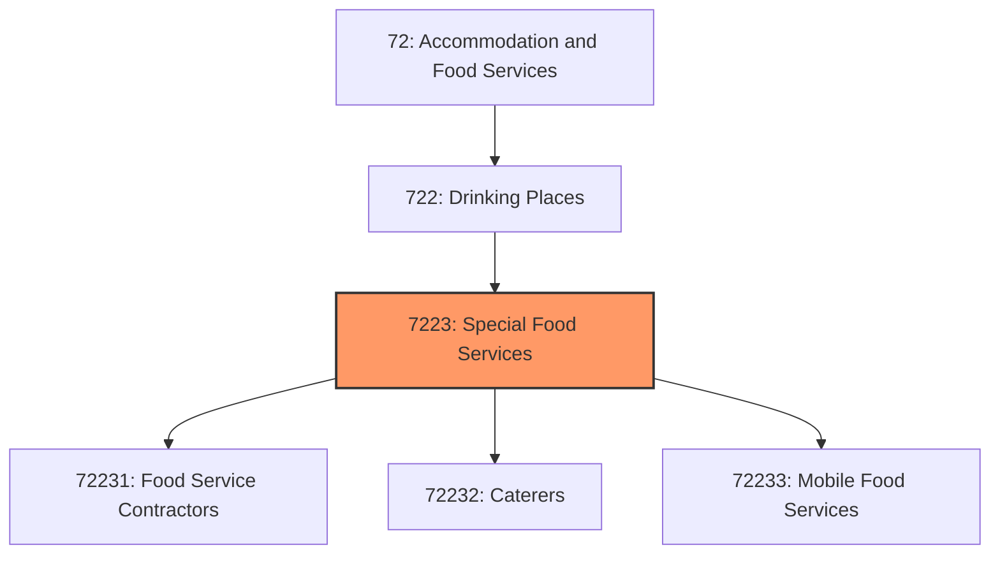
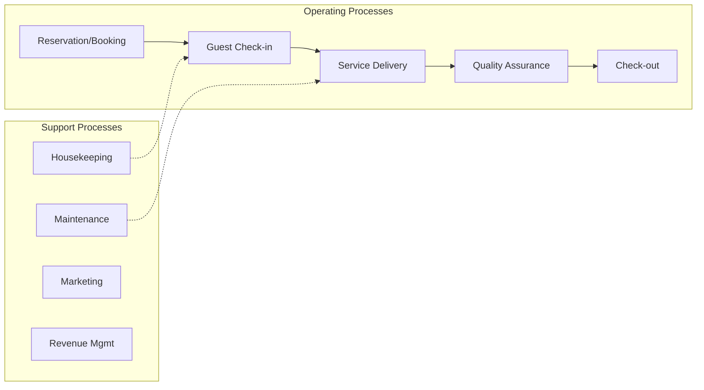

# Special Food Services

> This industry group comprises establishments primarily engaged in providing food services at one or more of the following locations: (1) the customer's location; (2) a location designated by the customer; or (3) from motorized vehicles or nonmotorized carts.

## Overview

Special Food Services represents an important category within the Accommodation and Food Services sector (NAICS 72). This industry group encompasses establishments primarily engaged in special food services.

This industry group comprises establishments primarily engaged in providing food services at one or more of the following locations: (1) the customer's location; (2) a location designated by the customer; or (3) from motorized vehicles or nonmotorized carts.

## Industry Hierarchy

## Key Statistics

| Metric | Value |
|--------|-------|
| NAICS Code | 7223 |
| Level | Industry Group |
| Parent | [Drinking Places](../) |
| Child Industries | 3 |

## Sub-Industries

| Industry | Code | Description |
|----------|------|-------------|
| [Food Service Contractors](./FoodServiceContractors/) | 72231 | See industry description for 722310 |
| [Caterers](./Caterers/) | 72232 | See industry description for 722320 |
| [Mobile Food Services](./MobileFoodServices/) | 72233 | See industry description for 722330 |

## Core Business Processes

## Industry Value Chain

```mermaid
graph LR
    subgraph Inputs["Inputs"]
        I1["Resources"]
        I2["Expertise"]
        I3["Technology"]
    end

    subgraph Primary["Primary Activities"]
        A1["Inbound Logistics"]
        A2["Core Operations"]
        A3["Quality Assurance"]
        A4["Outbound/Delivery"]
    end

    subgraph Outputs["Products/Services"]
        O1["Products"]
        O2["Services"]
        O3["Solutions"]
    end

    subgraph Customers["Markets"]
        C1["Businesses"]
        C2["Consumers"]
        C3["Government"]
        C4["Institutions"]
    end

    Inputs --> Primary --> Outputs --> Customers
```

---

*Source: NAICS 7223 - Special Food Services*
