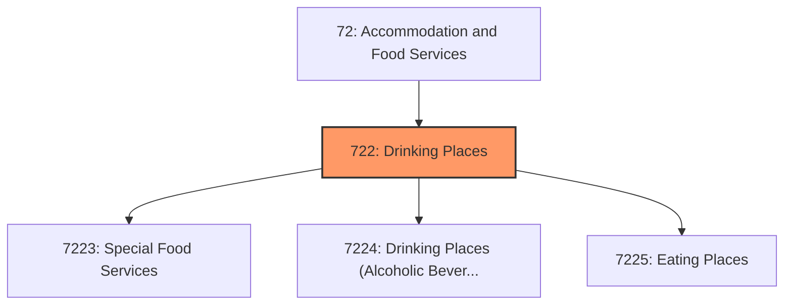
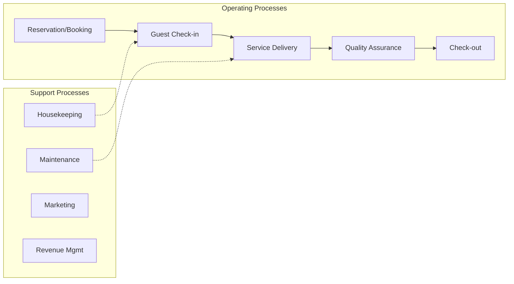

# Drinking Places

> Industries in the Food Services and Drinking Places subsector prepare meals, snacks, and beverages to customer order for immediate on-premises and off-premises consumption.

## Overview

Drinking Places represents an important category within the Accommodation and Food Services sector (NAICS 72). This subsector encompasses establishments primarily engaged in drinking places.

Industries in the Food Services and Drinking Places subsector prepare meals, snacks, and beverages to customer order for immediate on-premises and off-premises consumption. There is a wide range of establishments in these industries. Some provide food and drink only, while others provide various combinations of seating space, waiter/waitress services, and incidental amenities, such as limited entertainment. The industries in the subsector are grouped based on the type and level of services provided. The industry groups are Special Food Services, such as food service contractors, caterers, and mobile food services; Drinking Places (Alcoholic Beverages); and Restaurants and Other Eating Places. Food and beverage services at hotels and motels, amusement parks, theaters, casinos, country clubs, similar recreational facilities, and civic and social organizations are included in this subsector only if these services are provided by a separate establishment primarily engaged in providing food and beverage services. Excluded from this subsector are establishments operating dinner cruises. These establishments are classified in Subsector 487, Scenic and Sightseeing Transportation, because they utilize transportation equipment to provide scenic recreational entertainment.

## Industry Hierarchy

## Key Statistics

| Metric | Value |
|--------|-------|
| NAICS Code | 722 |
| Level | Subsector |
| Parent | [Accommodation](../) |
| Child Industries | 3 |

## Sub-Industries

| Industry | Code | Description |
|----------|------|-------------|
| [Special Food Services](./SpecialFoodServices/) | 7223 | This industry group comprises establishments primarily engaged in providing food |
| [Drinking Places (Alcoholic Beverages)](./DrinkingPlacesAlcoholicBeverages/) | 7224 | Drinking Places (Alcoholic Beverages) |
| [Eating Places](./EatingPlaces/) | 7225 | Eating Places |

## Core Business Processes

## Industry Value Chain

```mermaid
graph LR
    subgraph Inputs["Inputs"]
        I1["Resources"]
        I2["Expertise"]
        I3["Technology"]
    end

    subgraph Primary["Primary Activities"]
        A1["Inbound Logistics"]
        A2["Core Operations"]
        A3["Quality Assurance"]
        A4["Outbound/Delivery"]
    end

    subgraph Outputs["Products/Services"]
        O1["Products"]
        O2["Services"]
        O3["Solutions"]
    end

    subgraph Customers["Markets"]
        C1["Businesses"]
        C2["Consumers"]
        C3["Government"]
        C4["Institutions"]
    end

    Inputs --> Primary --> Outputs --> Customers
```

---

*Source: NAICS 722 - Drinking Places*
