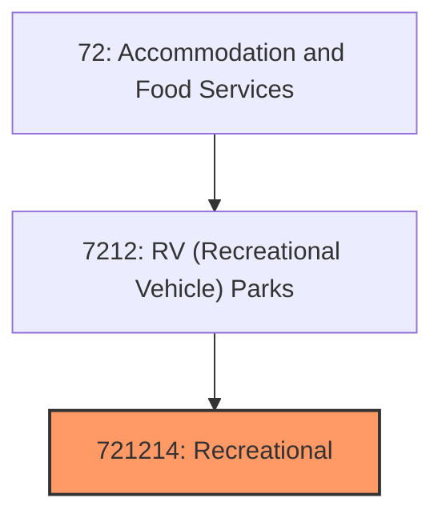
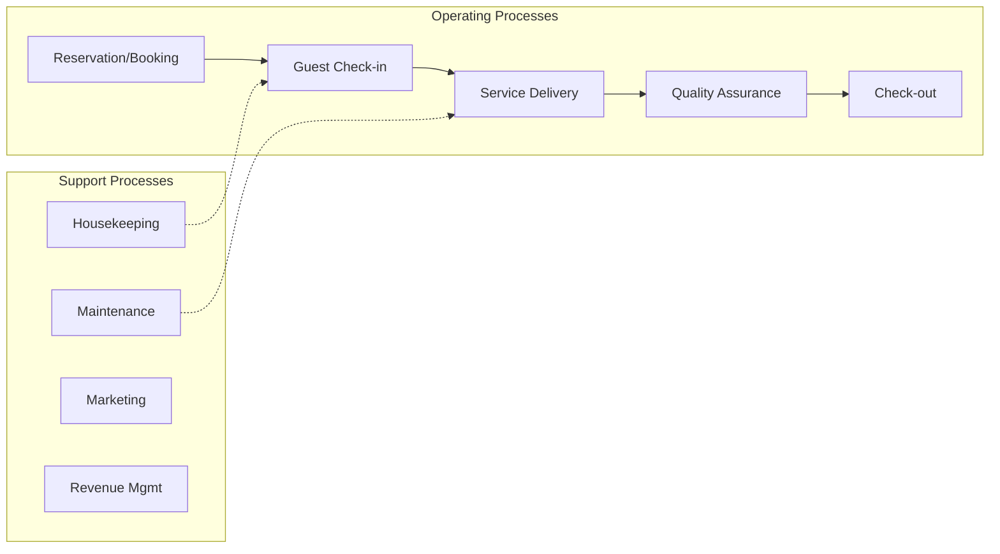

# Recreational

> This U.

## Overview

Recreational represents a specialized segment within the Accommodation and Food Services sector (NAICS 72).

This U.S. industry comprises establishments primarily engaged in operating overnight recreational camps, such as children's camps, family vacation camps, hunting and fishing camps, and outdoor adventure retreats, that offer trail riding, white water rafting, hiking, and similar activities. These establishments provide accommodation facilities, such as cabins and fixed campsites, and other amenities, such as food services, recreational facilities and equipment, and organized recreational activities. Illustrative Examples: Fishing camps with accommodation facilities Dude ranches Vacation camps (except campgrounds, day, instructional) Hunting camps with accommodation facilities Wilderness camps Outdoor adventure retreats with accommodation facilities Cross-References. Establishments primarily engaged in--

## Industry Hierarchy

## Key Statistics

| Metric | Value |
|--------|-------|
| NAICS Code | 721214 |
| Level | National Industry |
| Child Industries | 0 |

## Related Occupations

See the [occupations directory](/occupations) for roles commonly found in this industry.

## Core Business Processes

## Industry Value Chain

```mermaid
graph LR
    subgraph Inputs["Inputs"]
        I1["Resources"]
        I2["Expertise"]
        I3["Technology"]
    end

    subgraph Primary["Primary Activities"]
        A1["Inbound Logistics"]
        A2["Core Operations"]
        A3["Quality Assurance"]
        A4["Outbound/Delivery"]
    end

    subgraph Outputs["Products/Services"]
        O1["Products"]
        O2["Services"]
        O3["Solutions"]
    end

    subgraph Customers["Markets"]
        C1["Businesses"]
        C2["Consumers"]
        C3["Government"]
        C4["Institutions"]
    end

    Inputs --> Primary --> Outputs --> Customers
```

---

*Source: NAICS 721214 - Recreational*
