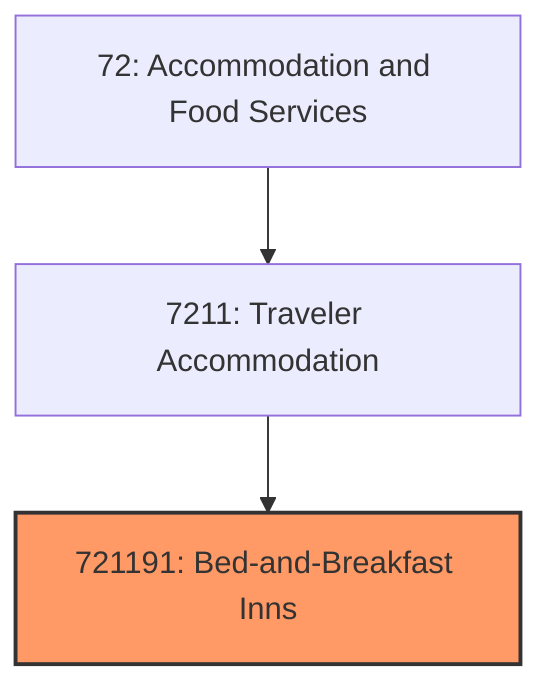
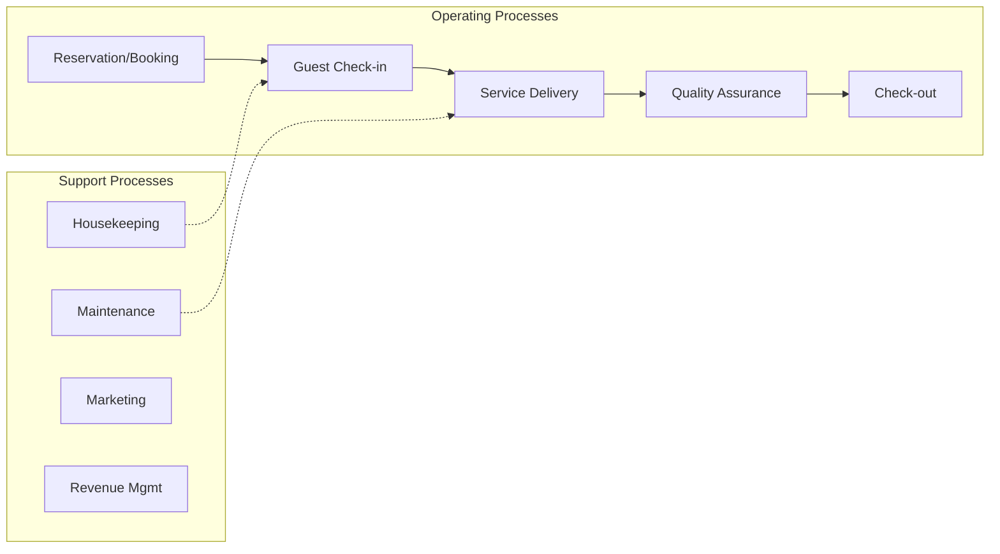

# Bed-and-Breakfast Inns

> This U.

## Overview

Bed-and-Breakfast Inns represents a specialized segment within the Accommodation and Food Services sector (NAICS 72).

This U.S. industry comprises establishments primarily engaged in providing short-term lodging in facilities known as bed-and-breakfast inns. These establishments provide short-term lodging in private homes or small buildings converted for this purpose. Bed-and-breakfast inns are characterized by a highly personalized service and inclusion of a full breakfast in the room rate.

## Industry Hierarchy

## Key Statistics

| Metric | Value |
|--------|-------|
| NAICS Code | 721191 |
| Level | National Industry |
| Child Industries | 0 |

## Related Occupations

See the [occupations directory](/occupations) for roles commonly found in this industry.

## Core Business Processes

## Industry Value Chain

```mermaid
graph LR
    subgraph Inputs["Inputs"]
        I1["Resources"]
        I2["Expertise"]
        I3["Technology"]
    end

    subgraph Primary["Primary Activities"]
        A1["Inbound Logistics"]
        A2["Core Operations"]
        A3["Quality Assurance"]
        A4["Outbound/Delivery"]
    end

    subgraph Outputs["Products/Services"]
        O1["Products"]
        O2["Services"]
        O3["Solutions"]
    end

    subgraph Customers["Markets"]
        C1["Businesses"]
        C2["Consumers"]
        C3["Government"]
        C4["Institutions"]
    end

    Inputs --> Primary --> Outputs --> Customers
```

---

*Source: NAICS 721191 - Bed-and-Breakfast Inns*
