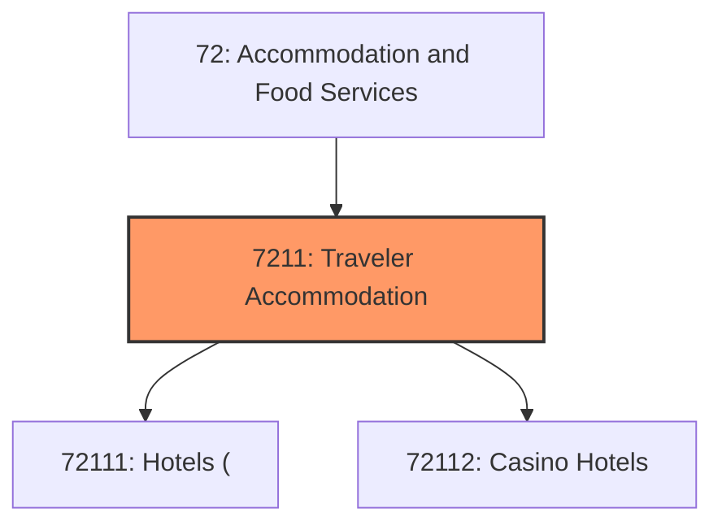
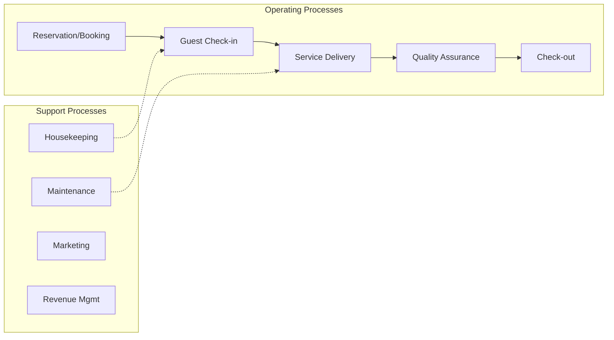

# Traveler Accommodation

> This industry group comprises establishments primarily engaged in providing short-term lodging in facilities, such as hotels, motels, casino hotels, and bed-and-breakfast inns.

## Overview

Traveler Accommodation represents an important category within the Accommodation and Food Services sector (NAICS 72).

This industry group comprises establishments primarily engaged in providing short-term lodging in facilities, such as hotels, motels, casino hotels, and bed-and-breakfast inns. In addition to lodging, these establishments may provide a range of other services to their guests.

## Industry Hierarchy

## Key Statistics

| Metric | Value |
|--------|-------|
| NAICS Code | 7211 |
| Level | Industry Group |
| Child Industries | 2 |

## Sub-Industries

| Industry | Code | Description |
|----------|------|-------------|
| [Hotels (](./Hotels/) | 72111 | See industry description for 721110 |
| [Casino Hotels](./CasinoHotels/) | 72112 | See industry description for 721120 |

## Related Occupations

See the [occupations directory](/occupations) for roles commonly found in this industry.

## Core Business Processes

## Industry Value Chain

```mermaid
graph LR
    subgraph Inputs["Inputs"]
        I1["Resources"]
        I2["Expertise"]
        I3["Technology"]
    end

    subgraph Primary["Primary Activities"]
        A1["Inbound Logistics"]
        A2["Core Operations"]
        A3["Quality Assurance"]
        A4["Outbound/Delivery"]
    end

    subgraph Outputs["Products/Services"]
        O1["Products"]
        O2["Services"]
        O3["Solutions"]
    end

    subgraph Customers["Markets"]
        C1["Businesses"]
        C2["Consumers"]
        C3["Government"]
        C4["Institutions"]
    end

    Inputs --> Primary --> Outputs --> Customers
```

---

*Source: NAICS 7211 - Traveler Accommodation*
