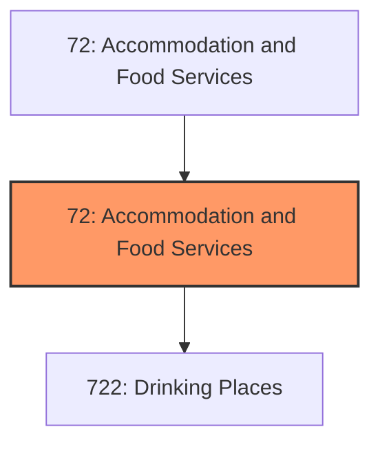
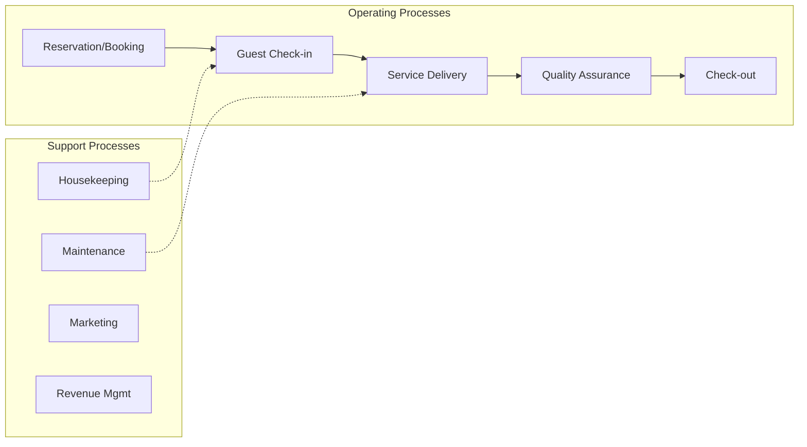

# Accommodation and Food Services

> The Sector as a Whole The Accommodation and Food Services sector comprises establishments providing customers with lodging and/or preparing meals, snacks, and beverages for immediate consumption.

## Overview

Accommodation and Food Services represents an important category within the Accommodation and Food Services sector (NAICS 72). This sector encompasses establishments primarily engaged in accommodation and food services.

The Sector as a Whole The Accommodation and Food Services sector comprises establishments providing customers with lodging and/or preparing meals, snacks, and beverages for immediate consumption. The sector includes both accommodation and food services establishments because the two activities are often combined at the same establishment. Some establishments that provide food and beverage services are classified in other sectors. Excluded from this sector are civic and social organizations. These establishments are classified in Sector 81, Other Services (except Public Administration). Amusement and recreation parks, dinner theaters, and other recreation or entertainment facilities are classified in Sector 71, Arts, Entertainment, and Recreation. Motion picture theaters are classified in Sector 51, Information.

## Industry Hierarchy

## Key Statistics

| Metric | Value |
|--------|-------|
| NAICS Code | 72 |
| Level | Sector |
| Child Industries | 1 |

## Sub-Industries

| Industry | Code | Description |
|----------|------|-------------|
| [Drinking Places](./DrinkingPlaces/) | 722 | Industries in the Food Services and Drinking Places subsector prepare meals, sna |

## Core Business Processes

## Industry Value Chain

## Market Context

Manufacturing transforms raw materials into finished goods, with Industry 4.0 driving automation, digitalization, and smart factory implementations.

| Aspect | Details |
|--------|---------|
| Industry Sector | Accommodation |
| NAICS/SIC Code | 72 |
| Market Segment | Accommodation and Food Services |

## Key Business Processes

- Production planning
- Manufacturing operations
- Quality assurance
- Inventory management
- Distribution and logistics

## Common Occupations

- [Industrial Production Managers](/occupations/Management/IndustrialProductionManagers)
- [Production Workers](/occupations/Production/ProductionWorkers)
- [Quality Control Inspectors](/occupations/Production/QualityControlInspectors)
- [Industrial Engineers](/occupations/Engineering/IndustrialEngineers)

## Regulations and Standards

- OSHA Manufacturing Standards
- EPA Environmental Regulations
- FDA regulations (where applicable)
- ISO quality standards
- Industry-specific certifications

## Technology and Tools

- Industrial automation and robotics
- Enterprise Resource Planning (ERP)
- Quality management systems
- Predictive maintenance
- IoT and smart manufacturing

## Industry Trends

- Digital transformation and automation adoption
- Sustainability and environmental compliance focus
- Workforce development and skills training
- Supply chain resilience and optimization
- Customer experience enhancement

---

*Source: NAICS 72 - Accommodation and Food Services*
