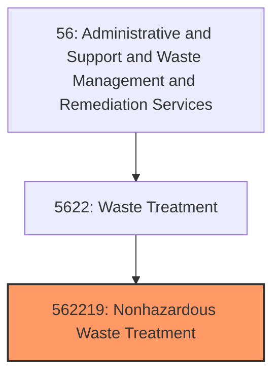
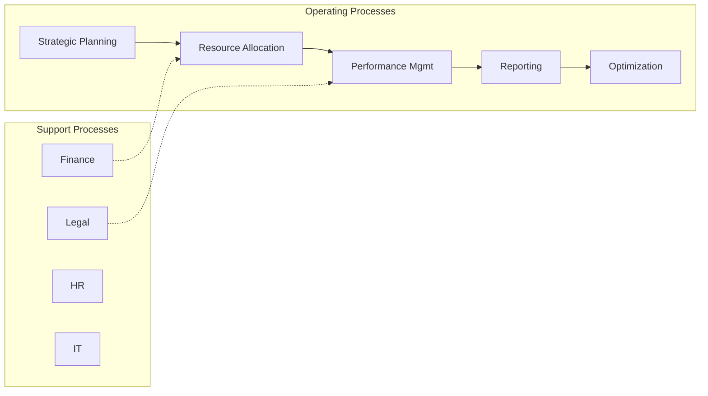

# Nonhazardous Waste Treatment

> This U.

## Overview

Nonhazardous Waste Treatment represents a specialized segment within the Administrative and Support and Waste Management and Remediation Services sector (NAICS 56).

This U.S. industry comprises establishments primarily engaged in (1) operating nonhazardous waste treatment and disposal facilities (except landfills, combustors, incinerators, and sewer systems or sewage treatment facilities) or (2) the combined activity of collecting and/or hauling of nonhazardous waste materials within a local area and operating waste treatment or disposal facilities (except landfills, combustors, incinerators, and sewer systems or sewage treatment facilities). Compost dumps are included in this industry. Cross-References. Establishments primarily engaged in--

## Industry Hierarchy

## Key Statistics

| Metric | Value |
|--------|-------|
| NAICS Code | 562219 |
| Level | National Industry |
| Child Industries | 0 |

## Related Occupations

See the [occupations directory](/occupations) for roles commonly found in this industry.

## Core Business Processes

## Industry Value Chain

```mermaid
graph LR
    subgraph Inputs["Inputs"]
        I1["Resources"]
        I2["Expertise"]
        I3["Technology"]
    end

    subgraph Primary["Primary Activities"]
        A1["Inbound Logistics"]
        A2["Core Operations"]
        A3["Quality Assurance"]
        A4["Outbound/Delivery"]
    end

    subgraph Outputs["Products/Services"]
        O1["Products"]
        O2["Services"]
        O3["Solutions"]
    end

    subgraph Customers["Markets"]
        C1["Businesses"]
        C2["Consumers"]
        C3["Government"]
        C4["Institutions"]
    end

    Inputs --> Primary --> Outputs --> Customers
```

---

*Source: NAICS 562219 - Nonhazardous Waste Treatment*
