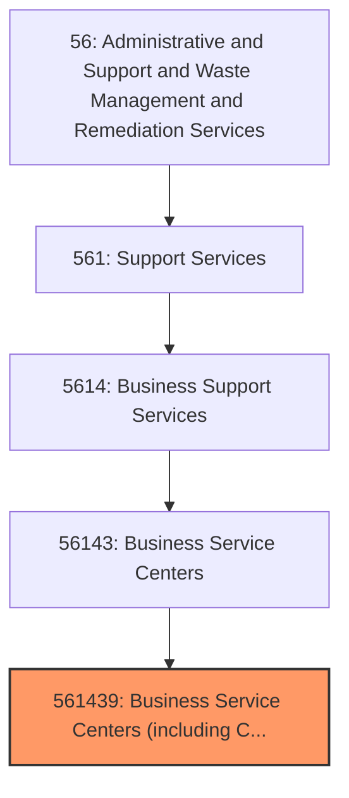
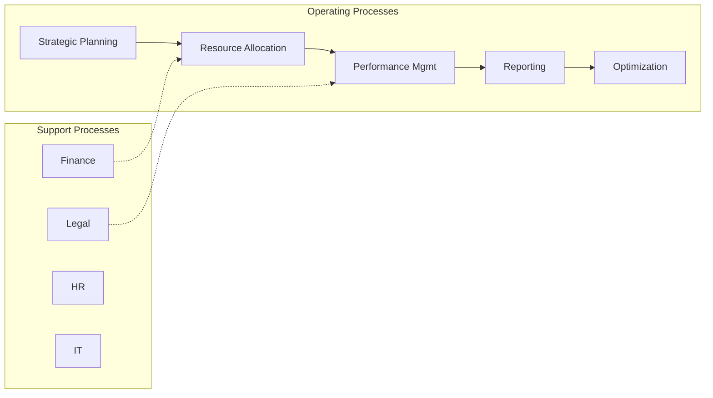

# Business Service Centers (including Copy Shops)

> This U.S.

## Overview

Business Service Centers (including Copy Shops) represents a specialized segment within the Administrative and Support and Waste Management and Remediation Services sector (NAICS 56). This national industry encompasses establishments primarily engaged in business service centers (including copy shops).

This U.S. industry comprises (1) establishments generally known as copy centers or shops primarily engaged in providing photocopying, duplicating, blueprinting, and other document copying services, without also providing printing services (e.g., offset printing, quick printing, digital printing, prepress services) and (2) establishments (except private mail centers) engaged in providing a range of office support services (except printing services), such as document copying services, facsimile services, word processing services, on-site PC rental services, and office product sales. Cross-References.

## Industry Hierarchy

## Key Statistics

| Metric | Value |
|--------|-------|
| NAICS Code | 561439 |
| Level | National Industry |
| Parent | [Business Service Centers](../) |
| Child Industries | 0 |

## Core Business Processes

## Industry Value Chain

---

*Source: NAICS 561439 - Business Service Centers (including Copy Shops)*
