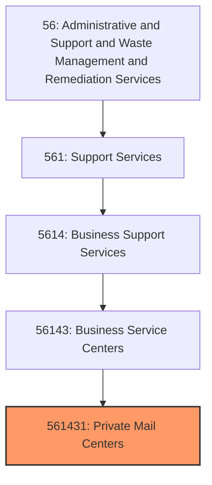
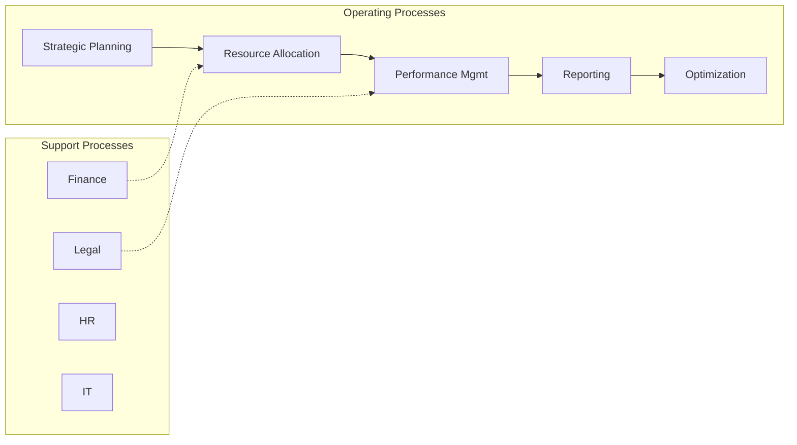

# Private Mail Centers

> This U.S.

## Overview

Private Mail Centers represents a specialized segment within the Administrative and Support and Waste Management and Remediation Services sector (NAICS 56). This national industry encompasses establishments primarily engaged in private mail centers.

This U.S. industry comprises (1) establishments primarily engaged in providing mailbox rental and other postal and mailing (except direct mail advertising) services or (2) establishments engaged in providing these mailing services along with one or more other office support services, such as facsimile services, word processing services, on-site PC rental services, and office product sales. Cross-References. Establishments primarily engaged in--

## Industry Hierarchy

## Key Statistics

| Metric | Value |
|--------|-------|
| NAICS Code | 561431 |
| Level | National Industry |
| Parent | [Business Service Centers](../) |
| Child Industries | 0 |

## Core Business Processes

## Industry Value Chain

```mermaid
graph LR
    subgraph Inputs["Inputs"]
        I1["Resources"]
        I2["Expertise"]
        I3["Technology"]
    end

    subgraph Primary["Primary Activities"]
        A1["Inbound Logistics"]
        A2["Core Operations"]
        A3["Quality Assurance"]
        A4["Outbound/Delivery"]
    end

    subgraph Outputs["Products/Services"]
        O1["Products"]
        O2["Services"]
        O3["Solutions"]
    end

    subgraph Customers["Markets"]
        C1["Businesses"]
        C2["Consumers"]
        C3["Government"]
        C4["Institutions"]
    end

    Inputs --> Primary --> Outputs --> Customers
```

---

*Source: NAICS 561431 - Private Mail Centers*
