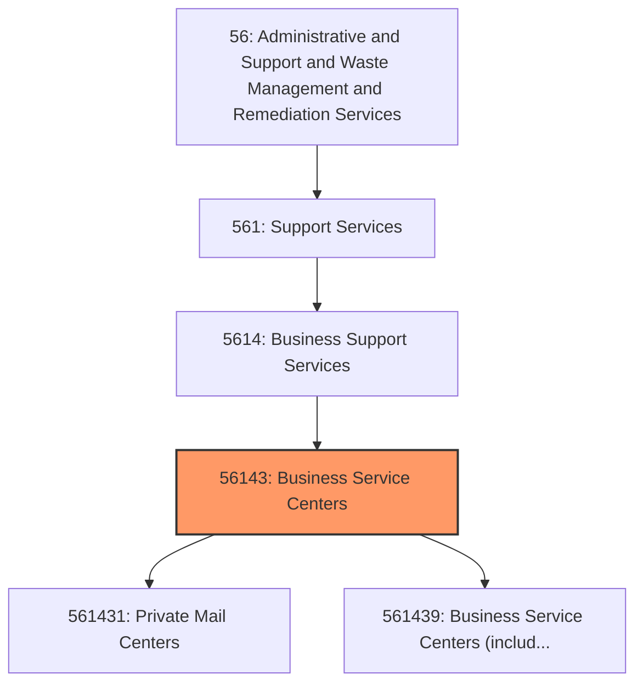
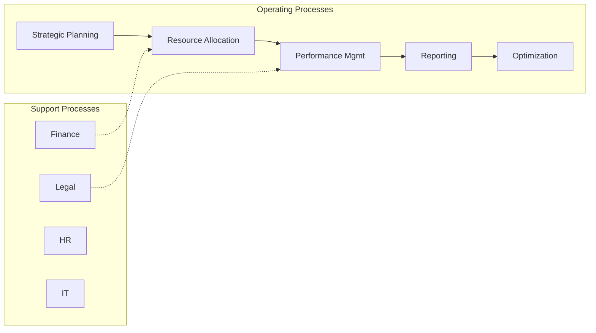

# Business Service Centers

> This industry comprises (1) establishments primarily engaged in providing mailbox rental and other postal and mailing services (except direct mail advertising); (2) establishments, generally known as copy centers or shops, primarily engaged in providing photocopying, duplicating, blueprinting, and other document copying services without also providing printing services (i.

## Overview

Business Service Centers represents an important category within the Administrative and Support and Waste Management and Remediation Services sector (NAICS 56). This industry encompasses establishments primarily engaged in business service centers.

This industry comprises (1) establishments primarily engaged in providing mailbox rental and other postal and mailing services (except direct mail advertising); (2) establishments, generally known as copy centers or shops, primarily engaged in providing photocopying, duplicating, blueprinting, and other document copying services without also providing printing services (i.e., offset printing, quick printing, digital printing, prepress services); and (3) establishments that provide a range of office support services (except printing services), such as mailing services, document copying services, facsimile services, word processing services, on-site PC rental services, and office product sales. Cross-References. Establishments primarily engaged in--

## Industry Hierarchy

## Key Statistics

| Metric | Value |
|--------|-------|
| NAICS Code | 56143 |
| Level | Industry |
| Parent | [Business Support Services](../) |
| Child Industries | 2 |

## Sub-Industries

| Industry | Code | Description |
|----------|------|-------------|
| [Private Mail Centers](./PrivateMailCenters.mdx) | 561431 | This U |
| [Business Service Centers (including Copy Shops)](./BusinessServiceCentersIncludingCopyShops.mdx) | 561439 | This U |

## Core Business Processes

## Industry Value Chain

---

*Source: NAICS 56143 - Business Service Centers*
