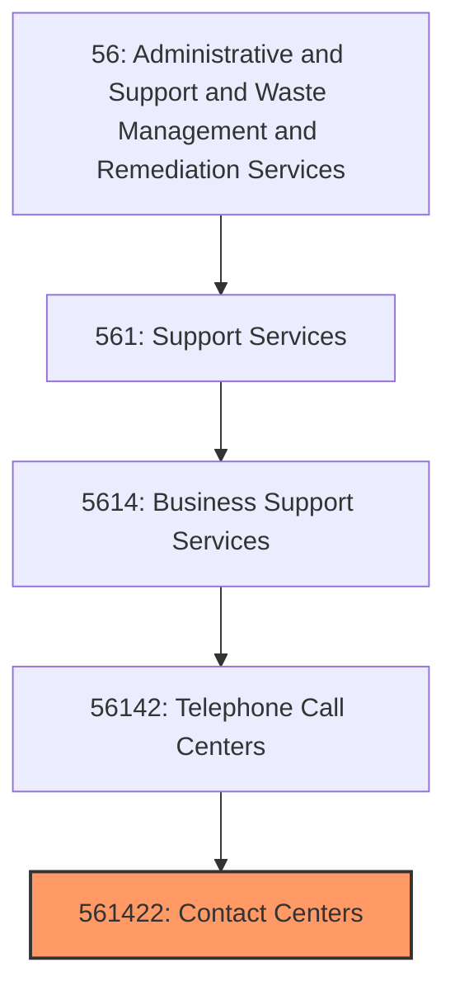
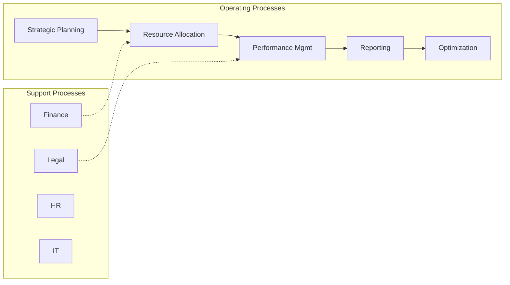

# Contact Centers

> This U.

## Overview

Contact Centers represents a specialized segment within the Administrative and Support and Waste Management and Remediation Services sector (NAICS 56).

This U.S. industry comprises establishments primarily engaged in operating call centers that initiate or receive communications via telephone, facsimile, email, or other communication modes for purposes such as: (1) promoting products or services, (2) taking orders, (3) soliciting contributions, and (4) providing information or assistance regarding products or services. Telemarketing bureaus and other contact centers provide these services on behalf of clients and do not own the products or provide the services that they are representing, or they serve other establishments of the same enterprise. Cross-References. Establishments primarily engaged in--

## Industry Hierarchy

## Key Statistics

| Metric | Value |
|--------|-------|
| NAICS Code | 561422 |
| Level | National Industry |
| Parent | [Telephone Call Centers](../) |
| Child Industries | 0 |

## Related Occupations

- [Administrative Services Managers](/occupations/Management/AdministrativeServicesManagers) - Plan and coordinate support services
- [Janitors and Cleaners](/occupations/JanitorsAndCleaners) - Keep buildings clean and orderly
- [Security Guards](/occupations/PublicSafety/SecurityGuards) - Guard and patrol property
- [Landscaping and Groundskeeping Workers](/occupations/Facilities/LandscapingAndGroundskeepingWorkers) - Maintain grounds and landscapes

## Core Business Processes

## Industry Value Chain

## Regulatory Environment

- **OSHA** (Occupational Safety and Health Administration) - Enforces workplace safety for service workers
- **EPA** (Environmental Protection Agency) - Regulates waste management and cleaning chemical use
- **State Licensing Boards** - Govern security, janitorial, and staffing licenses
- **Department of Labor** - Enforces wage, hour, and employment standards

## Technology & Innovation

- **Robotic Process Automation** - Automated data entry, scheduling, and workflow management
- **AI-Powered Staffing** - Machine learning job matching and candidate screening
- **IoT Facility Management** - Smart sensors for cleaning schedules and building maintenance
- **Drone Services** - Aerial inspection, security surveillance, and landscaping assessment

## Industry Outlook

The administrative and support services sector is growing with demand for outsourced business functions, temporary staffing, and facility services. Automation and AI are transforming staffing, security, and facility management operations. Labor market dynamics continue to drive demand for flexible workforce solutions, while environmental services and waste management benefit from sustainability mandates.

---

*Source: NAICS 561422 - Contact Centers*
