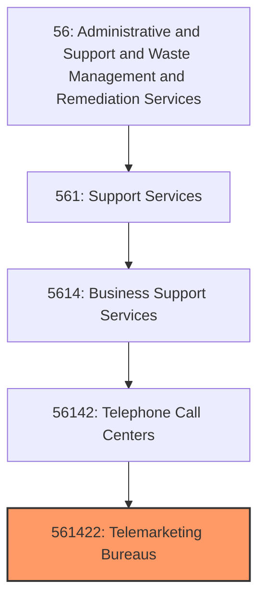
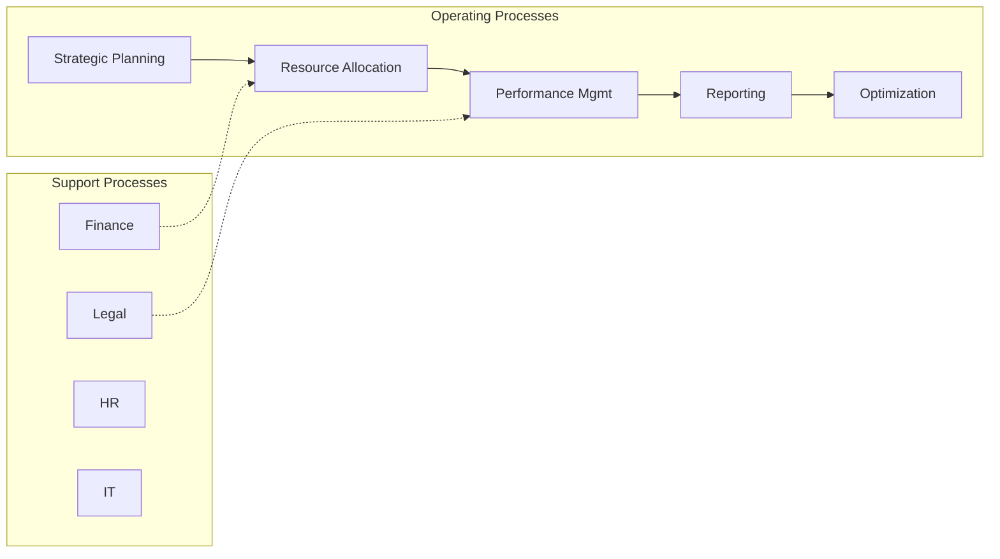

# Telemarketing Bureaus

> This U.S. industry comprises establishments primarily engaged in operating call centers that initiate or receive communications via telephone, facsimile, email, or other communication modes for purposes such as: (1) promoting products or services, (2) taking orders, (3) soliciting contributions, and (4) providing information or assistance regarding products or services.
## Overview

Telemarketing Bureaus represents a specialized segment within the Administrative and Support and Waste Management and Remediation Services sector (NAICS 56). This national industry encompasses establishments primarily engaged in telemarketing bureaus.

This U.S. industry comprises establishments primarily engaged in operating call centers that initiate or receive communications via telephone, facsimile, email, or other communication modes for purposes such as: (1) promoting products or services, (2) taking orders, (3) soliciting contributions, and (4) providing information or assistance regarding products or services. Telemarketing bureaus and other contact centers provide these services on behalf of clients and do not own the products or provide the services that they are representing, or they serve other establishments of the same enterprise. Cross-References. Establishments primarily engaged in--

## Industry Hierarchy

## Key Statistics

| Metric | Value |
|--------|-------|
| NAICS Code | 561422 |
| Level | National Industry |
| Parent | [Telephone Call Centers](../) |
| Child Industries | 0 |

## Core Business Processes

## Industry Value Chain

```mermaid
graph LR
    subgraph Inputs["Inputs"]
        I1["Resources"]
        I2["Expertise"]
        I3["Technology"]
    end

    subgraph Primary["Primary Activities"]
        A1["Inbound Logistics"]
        A2["Core Operations"]
        A3["Quality Assurance"]
        A4["Outbound/Delivery"]
    end

    subgraph Outputs["Products/Services"]
        O1["Products"]
        O2["Services"]
        O3["Solutions"]
    end

    subgraph Customers["Markets"]
        C1["Businesses"]
        C2["Consumers"]
        C3["Government"]
        C4["Institutions"]
    end

    Inputs --> Primary --> Outputs --> Customers
```

## Market Context

Manufacturing transforms raw materials into finished goods, with Industry 4.0 driving automation, digitalization, and smart factory implementations.

| Aspect | Details |
|--------|---------|
| Industry Sector | Administrative |
| NAICS/SIC Code | 561422 |
| Market Segment | Telemarketing Bureaus |

## Key Business Processes

- Production planning
- Manufacturing operations
- Quality assurance
- Inventory management
- Distribution and logistics

## Common Occupations

- [Industrial Production Managers](/occupations/Management/IndustrialProductionManagers)
- [Production Workers](/occupations/Production/ProductionWorkers)
- [Quality Control Inspectors](/occupations/Production/QualityControlInspectors)
- [Industrial Engineers](/occupations/Engineering/IndustrialEngineers)

## Regulations and Standards

- OSHA Manufacturing Standards
- EPA Environmental Regulations
- FDA regulations (where applicable)
- ISO quality standards
- Industry-specific certifications

## Technology and Tools

- Industrial automation and robotics
- Enterprise Resource Planning (ERP)
- Quality management systems
- Predictive maintenance
- IoT and smart manufacturing

## Industry Trends

- Digital transformation and automation adoption
- Sustainability and environmental compliance focus
- Workforce development and skills training
- Supply chain resilience and optimization
- Customer experience enhancement

---

*Source: NAICS 561422 - Telemarketing Bureaus*
