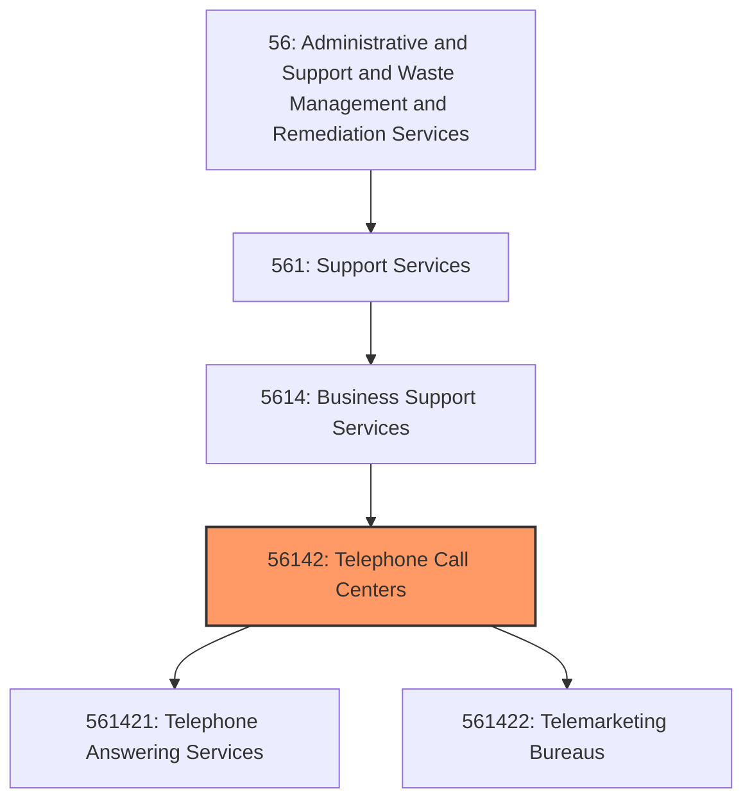
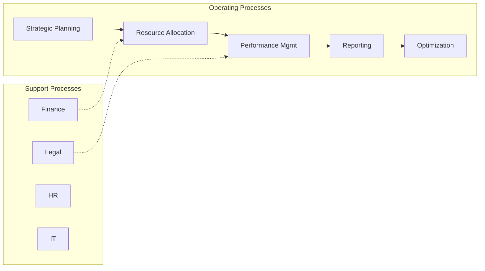

# Telephone Call Centers

> This industry comprises (1) establishments primarily engaged in answering telephone calls and relaying messages and (2) establishments primarily engaged in providing telemarketing services, such as promoting products or services by telephone; taking orders by telephone, facsimile, email, or other communication modes; and soliciting contributions or providing information by telephone.

## Overview

Telephone Call Centers represents an important category within the Administrative and Support and Waste Management and Remediation Services sector (NAICS 56). This industry encompasses establishments primarily engaged in telephone call centers.

This industry comprises (1) establishments primarily engaged in answering telephone calls and relaying messages and (2) establishments primarily engaged in providing telemarketing services, such as promoting products or services by telephone; taking orders by telephone, facsimile, email, or other communication modes; and soliciting contributions or providing information by telephone. Telephone call centers provide these services on behalf of clients and do not own the products or provide the services that they are representing, or they serve other establishments of the same enterprise. Cross-References. Establishments primarily engaged in--

## Industry Hierarchy

## Key Statistics

| Metric | Value |
|--------|-------|
| NAICS Code | 56142 |
| Level | Industry |
| Parent | [Business Support Services](../) |
| Child Industries | 2 |

## Sub-Industries

| Industry | Code | Description |
|----------|------|-------------|
| [Telephone Answering Services](./TelephoneAnsweringServices.mdx) | 561421 | This U |
| [Telemarketing Bureaus](./TelemarketingBureaus.mdx) | 561422 | This U |

## Core Business Processes

## Industry Value Chain

```mermaid
graph LR
    subgraph Inputs["Inputs"]
        I1["Resources"]
        I2["Expertise"]
        I3["Technology"]
    end

    subgraph Primary["Primary Activities"]
        A1["Inbound Logistics"]
        A2["Core Operations"]
        A3["Quality Assurance"]
        A4["Outbound/Delivery"]
    end

    subgraph Outputs["Products/Services"]
        O1["Products"]
        O2["Services"]
        O3["Solutions"]
    end

    subgraph Customers["Markets"]
        C1["Businesses"]
        C2["Consumers"]
        C3["Government"]
        C4["Institutions"]
    end

    Inputs --> Primary --> Outputs --> Customers
```

---

*Source: NAICS 56142 - Telephone Call Centers*
