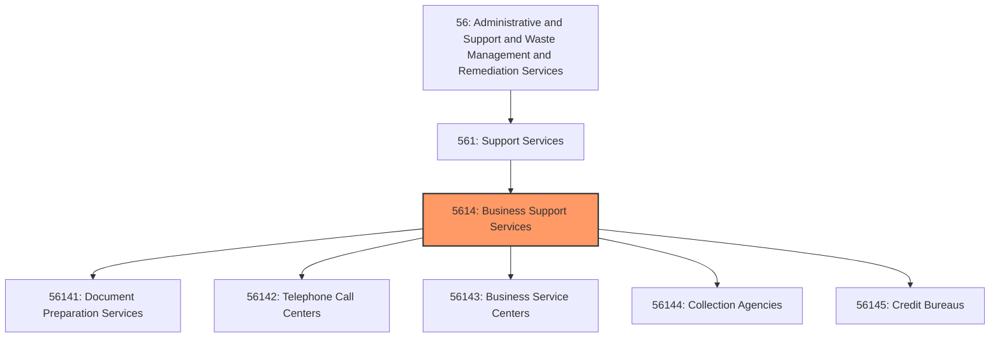
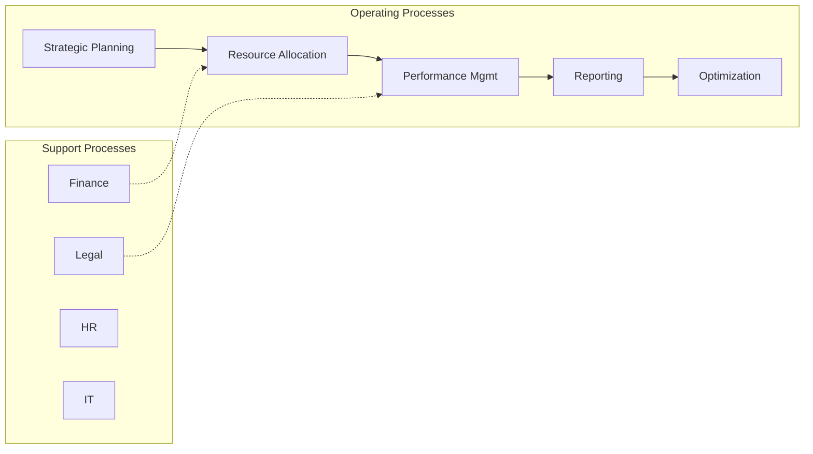

# Business Support Services

> This industry group comprises establishments engaged in performing activities that are ongoing routine business support functions for clients on a contract or fee basis, or serving other establishments of the same enterprise.

## Overview

Business Support Services represents an important category within the Administrative and Support and Waste Management and Remediation Services sector (NAICS 56). This industry group encompasses establishments primarily engaged in business support services.

This industry group comprises establishments engaged in performing activities that are ongoing routine business support functions for clients on a contract or fee basis, or serving other establishments of the same enterprise.

## Industry Hierarchy

## Key Statistics

| Metric | Value |
|--------|-------|
| NAICS Code | 5614 |
| Level | Industry Group |
| Parent | [Support Services](../) |
| Child Industries | 5 |

## Sub-Industries

| Industry | Code | Description |
|----------|------|-------------|
| [Document Preparation Services](./DocumentPreparationServices/) | 56141 | See industry description for 561410 |
| [Telephone Call Centers](./TelephoneCallCenters/) | 56142 | This industry comprises (1) establishments primarily engaged in answering teleph |
| [Business Service Centers](./BusinessServiceCenters/) | 56143 | This industry comprises (1) establishments primarily engaged in providing mailbo |
| [Collection Agencies](./CollectionAgencies/) | 56144 | See industry description for 561440 |
| [Credit Bureaus](./CreditBureaus/) | 56145 | See industry description for 561450 |

## Core Business Processes

## Industry Value Chain

## Market Context

Manufacturing transforms raw materials into finished goods, with Industry 4.0 driving automation, digitalization, and smart factory implementations.

| Aspect | Details |
|--------|---------|
| Industry Sector | Administrative |
| NAICS/SIC Code | 5614 |
| Market Segment | Business Support Services |

## Key Business Processes

- Production planning
- Manufacturing operations
- Quality assurance
- Inventory management
- Distribution and logistics

## Common Occupations

- [Industrial Production Managers](/occupations/Management/IndustrialProductionManagers)
- [Production Workers](/occupations/Production/ProductionWorkers)
- [Quality Control Inspectors](/occupations/Production/QualityControlInspectors)
- [Industrial Engineers](/occupations/Engineering/IndustrialEngineers)

## Regulations and Standards

- OSHA Manufacturing Standards
- EPA Environmental Regulations
- FDA regulations (where applicable)
- ISO quality standards
- Industry-specific certifications

## Technology and Tools

- Industrial automation and robotics
- Enterprise Resource Planning (ERP)
- Quality management systems
- Predictive maintenance
- IoT and smart manufacturing

## Industry Trends

- Digital transformation and automation adoption
- Sustainability and environmental compliance focus
- Workforce development and skills training
- Supply chain resilience and optimization
- Customer experience enhancement

---

*Source: NAICS 5614 - Business Support Services*
