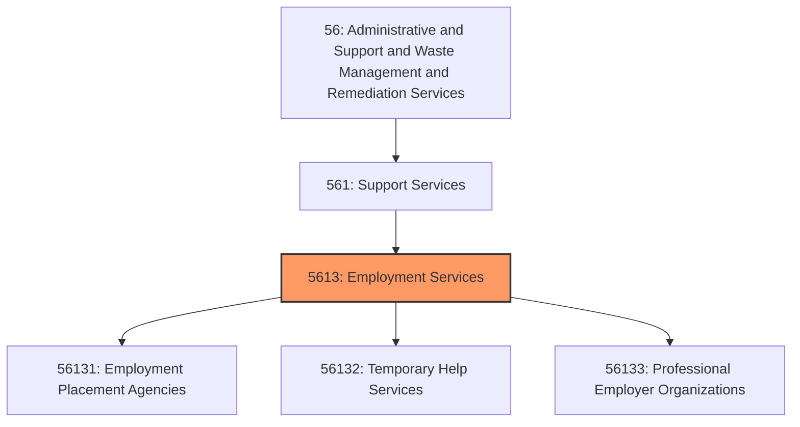
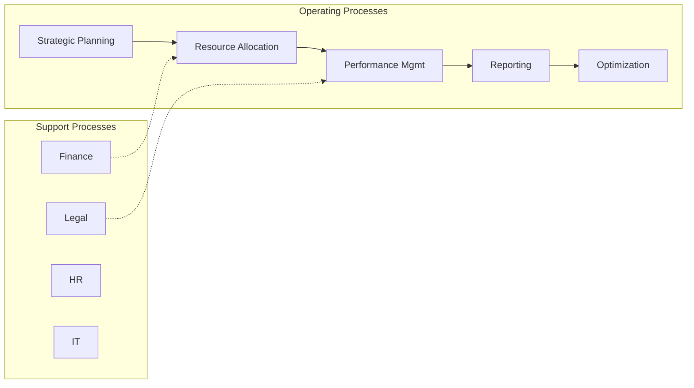

# Employment Services

> This industry group comprises establishments primarily engaged in one of the following: (1) listing employment vacancies and referring or placing applicants for employment; (2) providing executive search, recruitment, and placement services; (3) supplying workers to clients' businesses for limited periods of time to supplement the working force of the client; or (4) providing human resources and human resource management services to client businesses and households.

## Overview

Employment Services represents an important category within the Administrative and Support and Waste Management and Remediation Services sector (NAICS 56). This industry group encompasses establishments primarily engaged in employment services.

This industry group comprises establishments primarily engaged in one of the following: (1) listing employment vacancies and referring or placing applicants for employment; (2) providing executive search, recruitment, and placement services; (3) supplying workers to clients' businesses for limited periods of time to supplement the working force of the client; or (4) providing human resources and human resource management services to client businesses and households.

## Industry Hierarchy

## Key Statistics

| Metric | Value |
|--------|-------|
| NAICS Code | 5613 |
| Level | Industry Group |
| Parent | [Support Services](../) |
| Child Industries | 3 |

## Sub-Industries

| Industry | Code | Description |
|----------|------|-------------|
| [Employment Placement Agencies](./EmploymentPlacementAgencies/) | 56131 | This industry comprises establishments primarily engaged in one of the following |
| [Temporary Help Services](./TemporaryHelpServices/) | 56132 | See industry description for 561320 |
| [Professional Employer Organizations](./ProfessionalEmployerOrganizations/) | 56133 | See industry description for 561330 |

## Core Business Processes

## Industry Value Chain

## Market Context

Manufacturing transforms raw materials into finished goods, with Industry 4.0 driving automation, digitalization, and smart factory implementations.

| Aspect | Details |
|--------|---------|
| Industry Sector | Administrative |
| NAICS/SIC Code | 5613 |
| Market Segment | Employment Services |

## Key Business Processes

- Production planning
- Manufacturing operations
- Quality assurance
- Inventory management
- Distribution and logistics

## Common Occupations

- [Industrial Production Managers](/occupations/Management/IndustrialProductionManagers)
- [Production Workers](/occupations/Production/ProductionWorkers)
- [Quality Control Inspectors](/occupations/Production/QualityControlInspectors)
- [Industrial Engineers](/occupations/Engineering/IndustrialEngineers)

## Regulations and Standards

- OSHA Manufacturing Standards
- EPA Environmental Regulations
- FDA regulations (where applicable)
- ISO quality standards
- Industry-specific certifications

## Technology and Tools

- Industrial automation and robotics
- Enterprise Resource Planning (ERP)
- Quality management systems
- Predictive maintenance
- IoT and smart manufacturing

## Industry Trends

- Digital transformation and automation adoption
- Sustainability and environmental compliance focus
- Workforce development and skills training
- Supply chain resilience and optimization
- Customer experience enhancement

---

*Source: NAICS 5613 - Employment Services*
