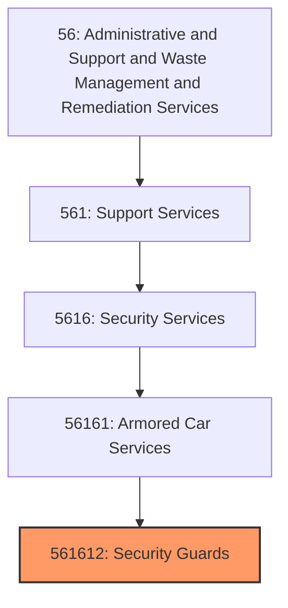
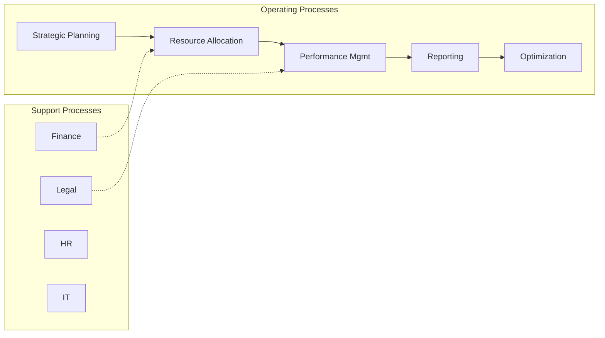

# Security Guards

> This U.S.

## Overview

Security Guards represents a specialized segment within the Administrative and Support and Waste Management and Remediation Services sector (NAICS 56). This national industry encompasses establishments primarily engaged in security guards.

This U.S. industry comprises establishments primarily engaged in providing guard and patrol services, such as bodyguard, guard dog, and parking security services. Cross-References.

## Industry Hierarchy

## Key Statistics

| Metric | Value |
|--------|-------|
| NAICS Code | 561612 |
| Level | National Industry |
| Parent | [Armored Car Services](../) |
| Child Industries | 0 |

## Core Business Processes

## Industry Value Chain

```mermaid
graph LR
    subgraph Inputs["Inputs"]
        I1["Resources"]
        I2["Expertise"]
        I3["Technology"]
    end

    subgraph Primary["Primary Activities"]
        A1["Inbound Logistics"]
        A2["Core Operations"]
        A3["Quality Assurance"]
        A4["Outbound/Delivery"]
    end

    subgraph Outputs["Products/Services"]
        O1["Products"]
        O2["Services"]
        O3["Solutions"]
    end

    subgraph Customers["Markets"]
        C1["Businesses"]
        C2["Consumers"]
        C3["Government"]
        C4["Institutions"]
    end

    Inputs --> Primary --> Outputs --> Customers
```

---

*Source: NAICS 561612 - Security Guards*
