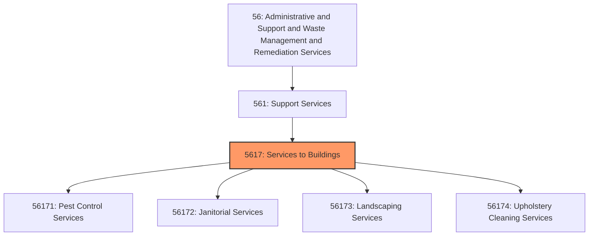
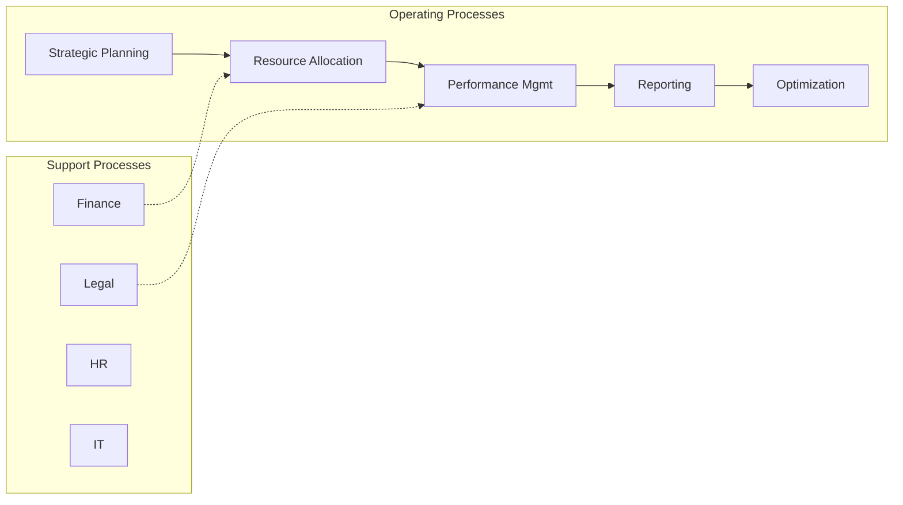

# Services to Buildings

> This industry group comprises establishments primarily engaged in one of the following: (1) exterminating and pest control services; (2) janitorial services; (3) landscaping services; (4) carpet and upholstery cleaning services; or (5) other services to buildings and dwellings.

## Overview

Services to Buildings represents an important category within the Administrative and Support and Waste Management and Remediation Services sector (NAICS 56). This industry group encompasses establishments primarily engaged in services to buildings.

This industry group comprises establishments primarily engaged in one of the following: (1) exterminating and pest control services; (2) janitorial services; (3) landscaping services; (4) carpet and upholstery cleaning services; or (5) other services to buildings and dwellings.

## Industry Hierarchy

## Key Statistics

| Metric | Value |
|--------|-------|
| NAICS Code | 5617 |
| Level | Industry Group |
| Parent | [Support Services](../) |
| Child Industries | 4 |

## Sub-Industries

| Industry | Code | Description |
|----------|------|-------------|
| [Pest Control Services](./PestControlServices/) | 56171 | See industry description for 561710 |
| [Janitorial Services](./JanitorialServices/) | 56172 | See industry description for 561720 |
| [Landscaping Services](./LandscapingServices/) | 56173 | See industry description for 561730 |
| [Upholstery Cleaning Services](./UpholsteryCleaningServices/) | 56174 | See industry description for 561740 |

## Core Business Processes

## Industry Value Chain

```mermaid
graph LR
    subgraph Inputs["Inputs"]
        I1["Resources"]
        I2["Expertise"]
        I3["Technology"]
    end

    subgraph Primary["Primary Activities"]
        A1["Inbound Logistics"]
        A2["Core Operations"]
        A3["Quality Assurance"]
        A4["Outbound/Delivery"]
    end

    subgraph Outputs["Products/Services"]
        O1["Products"]
        O2["Services"]
        O3["Solutions"]
    end

    subgraph Customers["Markets"]
        C1["Businesses"]
        C2["Consumers"]
        C3["Government"]
        C4["Institutions"]
    end

    Inputs --> Primary --> Outputs --> Customers
```

---

*Source: NAICS 5617 - Services to Buildings*
