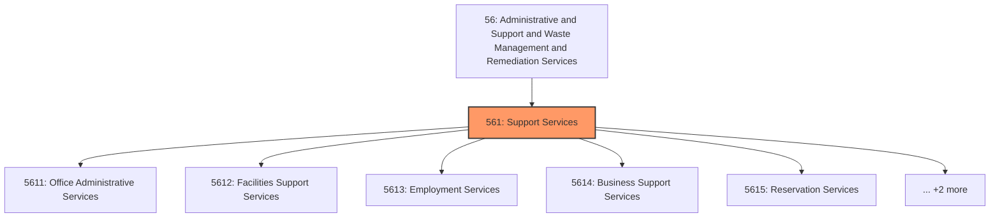
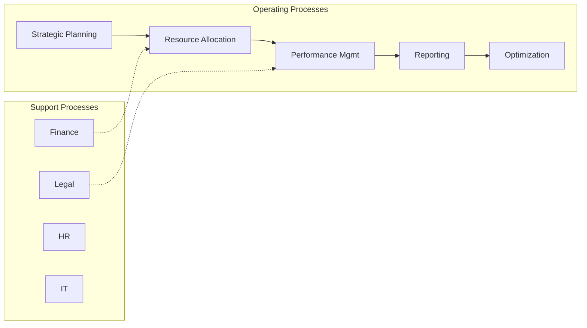

# Support Services

> Industries in the Administrative and Support Services subsector group establishments engaged in activities that support the day-to-day operations of other organizations.

## Overview

Support Services represents an important category within the Administrative and Support and Waste Management and Remediation Services sector (NAICS 56). This subsector encompasses establishments primarily engaged in support services.

Industries in the Administrative and Support Services subsector group establishments engaged in activities that support the day-to-day operations of other organizations. The processes employed in this sector (e.g., general management, personnel administration, clerical activities, cleaning activities) are often integral parts of the activities of establishments found in all sectors of the economy. The establishments classified in this subsector have specialization in one or more of these activities and can, therefore, provide services to clients in a variety of industries and, in some cases, to households. The individual industries of this subsector are defined on the basis of the particular process that they are engaged in and the particular services they provide. Many of the activities in this subsector are ongoing routine support functions that businesses and organizations perform in-house. However, it is common to contract or purchase services from businesses that specialize in such activities and can, therefore, provide the services more efficiently. The industries in this subsector cannot be viewed as strictly "support." The Travel Arrangement and Reservation Services industry group includes travel agents, tour operators, and providers of other travel arrangement services, such as hotel and restaurant reservations and arranging the purchase of tickets, serving many types of clients, including individual consumers. This group was placed in this subsector because the services are often of the "support" nature (e.g., travel arrangement) to businesses and other organizations that purchase such services. The administrative and management activities performed by establishments in this sector are typically on a contract or fee basis. These activities may also be performed by establishments that are part of the company or enterprise. However, establishments involved in administering, overseeing, and managing other establishments of the company or enterprise are classified in Sector 55, Management of Companies and Enterprises. Establishments in Sector 55, Management of Companies and Enterprises, normally undertake the strategic and organizational planning and decision-making role of the company or enterprise. Government establishments engaged in administering, overseeing, and managing governmental programs are classified in Sector 92, Public Administration.

## Industry Hierarchy

## Key Statistics

| Metric | Value |
|--------|-------|
| NAICS Code | 561 |
| Level | Subsector |
| Parent | [Remediation Services](../) |
| Child Industries | 7 |

## Sub-Industries

| Industry | Code | Description |
|----------|------|-------------|
| [Office Administrative Services](./OfficeAdministrativeServices/) | 5611 | Office Administrative Services |
| [Facilities Support Services](./FacilitiesSupportServices/) | 5612 | Facilities Support Services |
| [Employment Services](./EmploymentServices/) | 5613 | This industry group comprises establishments primarily engaged in one of the fol |
| [Business Support Services](./BusinessSupportServices/) | 5614 | This industry group comprises establishments engaged in performing activities th |
| [Reservation Services](./ReservationServices/) | 5615 | This industry group comprises establishments primarily engaged in one of the fol |
| [Security Services](./SecurityServices/) | 5616 | This industry group comprises establishments primarily engaged in one of the fol |
| [Services to Buildings](./ServicesToBuildings/) | 5617 | This industry group comprises establishments primarily engaged in one of the fol |

## Core Business Processes

## Industry Value Chain

```mermaid
graph LR
    subgraph Inputs["Inputs"]
        I1["Resources"]
        I2["Expertise"]
        I3["Technology"]
    end

    subgraph Primary["Primary Activities"]
        A1["Inbound Logistics"]
        A2["Core Operations"]
        A3["Quality Assurance"]
        A4["Outbound/Delivery"]
    end

    subgraph Outputs["Products/Services"]
        O1["Products"]
        O2["Services"]
        O3["Solutions"]
    end

    subgraph Customers["Markets"]
        C1["Businesses"]
        C2["Consumers"]
        C3["Government"]
        C4["Institutions"]
    end

    Inputs --> Primary --> Outputs --> Customers
```

---

*Source: NAICS 561 - Support Services*
