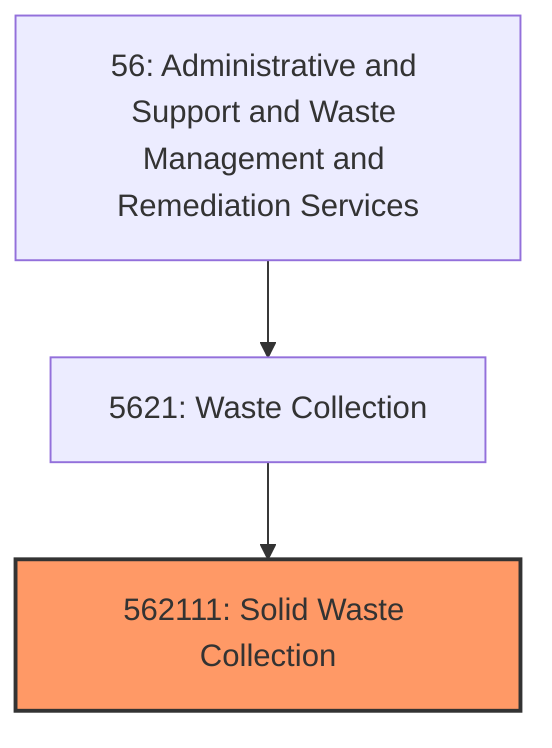
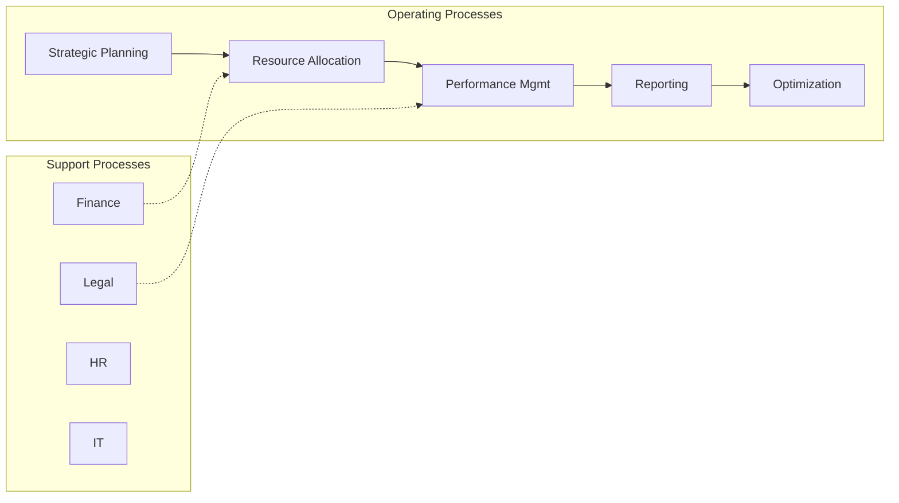

# Solid Waste Collection

> This U.

## Overview

Solid Waste Collection represents a specialized segment within the Administrative and Support and Waste Management and Remediation Services sector (NAICS 56).

This U.S. industry comprises establishments primarily engaged in one or more of the following: (1) collecting and/or hauling nonhazardous solid waste (i.e., garbage) within a local area; (2) operating nonhazardous solid waste transfer stations; and (3) collecting and/or hauling mixed recyclable materials within a local area. Cross-References. Establishments primarily engaged in--

## Industry Hierarchy

## Key Statistics

| Metric | Value |
|--------|-------|
| NAICS Code | 562111 |
| Level | National Industry |
| Child Industries | 0 |

## Related Occupations

See the [occupations directory](/occupations) for roles commonly found in this industry.

## Core Business Processes

## Industry Value Chain

```mermaid
graph LR
    subgraph Inputs["Inputs"]
        I1["Resources"]
        I2["Expertise"]
        I3["Technology"]
    end

    subgraph Primary["Primary Activities"]
        A1["Inbound Logistics"]
        A2["Core Operations"]
        A3["Quality Assurance"]
        A4["Outbound/Delivery"]
    end

    subgraph Outputs["Products/Services"]
        O1["Products"]
        O2["Services"]
        O3["Solutions"]
    end

    subgraph Customers["Markets"]
        C1["Businesses"]
        C2["Consumers"]
        C3["Government"]
        C4["Institutions"]
    end

    Inputs --> Primary --> Outputs --> Customers
```

---

*Source: NAICS 562111 - Solid Waste Collection*
