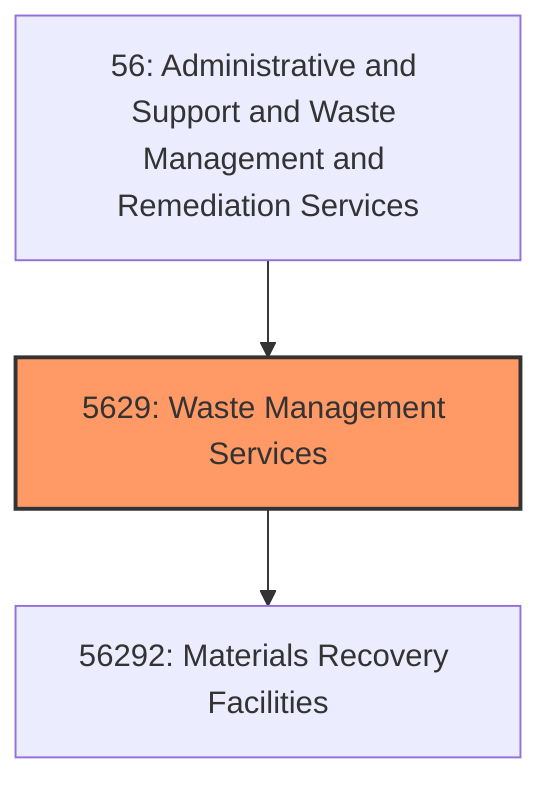
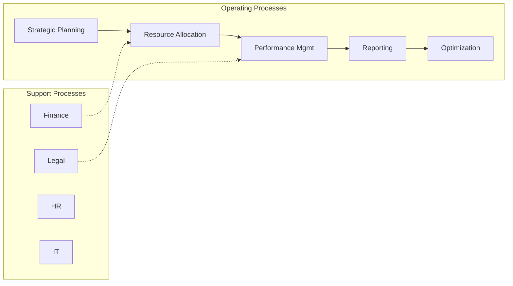

# Waste Management Services

> This industry group comprises establishments primarily engaged in remediation and other waste management services (except waste collection, waste treatment and disposal, and waste management consulting services).

## Overview

Waste Management Services represents an important category within the Administrative and Support and Waste Management and Remediation Services sector (NAICS 56).

This industry group comprises establishments primarily engaged in remediation and other waste management services (except waste collection, waste treatment and disposal, and waste management consulting services).

## Industry Hierarchy

## Key Statistics

| Metric | Value |
|--------|-------|
| NAICS Code | 5629 |
| Level | Industry Group |
| Child Industries | 1 |

## Sub-Industries

| Industry | Code | Description |
|----------|------|-------------|
| [Materials Recovery Facilities](./MaterialsRecoveryFacilities/) | 56292 | See industry description for 562920 |

## Related Occupations

See the [occupations directory](/occupations) for roles commonly found in this industry.

## Core Business Processes

## Industry Value Chain

```mermaid
graph LR
    subgraph Inputs["Inputs"]
        I1["Resources"]
        I2["Expertise"]
        I3["Technology"]
    end

    subgraph Primary["Primary Activities"]
        A1["Inbound Logistics"]
        A2["Core Operations"]
        A3["Quality Assurance"]
        A4["Outbound/Delivery"]
    end

    subgraph Outputs["Products/Services"]
        O1["Products"]
        O2["Services"]
        O3["Solutions"]
    end

    subgraph Customers["Markets"]
        C1["Businesses"]
        C2["Consumers"]
        C3["Government"]
        C4["Institutions"]
    end

    Inputs --> Primary --> Outputs --> Customers
```

---

*Source: NAICS 5629 - Waste Management Services*
