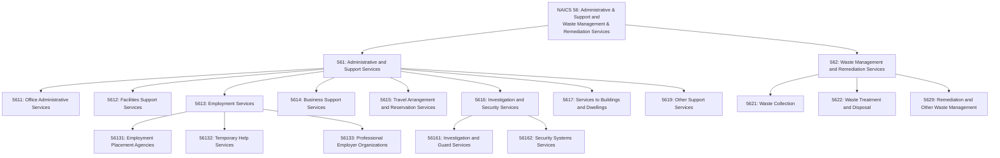
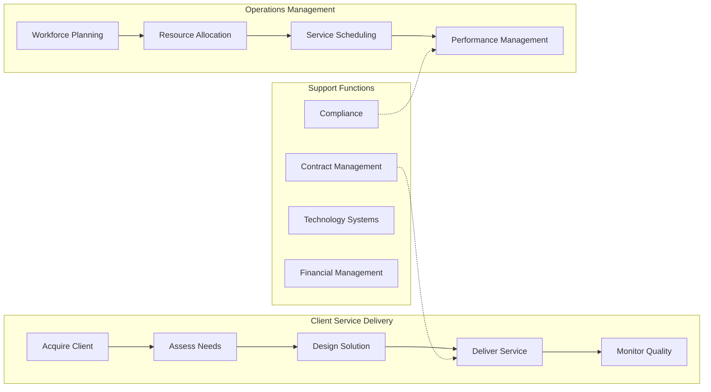
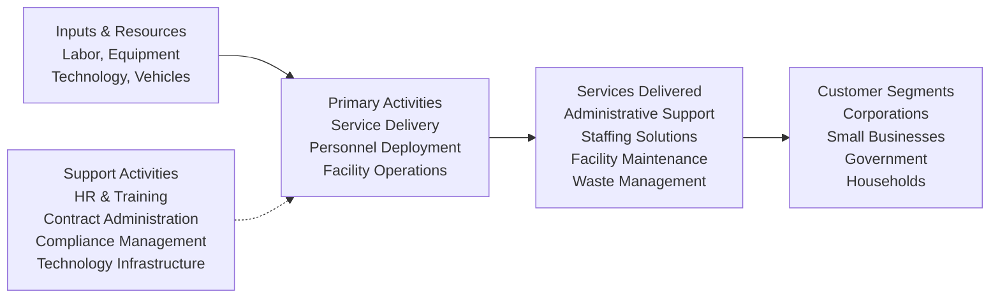

# Administrative and Support and Waste Management and Remediation Services

> The Administrative and Support and Waste Management and Remediation Services sector comprises establishments performing routine support activities for the day-to-day operations of other organizations, as well as waste management and remediation services.

## Overview

This sector encompasses establishments that specialize in providing essential support activities to businesses and households. These activities are often undertaken in-house by establishments in many sectors of the economy, but the establishments in this sector have specialized in one or more support activities and provide these services to clients in a variety of industries.

Activities performed include:
- **Office administration** - General administrative and management services
- **Personnel services** - Hiring, placing, and managing personnel
- **Document services** - Document preparation and similar clerical services
- **Sales support** - Solicitation and collection services
- **Security services** - Security, surveillance, and investigation services
- **Facility services** - Cleaning, landscaping, and building maintenance
- **Waste services** - Waste collection, treatment, disposal, and remediation

The administrative and management activities performed by establishments in this sector are typically on a contract or fee basis. Establishments involved in administering and managing other establishments of the same company or enterprise are classified in Sector 55, Management of Companies and Enterprises.

## Industry Hierarchy

## Key Statistics

| Metric | Value |
|--------|-------|
| NAICS Code | 56 |
| Level | Sector |
| Subsectors | 2 |
| Industry Groups | 11 |
| Industries | 30+ |
| Related Occupations | 650+ |

## Sub-Industries

### Administrative and Support Services (561)

| Industry Group | Code | Description |
|----------------|------|-------------|
| Office Administrative Services | 5611 | Providing day-to-day administrative services on a contract or fee basis |
| Facilities Support Services | 5612 | Providing operating staff for client facilities |
| Employment Services | 5613 | Employment placement, temporary help, and professional employer organizations |
| Business Support Services | 5614 | Document preparation, call centers, collection agencies, and credit bureaus |
| Travel Arrangement and Reservation Services | 5615 | Travel agencies, tour operators, and reservation services |
| Investigation and Security Services | 5616 | Investigation, guard, armored car, and security systems services |
| Services to Buildings and Dwellings | 5617 | Exterminating, janitorial, landscaping, and carpet cleaning services |
| Other Support Services | 5619 | Packaging, labeling, convention organizers, and other support services |

### Waste Management and Remediation Services (562)

| Industry Group | Code | Description |
|----------------|------|-------------|
| Waste Collection | 5621 | Collection of hazardous and nonhazardous waste |
| Waste Treatment and Disposal | 5622 | Operating waste treatment and disposal facilities |
| Remediation and Other Waste Management | 5629 | Remediation services, materials recovery facilities, and other waste management |

## Related Occupations

### Management Occupations
- [Chief Executives](/occupations/ChiefExecutives) - Strategic direction and policy formulation
- [General and Operations Managers](/occupations/GeneralAndOperationsManagers) - Daily operations coordination
- [Administrative Services Managers](/occupations/AdministrativeServicesManagers) - Administrative services oversight
- [Facilities Managers](/occupations/FacilitiesManagers) - Building and grounds management
- [Human Resources Managers](/occupations/HumanResourcesManagers) - Personnel and staffing programs

### Business and Financial Occupations
- [Human Resources Specialists](/occupations/HumanResourcesSpecialists) - Recruitment and employee relations
- [Training and Development Specialists](/occupations/TrainingAndDevelopmentSpecialists) - Employee training programs
- [Management Analysts](/occupations/ManagementAnalysts) - Organizational efficiency consulting
- [Logisticians](/occupations/Logisticians) - Supply chain and distribution coordination
- [Market Research Analysts](/occupations/MarketResearchAnalysts) - Market conditions and sales potential analysis

### Office and Administrative Support
- [Executive Secretaries and Administrative Assistants](/occupations/ExecutiveSecretariesAndAdministrativeAssistants) - Executive support
- [Receptionists and Information Clerks](/occupations/ReceptionistsAndInformationClerks) - Front office operations
- [Customer Service Representatives](/occupations/CustomerServiceRepresentatives) - Customer inquiries and support
- [Bill and Account Collectors](/occupations/BillAndAccountCollectors) - Debt collection services

### Protective Service Occupations
- [Security Guards](/occupations/SecurityGuards) - Property and personnel protection
- [Private Detectives and Investigators](/occupations/PrivateDetectivesAndInvestigators) - Investigation services

### Building and Grounds Maintenance
- [Janitors and Cleaners](/occupations/JanitorsAndCleaners) - Building cleaning and maintenance
- [Landscaping and Groundskeeping Workers](/occupations/LandscapingAndGroundskeepingWorkers) - Grounds maintenance
- [Pest Control Workers](/occupations/PestControlWorkers) - Pest management services

### Waste Management Occupations
- [Refuse and Recyclable Material Collectors](/occupations/RefuseAndRecyclableMaterialCollectors) - Waste collection
- [Hazardous Materials Removal Workers](/occupations/HazardousMaterialsRemovalWorkers) - Hazardous waste handling

## Core Business Processes

### Client Acquisition and Service Delivery

Developing client relationships and delivering contracted support services on an ongoing basis.

**Key Activities:**
- Identify and pursue service opportunities
- Conduct needs assessments and develop service proposals
- Negotiate contracts and service level agreements
- Deploy personnel and resources to client sites
- Monitor service quality and client satisfaction

### Workforce Management

Managing a flexible workforce to meet varying client demands across multiple service categories.

**Key Activities:**
- Recruit, screen, and onboard service personnel
- Match employee skills to client requirements
- Manage scheduling and deployment logistics
- Conduct performance evaluations and training
- Ensure compliance with labor regulations

### Service Quality Assurance

Maintaining consistent service delivery standards across diverse client engagements.

**Key Activities:**
- Develop and document service standards
- Implement quality monitoring systems
- Gather and analyze client feedback
- Address service issues and implement improvements
- Measure and report key performance indicators

## Industry Value Chain

## Service Categories

### Administrative Support Services

Establishments providing comprehensive administrative and office support functions:

- **Office Administration**: Managing office operations, records, and administrative functions
- **Document Services**: Word processing, transcription, and document management
- **Call Center Services**: Inbound/outbound call handling, telemarketing, and customer service
- **Collection Services**: Debt collection and credit reporting

### Employment and Staffing Services

Connecting workers with employment opportunities through various service models:

- **Employment Placement**: Permanent placement and executive search services
- **Temporary Staffing**: Providing workers for short-term assignments
- **Professional Employer Organizations (PEO)**: Co-employment arrangements for HR, payroll, and benefits

### Facility and Property Services

Maintaining buildings, grounds, and physical environments:

- **Security Services**: Guard services, patrol, armored transport, and alarm monitoring
- **Cleaning Services**: Janitorial, carpet cleaning, and specialized cleaning
- **Landscaping**: Grounds maintenance, lawn care, and landscape installation
- **Pest Control**: Inspection, treatment, and prevention services

### Waste Management Services

Managing the collection, processing, and disposal of waste materials:

- **Waste Collection**: Residential, commercial, and industrial waste pickup
- **Treatment and Disposal**: Operating landfills, incinerators, and treatment facilities
- **Remediation**: Environmental cleanup and hazardous waste management
- **Materials Recovery**: Recycling operations and resource recovery

## Regulatory Environment

This sector operates under extensive federal, state, and local regulations:

### Employment Regulations
- **Fair Labor Standards Act (FLSA)**: Minimum wage, overtime, and recordkeeping requirements
- **EEOC Compliance**: Non-discrimination in employment practices
- **OSHA Standards**: Workplace safety requirements for various service categories
- **State Licensing**: Employment agency licensing and bonding requirements

### Security Industry Regulations
- **State Licensing**: Private security guard and investigator licensing
- **Background Check Requirements**: Criminal history and eligibility verification
- **Firearms Regulations**: Armed security officer certification and training
- **Alarm Industry Standards**: False alarm reduction and monitoring requirements

### Environmental Regulations
- **Resource Conservation and Recovery Act (RCRA)**: Hazardous waste management standards
- **EPA Regulations**: Waste treatment, disposal, and emissions requirements
- **State Environmental Agencies**: Permits for waste facilities and transportation
- **CERCLA (Superfund)**: Liability for contaminated site remediation

### Industry-Specific Compliance
- **PCI DSS**: Payment card data security for call centers
- **HIPAA**: Health information protection in business associate roles
- **SOC 2**: Service organization controls for data security
- **ISO Standards**: Quality management and environmental management systems

## Technology & Innovation

The sector is experiencing significant technological transformation:

### Workforce Management Technology
- **Scheduling Software**: Automated shift planning and workforce optimization
- **Time and Attendance**: Mobile clock-in, geolocation tracking, and biometrics
- **Applicant Tracking Systems**: AI-powered recruiting and candidate matching
- **Learning Management Systems**: Online training and certification tracking

### Service Delivery Technology
- **IoT Sensors**: Smart building systems, waste level monitoring, and equipment tracking
- **Mobile Applications**: Field service management, work order systems, and communication
- **Route Optimization**: AI-driven routing for waste collection and service delivery
- **Robotic Process Automation**: Automated data entry, invoice processing, and reporting

### Security Technology
- **Video Analytics**: AI-powered surveillance and threat detection
- **Access Control Systems**: Biometric authentication and smart credentials
- **Drone Technology**: Aerial surveillance and facility inspection
- **Cybersecurity Services**: Remote monitoring and incident response

### Environmental Technology
- **Waste-to-Energy**: Converting waste to electricity and renewable fuels
- **Advanced Recycling**: Chemical recycling and materials recovery technologies
- **Emissions Monitoring**: Real-time tracking and environmental compliance
- **Remediation Technology**: Bioremediation, soil vapor extraction, and treatment systems

## Market Dynamics

### Growth Drivers
- **Outsourcing Trends**: Companies increasingly outsourcing non-core functions
- **Gig Economy**: Rise of flexible staffing and on-demand services
- **Sustainability Focus**: Growing demand for recycling and waste reduction
- **Security Concerns**: Increased investment in physical and cyber security

### Industry Challenges
- **Labor Availability**: Recruiting and retaining service workers
- **Wage Pressures**: Minimum wage increases and competitive labor markets
- **Technology Disruption**: Automation affecting traditional service roles
- **Regulatory Complexity**: Varying state and local requirements

---

*Source: NAICS 56 - Administrative and Support and Waste Management and Remediation Services*
