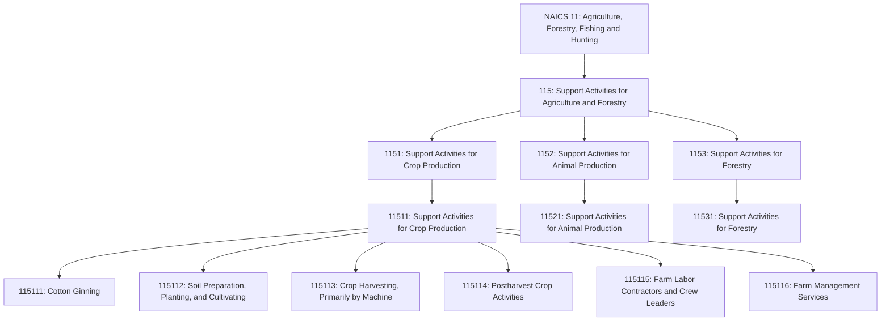
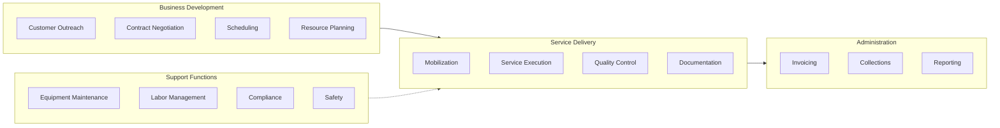

# Support Activities for Agriculture and Forestry

> Industries in the Support Activities for Agriculture and Forestry subsector provide support services that are an essential part of agricultural and forestry production. These support activities may be performed by the agriculture or forestry producing establishment or conducted independently as an alternative source of inputs required for the production process for a given crop, animal, or forestry industry.

## Overview

The Support Activities for Agriculture and Forestry subsector comprises establishments that provide essential support services for agricultural and forestry production operations. Unlike the production-focused subsectors, these establishments perform specialized activities on a contract or fee basis, serving as an alternative to integrated on-farm operations.

This subsector includes three main categories: support activities for crop production (such as soil preparation, planting, and harvesting services), support activities for animal production (such as breeding services and livestock management), and support activities for forestry (such as timber cruising and reforestation services). Many establishments in this subsector operate with specialized equipment or expertise that would be uneconomical for individual farms to own or maintain.

## Industry Hierarchy

## Key Statistics

| Metric | Value |
|--------|-------|
| NAICS Code | 115 |
| Level | Subsector |
| Parent Sector | [Agriculture, Forestry, Fishing and Hunting](../) |
| Industry Groups | 3 |
| Industries | 3 |
| National Industries | 8 |

## Sub-Industries

| Industry Group | Code | Description |
|----------------|------|-------------|
| Support Activities for Crop Production | 1151 | Services including ginning, soil preparation, planting, harvesting, and farm management |
| Support Activities for Animal Production | 1152 | Services including breeding, pedigree record, boarding, and management services |
| Support Activities for Forestry | 1153 | Services including timber cruising, fire fighting, and reforestation |

## Service Categories

| Category | Services | Typical Customers |
|----------|----------|-------------------|
| Crop Support | Cotton ginning, custom harvesting, aerial application | Row crop farms, specialty crop operations |
| Land Preparation | Tillage, leveling, drainage, irrigation | All agricultural operations |
| Labor Services | Farm labor contracting, crew leadership | Large farms, harvest operations |
| Animal Support | Breeding services, livestock management, veterinary | Ranches, feedlots, dairies |
| Forestry Support | Timber cruising, reforestation, fire control | Timber companies, landowners |

## Related Occupations

- [Farm Labor Contractors](/occupations/Business/FarmLaborContractors) - Recruit and manage agricultural workers
- [Farmers, Ranchers, and Other Agricultural Managers](/occupations/Management/FarmersRanchersAndOtherAgriculturalManagers) - Provide farm management services
- [Agricultural Equipment Operators](/occupations/Agriculture/AgriculturalEquipmentOperators) - Operate custom farming equipment
- [Agricultural Inspectors](/occupations/Agriculture/AgriculturalInspectors) - Inspect crops and commodities
- [Veterinarians](/occupations/HealthcarePractitioners/Veterinarians) - Provide animal health services
- [Foresters](/occupations/Science/Foresters) - Provide forestry consulting services
- [Pesticide Handlers, Sprayers, and Applicators](/occupations/PesticideHandlersSprayersAndApplicators) - Apply agricultural chemicals

## Core Business Processes

### Support Activities for Crop Production

Providing specialized services for crop farming operations.

**Key Activities:**
- Cotton ginning and fiber processing
- Soil preparation including tillage and leveling
- Custom planting and seeding services
- Aerial and ground application of pesticides and fertilizers
- Custom harvesting with specialized equipment
- Grain drying and storage services
- Farm labor contracting and crew management
- Farm management and consulting services

### Support Activities for Animal Production

Providing specialized services for livestock and animal operations.

**Key Activities:**
- Artificial insemination and breeding services
- Livestock vaccination and health services
- Hoof trimming and farrier services
- Livestock transportation
- Custom feeding and boarding services
- Pedigree record services
- Pasture and range management

### Support Activities for Forestry

Providing specialized services for timber and forest management.

**Key Activities:**
- Timber cruising and inventory services
- Reforestation and tree planting
- Forest fire prevention and suppression
- Timber valuation and appraisal
- Forest pest control
- Timber stand improvement
- Forestry consulting services

## Industry Value Chain

```mermaid
graph LR
    subgraph Inputs["Inputs"]
        I1["Equipment"]
        I2["Labor"]
        I3["Materials"]
        I4["Expertise"]
        I5["Certifications"]
    end

    subgraph Primary["Primary Activities"]
        A1["Assessment"]
        A2["Planning"]
        A3["Execution"]
        A4["Follow-up"]
    end

    subgraph Outputs["Services"]
        O1["Crop Services"]
        O2["Animal Services"]
        O3["Forestry Services"]
        O4["Management Services"]
    end

    subgraph Customers["Markets"]
        C1["Farms/Ranches"]
        C2["Timber Companies"]
        C3["Landowners"]
        C4["Government Agencies"]
    end

    Inputs --> Primary --> Outputs --> Customers
```

## Regulatory Environment

Support service providers must comply with regulations applicable to the services they provide:

- **USDA**: Agricultural program compliance, organic certification support
- **EPA**: Pesticide applicator licensing, Worker Protection Standard
- **DOL**: Farm labor contractor registration, H-2A program compliance
- **OSHA**: Worker safety, equipment safety standards
- **State Agencies**: State-specific licensing, agricultural labor laws

Key compliance areas include:
- Pesticide applicator licensing and record-keeping
- Farm labor contractor registration
- Equipment safety and inspection
- Worker protection and training
- Environmental compliance
- Professional licensing (veterinary, forestry)

## Technology & Innovation

Agricultural support services are becoming increasingly technology-driven:

- **Precision Agriculture Services**: Variable rate application technology, GPS-guided equipment, yield monitoring and mapping
- **Aerial Services**: Drone-based application and monitoring, fixed-wing and helicopter operations, remote sensing integration
- **Digital Platforms**: Farm management software, scheduling and dispatch systems, mobile workforce management
- **Data Analytics**: Agronomic decision support, predictive modeling, benchmarking services
- **Equipment Technology**: Automated harvesting systems, advanced application equipment, telematics and monitoring
- **Communication Systems**: Real-time field reporting, customer portals, integrated billing systems

## Related Industries

- [Crop Production](../CropProduction/) - Primary customers for crop support services
- [Animal Production](../AnimalProduction/) - Primary customers for animal support services
- [Forestry and Logging](../Forestry/) - Primary customers for forestry support services
- [Professional Services](/industries/ProfessionalServices/) - Related consulting and technical services

---

*Source: NAICS 115 - Support Activities for Agriculture and Forestry*
