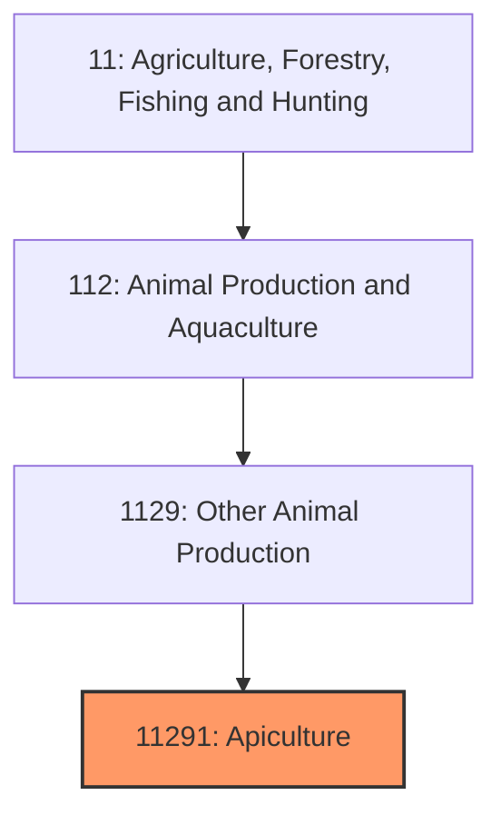
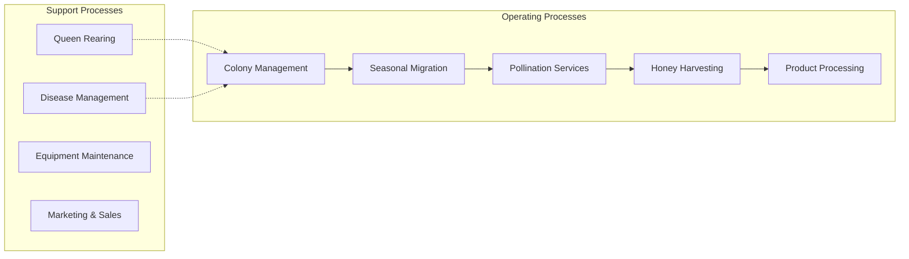

# Apiculture

> Establishments primarily engaged in raising bees for honey production, beeswax, pollination services, and the production of other bee-related products.

## Overview

Apiculture, also known as beekeeping, is a specialized agricultural industry that encompasses the maintenance of honey bee colonies in hives for the production of honey, beeswax, propolis, royal jelly, and bee pollen. Beyond direct product sales, commercial apiculturists provide essential pollination services to agricultural operations, making this industry critical to the broader food production ecosystem. The U.S. beekeeping industry manages approximately 2.7 million honey-producing colonies, with commercial operations (those with 500+ colonies) accounting for the majority of honey production and pollination services.

The industry operates at multiple scales, from hobbyist beekeepers with a few hives to large commercial operations managing thousands of colonies that migrate seasonally to pollinate crops across the country. California's almond orchards alone require approximately 2 million colonies for pollination each spring, representing the single largest pollination event in the United States.

## Market Context

| Metric | Value |
|--------|-------|
| U.S. Honey Production | 126 million pounds annually |
| Number of U.S. Beekeepers | ~125,000 |
| Pollination Services Value | $15-20 billion annually |
| Average Honey Price | $2.00-2.50 per pound (wholesale) |
| Import Competition | ~75% of U.S. honey consumption is imported |

The pollination services segment has grown significantly, with fees for almond pollination reaching $200-250 per colony. This revenue stream often exceeds honey sales for commercial operations.

## Industry Hierarchy

## Key Statistics

| Metric | Value |
|--------|-------|
| NAICS Code | 11291 |
| Level | Industry |
| Parent | [Other Animal Production](../) |
| Child Industries | 0 |

## Related Occupations

- [Farmers, Ranchers, and Other Agricultural Managers](/occupations/Management/FarmersRanchersAndOtherAgriculturalManagers) - Manage beekeeping operations and coordinate seasonal migrations
- [Agricultural Workers](/occupations/FarmingFishingAndForestry/AgriculturalWorkers) - Assist with hive inspection, honey extraction, and colony management
- [Veterinarians](/occupations/Healthcare/Veterinarians) - Diagnose and treat bee diseases and parasites
- [Agricultural Inspectors](/occupations/FarmingFishingAndForestry/AgriculturalInspectors) - Inspect apiaries for disease and compliance
- [Biological Scientists](/occupations/Science/BiologicalScientists) - Research bee health, genetics, and colony management

## Core Business Processes

### Colony Management
Year-round care of bee colonies including feeding, inspection for diseases and pests, monitoring queen health, and managing colony strength through splitting or combining hives.

**Key Activities:**
- Regular hive inspections (every 7-14 days during active season)
- Varroa mite monitoring and treatment
- Supplemental feeding during nectar dearths
- Queen assessment and replacement
- Swarm prevention and management

### Pollination Services
Contracting with agricultural operations to provide bee colonies for crop pollination, requiring transportation of hives and coordination with farmers.

**Key Activities:**
- Contract negotiation with growers
- Colony preparation and strength assessment
- Transportation logistics planning
- Placement and retrieval of hives
- Colony recovery and health monitoring post-pollination

### Honey Production
Harvesting, extracting, and processing honey from hives for commercial sale.

**Key Activities:**
- Timing harvest based on nectar flow completion
- Frame removal and uncapping
- Centrifugal extraction
- Filtering and settling
- Bottling and labeling

## Industry Value Chain

```mermaid
graph LR
    subgraph Inputs["Inputs"]
        I1["Bee Packages/Queens"]
        I2["Hive Equipment"]
        I3["Feed/Supplements"]
        I4["Medications/Treatments"]
    end

    subgraph Primary["Primary Activities"]
        A1["Colony Building"]
        A2["Pollination Services"]
        A3["Honey Harvesting"]
        A4["Product Processing"]
    end

    subgraph Outputs["Products/Services"]
        O1["Honey"]
        O2["Beeswax"]
        O3["Pollination Services"]
        O4["Queens/Packages"]
    end

    subgraph Customers["Markets"]
        C1["Food Manufacturers"]
        C2["Agricultural Growers"]
        C3["Retailers"]
        C4["Other Beekeepers"]
    end

    Inputs --> Primary --> Outputs --> Customers
```

## Regulatory Environment

- **USDA Animal and Plant Health Inspection Service (APHIS)** - Regulates interstate movement of bees, establishes import requirements, and monitors for exotic pests
- **EPA** - Regulates pesticide use affecting bee health, including neonicotinoid restrictions
- **FDA** - Oversees honey as a food product, including labeling requirements and adulteration standards
- **State Departments of Agriculture** - Require apiary registration, conduct inspections, and enforce quarantine regulations
- **Honey Packers and Dealers Association** - Industry standards for honey grading and quality

### Key Regulations
- Honey labeling requirements (country of origin, pure honey standards)
- Interstate bee movement permits
- Africanized honeybee quarantine zones
- Organic certification standards for honey

## Technology & Innovation

- **Hive Monitoring Systems** - IoT sensors tracking temperature, humidity, weight, and acoustics to detect problems remotely
- **Precision Apiculture** - GPS tracking of hives, data analytics for colony management decisions
- **Genetic Selection Programs** - Breeding for Varroa resistance, hygienic behavior, and gentleness
- **Automated Extraction Equipment** - Mechanized uncapping and extraction systems for large operations
- **Disease Detection Technologies** - PCR testing, digital imaging for disease identification
- **Alternative Treatments** - Organic acids, essential oils, and biological controls for Varroa management

## Industry Challenges

- **Colony Collapse Disorder (CCD)** - Ongoing colony losses averaging 30-40% annually
- **Varroa Destructor Mites** - Primary pest requiring constant management
- **Pesticide Exposure** - Agricultural chemicals impacting bee health
- **Import Competition** - Low-cost honey imports affecting domestic prices
- **Climate Variability** - Shifting bloom times and nectar availability
- **Labor Shortages** - Difficulty finding skilled workers for seasonal operations

## Industry Outlook

The apiculture industry faces significant challenges from colony health issues and import competition, but demand for pollination services continues to grow as agriculture expands. The increasing consumer interest in local, pure honey and concerns about honey adulteration in imports create opportunities for domestic producers. Technology adoption, particularly remote monitoring systems, is improving efficiency and early problem detection. Research into Varroa-resistant bee genetics and alternative treatments offers hope for reducing colony losses. The industry's essential role in food production through pollination services ensures its continued importance despite market pressures.

---

*Source: NAICS 11291 - Apiculture*
