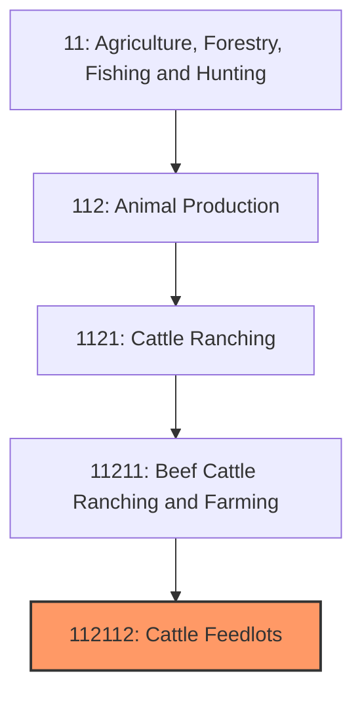
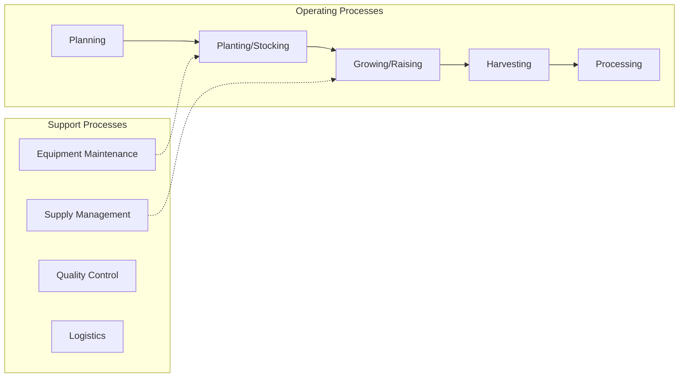

# Cattle Feedlots

> This U.S.

## Overview

Cattle Feedlots represents a specialized segment within the Agriculture, Forestry, Fishing and Hunting sector (NAICS 11). This national industry encompasses establishments primarily engaged in cattle feedlots.

This U.S. industry comprises establishments primarily engaged in feeding cattle for fattening. Cross-References.

## Industry Hierarchy

## Key Statistics

| Metric | Value |
|--------|-------|
| NAICS Code | 112112 |
| Level | National Industry |
| Parent | [Beef Cattle Ranching and Farming](../) |
| Child Industries | 0 |

## Core Business Processes

## Industry Value Chain

```mermaid
graph LR
    subgraph Inputs["Inputs"]
        I1["Seeds/Stock"]
        I2["Equipment"]
        I3["Fertilizers"]
        I4["Labor"]
    end

    subgraph Primary["Primary Activities"]
        A1["Inbound Logistics"]
        A2["Core Operations"]
        A3["Quality Assurance"]
        A4["Outbound/Delivery"]
    end

    subgraph Outputs["Products/Services"]
        O1["Crops"]
        O2["Livestock"]
        O3["Raw Materials"]
    end

    subgraph Customers["Markets"]
        C1["Processors"]
        C2["Distributors"]
        C3["Retailers"]
        C4["Export Markets"]
    end

    Inputs --> Primary --> Outputs --> Customers
```

---

*Source: NAICS 112112 - Cattle Feedlots*
