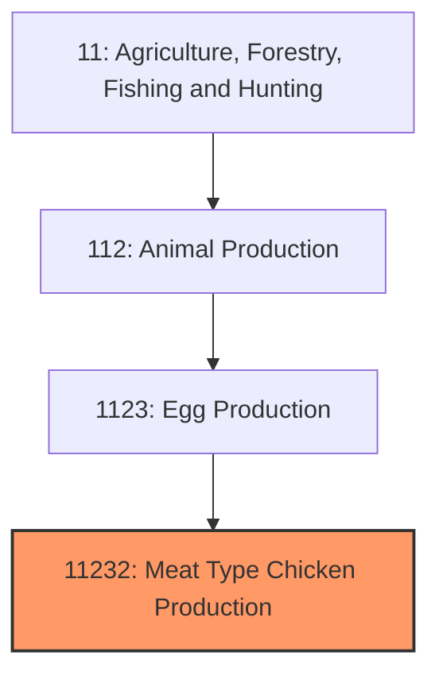
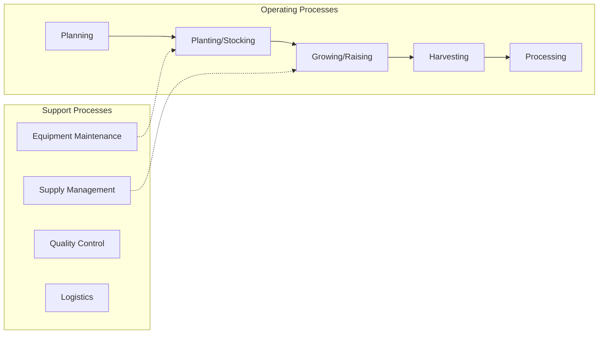

# Meat Type Chicken Production

> See industry description for 112320.

## Overview

Meat Type Chicken Production represents an important category within the Agriculture, Forestry, Fishing and Hunting sector (NAICS 11). This industry encompasses establishments primarily engaged in meat type chicken production.

## Industry Hierarchy

## Key Statistics

| Metric | Value |
|--------|-------|
| NAICS Code | 11232 |
| Level | Industry |
| Parent | [Egg Production](../) |
| Child Industries | 0 |

## Core Business Processes

## Industry Value Chain

```mermaid
graph LR
    subgraph Inputs["Inputs"]
        I1["Seeds/Stock"]
        I2["Equipment"]
        I3["Fertilizers"]
        I4["Labor"]
    end

    subgraph Primary["Primary Activities"]
        A1["Inbound Logistics"]
        A2["Core Operations"]
        A3["Quality Assurance"]
        A4["Outbound/Delivery"]
    end

    subgraph Outputs["Products/Services"]
        O1["Crops"]
        O2["Livestock"]
        O3["Raw Materials"]
    end

    subgraph Customers["Markets"]
        C1["Processors"]
        C2["Distributors"]
        C3["Retailers"]
        C4["Export Markets"]
    end

    Inputs --> Primary --> Outputs --> Customers
```

---

*Source: NAICS 11232 - Meat Type Chicken Production*
