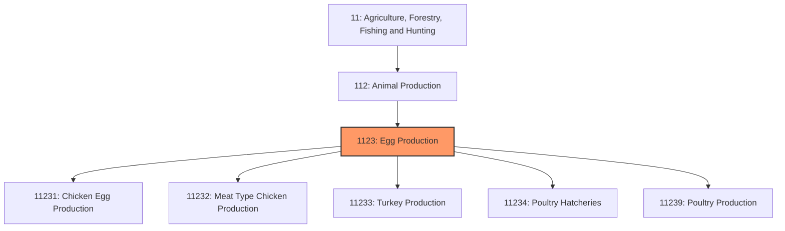
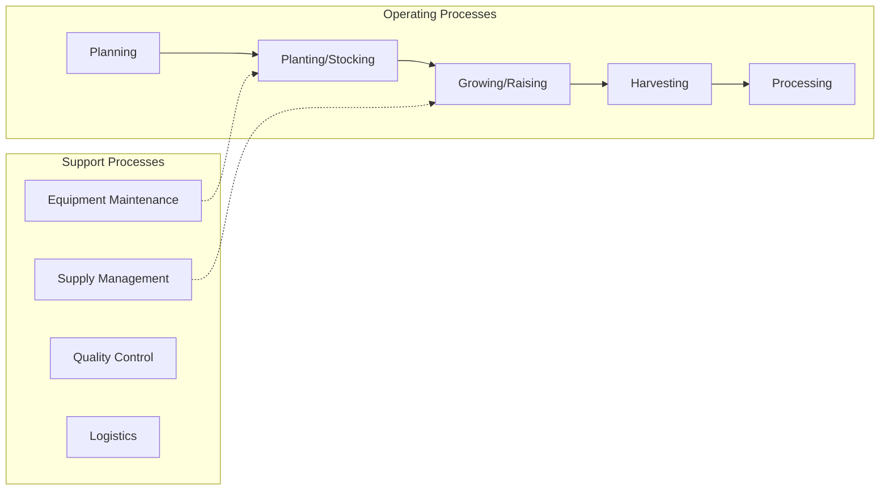

# Egg Production

> This industry group comprises establishments primarily engaged in breeding, hatching, and raising poultry for meat or egg production.

## Overview

Egg Production represents an important category within the Agriculture, Forestry, Fishing and Hunting sector (NAICS 11). This industry group encompasses establishments primarily engaged in egg production.

This industry group comprises establishments primarily engaged in breeding, hatching, and raising poultry for meat or egg production.

## Industry Hierarchy

## Key Statistics

| Metric | Value |
|--------|-------|
| NAICS Code | 1123 |
| Level | Industry Group |
| Parent | [Animal Production](../) |
| Child Industries | 5 |

## Sub-Industries

| Industry | Code | Description |
|----------|------|-------------|
| [Chicken Egg Production](./ChickenEggProduction/) | 11231 | See industry description for 112310 |
| [Meat Type Chicken Production](./MeatTypeChickenProduction/) | 11232 | See industry description for 112320 |
| [Turkey Production](./TurkeyProduction/) | 11233 | See industry description for 112330 |
| [Poultry Hatcheries](./PoultryHatcheries/) | 11234 | See industry description for 112340 |
| [Poultry Production](./PoultryProduction/) | 11239 | See industry description for 112390 |

## Core Business Processes

## Industry Value Chain

```mermaid
graph LR
    subgraph Inputs["Inputs"]
        I1["Seeds/Stock"]
        I2["Equipment"]
        I3["Fertilizers"]
        I4["Labor"]
    end

    subgraph Primary["Primary Activities"]
        A1["Inbound Logistics"]
        A2["Core Operations"]
        A3["Quality Assurance"]
        A4["Outbound/Delivery"]
    end

    subgraph Outputs["Products/Services"]
        O1["Crops"]
        O2["Livestock"]
        O3["Raw Materials"]
    end

    subgraph Customers["Markets"]
        C1["Processors"]
        C2["Distributors"]
        C3["Retailers"]
        C4["Export Markets"]
    end

    Inputs --> Primary --> Outputs --> Customers
```

---

*Source: NAICS 1123 - Egg Production*
