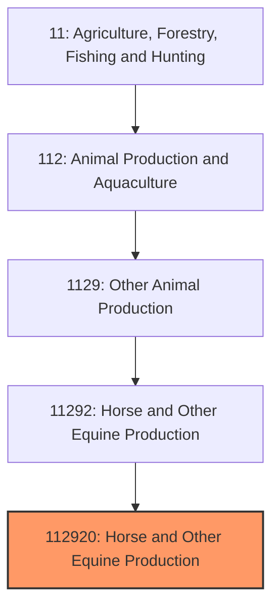
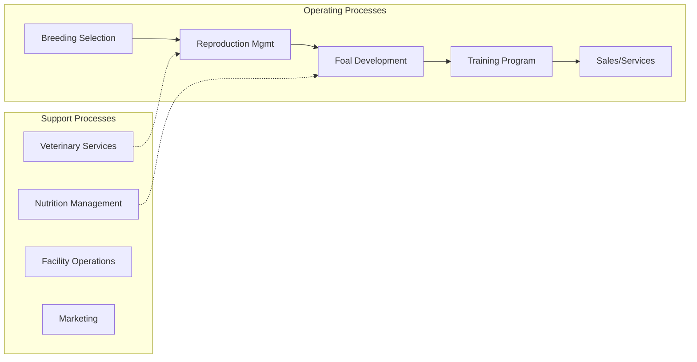

# Equine Production

> Establishments primarily engaged in raising horses, ponies, mules, burros, and donkeys for breeding, sale, working purposes, or recreational use.

## Overview

Equine production encompasses the breeding, raising, and management of horses and other equids for diverse end markets including racing, showing, recreation, ranch work, therapeutic programs, and breeding stock sales. The industry spans from large-scale Thoroughbred breeding operations in Kentucky's Bluegrass region to small family farms producing pleasure horses. The U.S. maintains approximately 7.2 million horses, making it one of the world's largest horse populations.

Unlike traditional livestock operations focused on food production, equine production serves recreational, sporting, and working purposes. The industry's economic model depends heavily on the value of individual animals, with prices ranging from a few hundred dollars for grade horses to millions for elite racehorses. This value concentration creates unique business dynamics where genetics, training, and reputation drive profitability.

## Market Context

| Metric | Value |
|--------|-------|
| U.S. Horse Population | 7.2 million |
| Total Industry Impact | $122 billion annually |
| Direct Employment | 988,000 jobs |
| Average Horse Ownership Cost | $3,876/year |
| Thoroughbred Yearling Average | $100,000+ (select sales) |

The industry operates through distinct market segments with different economics. The racing sector commands premium prices for proven bloodlines, while recreational markets emphasize temperament and versatility. Breeding services, boarding, and training generate significant ancillary revenue.

## Industry Hierarchy

## Key Statistics

| Metric | Value |
|--------|-------|
| NAICS Code | 112920 |
| Level | National Industry |
| Parent | [Other Animal Production](../) |
| Child Industries | 0 |

## Related Occupations

- [Farmers, Ranchers, and Other Agricultural Managers](/occupations/Management/FarmersRanchersAndOtherAgriculturalManagers) - Manage breeding operations and farm business strategy
- [Animal Trainers](/occupations/PersonalCareAndService/AnimalTrainers) - Train horses for specific disciplines and uses
- [Veterinarians](/occupations/Healthcare/Veterinarians) - Provide medical care, reproduction services, and performance medicine
- [Animal Breeders](/occupations/FarmingFishingAndForestry/AnimalBreeders) - Develop and execute breeding programs
- [Farmworkers and Laborers](/occupations/FarmingFishingAndForestry/FarmworkersAndLaborers) - Provide daily care, grooming, and stable management
- [Veterinary Technicians](/occupations/Healthcare/VeterinaryTechnologistsAndTechnicians) - Assist with medical procedures and reproductive technologies

## Core Business Processes

### Breeding Selection
Identifying and acquiring stallions and mares with genetics suited to target market demands.

**Key Activities:**
- Bloodline analysis and pedigree research
- Performance record evaluation
- Conformation assessment
- Stallion service contract negotiation
- Breeding stock acquisition

### Reproduction Management
Managing the breeding process from mare preparation through foaling.

**Key Activities:**
- Mare reproductive health monitoring
- Estrus detection and breeding timing
- Artificial insemination or live cover coordination
- Pregnancy diagnosis and monitoring
- Foaling supervision and neonatal care

### Training and Development
Preparing young horses for their intended use through progressive training programs.

**Key Activities:**
- Imprint training and early handling
- Halter breaking and ground manners
- Initial saddle training
- Discipline-specific skill development
- Competition conditioning

## Industry Value Chain

```mermaid
graph LR
    subgraph Inputs["Inputs"]
        I1["Breeding Stock"]
        I2["Land/Facilities"]
        I3["Feed/Hay"]
        I4["Veterinary Services"]
    end

    subgraph Primary["Primary Activities"]
        A1["Breeding"]
        A2["Foal Raising"]
        A3["Training"]
        A4["Marketing/Sales"]
    end

    subgraph Outputs["Products/Services"]
        O1["Trained Horses"]
        O2["Breeding Services"]
        O3["Boarding"]
        O4["Lessons"]
    end

    subgraph Customers["Markets"]
        C1["Racing Industry"]
        C2["Show Competitors"]
        C3["Recreational Riders"]
        C4["Working Ranches"]
    end

    Inputs --> Primary --> Outputs --> Customers
```

## Regulatory Environment

- **USDA APHIS** - Interstate movement regulations, disease surveillance, and import requirements
- **State Racing Commissions** - License racing participants and regulate racing activities
- **Jockey Club** - Thoroughbred registration and breed standards
- **AQHA, APHA, and other registries** - Breed-specific registration and rules
- **State Veterinarians** - Health certificate and testing requirements

### Key Regulations
- Coggins testing for Equine Infectious Anemia
- Interstate health certificate requirements
- Brand inspection requirements (western states)
- Racing medication and drug testing rules
- Import quarantine procedures

## Technology & Innovation

- **Reproductive Technologies** - Artificial insemination, embryo transfer, ICSI, and frozen semen
- **Genetic Testing** - Disease markers, parentage verification, and performance genes
- **Performance Analysis** - Gait analysis, heart rate monitors, and GPS tracking
- **Veterinary Imaging** - Digital X-ray, ultrasound, MRI, and nuclear scintigraphy
- **Nutrition Technology** - Feed analysis, body condition monitoring, and metabolic testing
- **Farm Management Software** - Breeding records, health tracking, and financial management

## Breed Categories

### Light Horses
Thoroughbreds, Quarter Horses, Arabians, Warmbloods, and other riding breeds.

### Draft Horses
Percherons, Belgians, Clydesdales raised for driving, farm work, and showing.

### Ponies
Welsh, Shetland, and other pony breeds for children's mounts and driving.

### Mules and Donkeys
Produced for working, packing, and recreational use.

## Industry Challenges

- **Economic Sensitivity** - Recreational spending vulnerability to economic downturns
- **Liability Exposure** - Inherent risk in equine activities
- **Land Pressure** - Development encroachment on equestrian facilities
- **Labor Costs** - Horse care is labor-intensive with limited automation
- **Health Costs** - Veterinary care and injury treatment expenses
- **Market Cyclicality** - Breed popularity and racing industry fluctuations

## Industry Outlook

The equine production industry maintains stability through its connection to recreation and lifestyle rather than commodity markets. Growth areas include therapeutic riding programs gaining medical recognition, competitive trail sports, and international demand for American bloodlines. The industry faces challenges from changing demographics and competition for leisure time, but dedicated enthusiast communities provide resilience. Technology adoption in reproduction and health management improves breeding program success rates. Environmental and land use pressures may constrain operations in urbanizing areas, while rural regions offer expansion opportunities. The industry's future depends on attracting new participants, particularly younger generations, while serving established markets.

---

*Source: NAICS 112920 - Horse and Other Equine Production*
