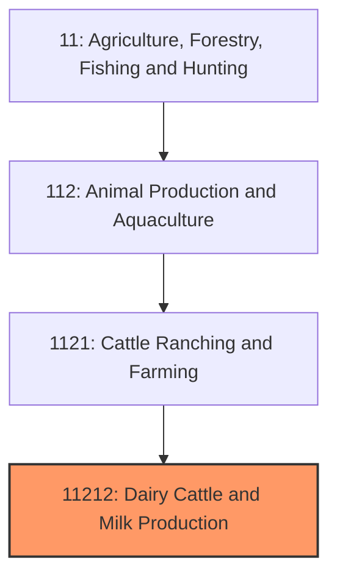
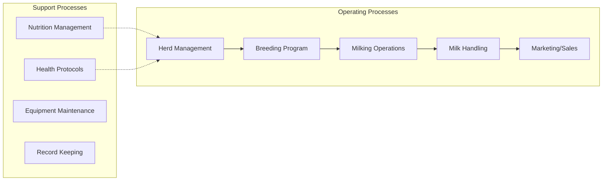

# Dairy Cattle and Milk Production

> Establishments primarily engaged in milking dairy cattle and producing raw milk for sale to dairy processors or direct consumption markets.

## Overview

Dairy cattle farming is a specialized segment of animal agriculture focused on raising and managing dairy cows primarily for milk production. The U.S. dairy industry is a major agricultural sector, with approximately 9.4 million dairy cows producing over 226 billion pounds of milk annually. While the total number of dairy farms has declined significantly over the past decades due to consolidation, average herd sizes have increased dramatically, with operations ranging from small family farms with 50-100 cows to large confined animal feeding operations (CAFOs) with thousands of animals.

The industry operates year-round, as dairy cows require daily milking (typically twice or three times per day) and produce milk continuously when properly managed. Modern dairy operations integrate advanced genetics, nutrition science, and technology to maximize milk production per cow while maintaining animal health and welfare. The Holstein breed dominates U.S. dairy production, though Jersey, Brown Swiss, Guernsey, and Ayrshire breeds contribute to specialty milk markets.

## Market Context

| Metric | Value |
|--------|-------|
| U.S. Milk Production | 226 billion pounds annually |
| Number of Dairy Farms | ~24,000 licensed operations |
| Number of Dairy Cows | 9.4 million head |
| Average Production | 24,000 lbs milk/cow/year |
| Farm Gate Milk Price | $18-22 per hundredweight |
| Industry Revenue | $42 billion annually |

California, Wisconsin, Idaho, Texas, and New York are the top milk-producing states, collectively accounting for over 50% of national production. The industry has seen significant geographic shifts, with growth in western states where large-scale operations benefit from favorable climates and access to feed supplies.

## Industry Hierarchy

## Key Statistics

| Metric | Value |
|--------|-------|
| NAICS Code | 11212 |
| Level | Industry |
| Parent | [Cattle Ranching](../) |
| Child Industries | 0 |

## Related Occupations

- [Farmers, Ranchers, and Other Agricultural Managers](/occupations/Management/FarmersRanchersAndOtherAgriculturalManagers) - Manage dairy operations, make breeding and culling decisions, oversee staff
- [Animal Scientists](/occupations/Science/AnimalScientists) - Research nutrition, genetics, and production optimization
- [Veterinarians](/occupations/Healthcare/Veterinarians) - Provide herd health services, reproductive management, and disease treatment
- [Agricultural Technicians](/occupations/Science/AgriculturalTechnicians) - Assist with breeding programs, milk testing, and feed analysis
- [Farmworkers and Laborers, Crop, Nursery, and Greenhouse](/occupations/FarmingFishingAndForestry/FarmworkersAndLaborers) - Perform daily milking, feeding, and animal care
- [Farm Equipment Mechanics](/occupations/Installation/FarmEquipmentMechanics) - Maintain milking systems, cooling equipment, and tractors

## Core Business Processes

### Milking Operations
The core daily activity of dairy farming, performed 2-3 times daily using automated milking parlors or robotic milking systems.

**Key Activities:**
- Cow preparation and udder sanitation
- Milking unit attachment and monitoring
- Post-milking teat dipping for mastitis prevention
- Milk flow monitoring and automatic detachment
- Parlor cleaning and sanitization

### Herd Management
Continuous oversight of animal health, reproduction, and productivity to maintain a profitable milking herd.

**Key Activities:**
- Daily health observation and treatment protocols
- Reproductive management and heat detection
- Dry cow management and calving assistance
- Calf rearing and heifer development
- Culling decisions based on production and health data

### Nutrition Management
Formulating and delivering balanced rations to maximize milk production while maintaining cow health.

**Key Activities:**
- Total Mixed Ration (TMR) formulation
- Forage quality testing and inventory management
- Feed delivery and bunk management
- Body condition scoring
- Transition cow nutrition programs

## Industry Value Chain

```mermaid
graph LR
    subgraph Inputs["Inputs"]
        I1["Breeding Stock/Genetics"]
        I2["Feed/Forage"]
        I3["Veterinary Services"]
        I4["Equipment/Facilities"]
    end

    subgraph Primary["Primary Activities"]
        A1["Herd Development"]
        A2["Daily Milking"]
        A3["Milk Cooling/Storage"]
        A4["Quality Testing"]
    end

    subgraph Outputs["Products/Services"]
        O1["Raw Milk"]
        O2["Cull Cows/Bulls"]
        O3["Heifer Calves"]
        O4["Manure/Compost"]
    end

    subgraph Customers["Markets"]
        C1["Dairy Cooperatives"]
        C2["Milk Processors"]
        C3["Livestock Markets"]
        C4["Direct Sales"]
    end

    Inputs --> Primary --> Outputs --> Customers
```

## Regulatory Environment

- **USDA Agricultural Marketing Service (AMS)** - Administers Federal Milk Marketing Orders setting minimum prices
- **FDA/CFSAN** - Regulates milk as a food product under the Pasteurized Milk Ordinance (PMO)
- **EPA** - Regulates waste management, water quality, and air emissions from dairy operations
- **State Milk Control Boards** - License dairy farms, conduct inspections, and enforce quality standards
- **USDA APHIS** - Monitors animal health and disease control programs

### Key Regulations
- Grade A Pasteurized Milk Ordinance (PMO) requirements
- Somatic Cell Count (SCC) limits for Grade A milk
- Antibiotic residue testing and withholding periods
- Nutrient Management Plans for manure handling
- Concentrated Animal Feeding Operation (CAFO) permits
- Animal identification and traceability requirements

## Technology & Innovation

- **Robotic Milking Systems** - Automated milking allowing cows to self-select milking times, reducing labor needs
- **Herd Management Software** - Computer systems tracking individual cow production, health, and reproduction
- **Precision Feeding** - Automated feed delivery systems with individual cow ration adjustments
- **Activity Monitoring** - Collar and leg sensors detecting heat, health issues, and rumination patterns
- **Genetic Genomics** - DNA testing for breeding decisions and disease resistance traits
- **Methane Digesters** - Converting manure to biogas for energy generation and carbon reduction

## Industry Challenges

- **Milk Price Volatility** - Commodity pricing creates income uncertainty for producers
- **Labor Availability** - Difficulty finding skilled workers for demanding 365-day operations
- **Environmental Regulations** - Increasing scrutiny of manure management and greenhouse gas emissions
- **Animal Welfare Concerns** - Consumer pressure regarding housing systems and calf management
- **Consolidation Pressure** - Small farms struggling to compete with large-scale operations
- **Input Cost Inflation** - Rising feed, fuel, and labor costs squeezing margins

## Industry Outlook

The U.S. dairy industry faces a complex future balancing productivity gains against environmental and social pressures. Milk production per cow continues to increase through genetic improvement and management advances, while total cow numbers decline. Technology adoption, particularly robotic milking and precision management tools, is accelerating as labor becomes scarcer and more expensive. Environmental sustainability initiatives, including methane reduction and water conservation, are becoming business imperatives as processors and retailers set supply chain sustainability goals. The industry is adapting to changing consumer preferences with growth in organic, grass-fed, and specialty milk products. Export markets remain important for balancing domestic supply, with dairy products representing a significant U.S. agricultural export category.

---

*Source: NAICS 11212 - Dairy Cattle and Milk Production*
