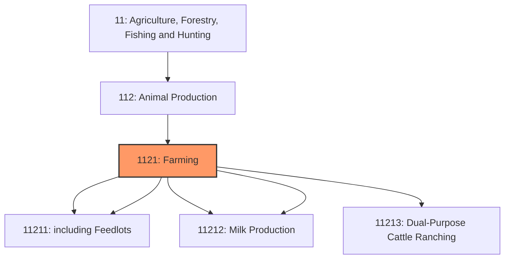
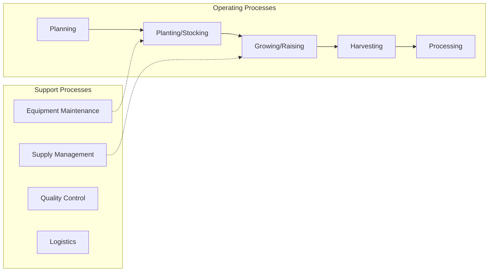

# Farming

> This industry group comprises establishments primarily engaged in raising cattle, milking dairy cattle, or feeding cattle for fattening.

## Overview

Farming represents an important category within the Agriculture, Forestry, Fishing and Hunting sector (NAICS 11).

This industry group comprises establishments primarily engaged in raising cattle, milking dairy cattle, or feeding cattle for fattening.

## Industry Hierarchy

## Key Statistics

| Metric | Value |
|--------|-------|
| NAICS Code | 1121 |
| Level | Industry Group |
| Parent | [Animal Production](../) |
| Child Industries | 5 |

## Sub-Industries

| Industry | Code | Description |
|----------|------|-------------|
| [Beef Cattle Ranching and Farming](./BeefCattleRanchingAndFarming/) | 11211 | This industry comprises establishments primarily engaged in raising cattle (incl |
| [including Feedlots](./IncludingFeedlots/) | 11211 | This industry comprises establishments primarily engaged in raising cattle (incl |
| [Dairy Cattle](./DairyCattle/) | 11212 | See industry description for 112120 |
| [Milk Production](./MilkProduction/) | 11212 | See industry description for 112120 |
| [Dual-Purpose Cattle Ranching](./DualpurposeCattleRanching/) | 11213 | See industry description for 112130 |

## Related Occupations

See the [occupations directory](/occupations) for roles commonly found in this industry.

## Core Business Processes

## Industry Value Chain

```mermaid
graph LR
    subgraph Inputs["Inputs"]
        I1["Seeds/Stock"]
        I2["Equipment"]
        I3["Fertilizers"]
        I4["Labor"]
    end

    subgraph Primary["Primary Activities"]
        A1["Inbound Logistics"]
        A2["Core Operations"]
        A3["Quality Assurance"]
        A4["Outbound/Delivery"]
    end

    subgraph Outputs["Products/Services"]
        O1["Crops"]
        O2["Livestock"]
        O3["Raw Materials"]
    end

    subgraph Customers["Markets"]
        C1["Processors"]
        C2["Distributors"]
        C3["Retailers"]
        C4["Export Markets"]
    end

    Inputs --> Primary --> Outputs --> Customers
```

## Market Context

Agricultural production forms the foundation of the food supply chain, with increasing emphasis on sustainable practices, precision farming, and technology adoption.

| Aspect | Details |
|--------|---------|
| Industry Sector | Agriculture |
| NAICS/SIC Code | 1121 |
| Market Segment | Farming |

## Key Business Processes

- Planting and cultivation
- Harvesting and processing
- Quality control and grading
- Storage and distribution
- Marketing and sales

## Common Occupations

- [Agricultural Managers](/occupations/Management/FarmersRanchersAndOtherAgriculturalManagers)
- [Agricultural Workers](/occupations/Agriculture/AgriculturalWorkers)
- [Agricultural Equipment Operators](/occupations/Agriculture/AgriculturalEquipmentOperators)
- [Agricultural Inspectors](/occupations/Agriculture/AgriculturalInspectors)

## Regulations and Standards

- USDA Food Safety and Inspection Service (FSIS)
- EPA Agricultural Regulations
- State Department of Agriculture requirements
- Food Safety Modernization Act (FSMA)
- Worker Protection Standard (WPS)

## Technology and Tools

- Precision agriculture and GPS guidance
- Automated irrigation systems
- Farm management software
- Crop monitoring drones
- Livestock tracking systems

## Industry Trends

- Digital transformation and automation adoption
- Sustainability and environmental compliance focus
- Workforce development and skills training
- Supply chain resilience and optimization
- Customer experience enhancement

---

*Source: NAICS 1121 - Farming*
