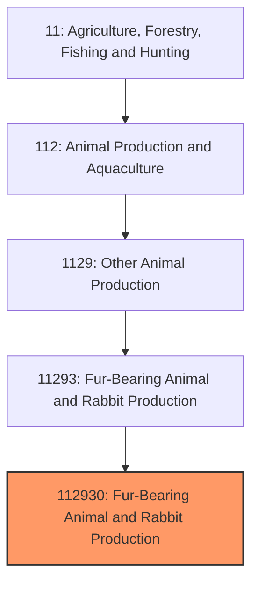
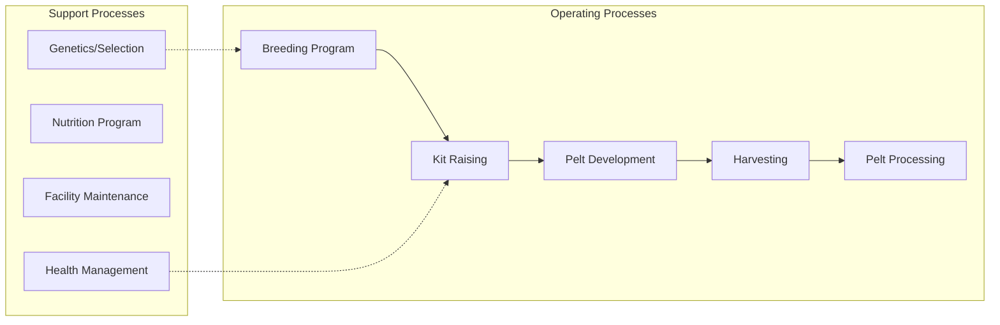

# Fur-Bearing Animal Production

> Establishments primarily engaged in raising fur-bearing animals such as mink, chinchilla, fox, and other species for pelt production.

## Overview

Fur-bearing animal production encompasses the farming of animals raised primarily for their pelts, which are processed into fur garments, accessories, and trim. The industry is dominated by mink farming, which accounts for approximately 85% of farmed fur production globally. Other farmed fur-bearing species include chinchillas, foxes (silver and blue), sable, and fitch. The United States was historically a major producer, but the industry has declined significantly due to changing consumer attitudes, animal welfare concerns, and regulatory pressures.

U.S. fur farming peaked in the 1980s with over 1,000 mink farms; today fewer than 100 remain operational. The industry has consolidated geographically, with Wisconsin and Utah maintaining the largest concentrations of remaining operations. Global production centers have shifted to Denmark, Poland, and China, though recent disease outbreaks and regulatory changes have disrupted international markets.

## Market Context

| Metric | Value |
|--------|-------|
| U.S. Mink Pelt Production | ~2-3 million pelts annually |
| Global Mink Production | ~60 million pelts (pre-2020) |
| Average Mink Pelt Price | $30-60 (varies significantly by quality/color) |
| U.S. Fur Farm Employment | ~1,500 workers |
| Industry Trend | Declining domestically |

The global fur market has experienced significant disruption from COVID-19 (mink-to-human transmission concerns led to mass cullings in Denmark) and growing bans on fur farming in European countries. U.S. production continues primarily serving the international auction market.

## Industry Hierarchy

## Key Statistics

| Metric | Value |
|--------|-------|
| NAICS Code | 112930 |
| Level | National Industry |
| Parent | [Other Animal Production](../) |
| Child Industries | 0 |

## Related Occupations

- [Farmers, Ranchers, and Other Agricultural Managers](/occupations/Management/FarmersRanchersAndOtherAgriculturalManagers) - Manage fur farm operations and business planning
- [Animal Breeders](/occupations/FarmingFishingAndForestry/AnimalBreeders) - Develop breeding programs for pelt quality and color
- [Farmworkers and Laborers](/occupations/FarmingFishingAndForestry/FarmworkersAndLaborers) - Daily animal care, feeding, and facility maintenance
- [Veterinarians](/occupations/Healthcare/Veterinarians) - Provide health care and disease prevention
- [Skinners and Pelt Processors](/occupations/Production/ButchersAndMeatCutters) - Harvest and prepare pelts

## Core Business Processes

### Breeding Program
Genetic selection and breeding management focused on producing pelts with desired qualities including color, density, and size.

**Key Activities:**
- Selection of breeding stock based on pelt characteristics
- Color mutation development and maintenance
- Breeding timing for optimal kit production
- Genetic record keeping
- Culling and replacement decisions

### Pelt Development
Managing animal growth and coat development to produce premium quality pelts.

**Key Activities:**
- Nutrition optimization for coat quality
- Environmental management for prime coat development
- Timing pelting to coincide with prime fur condition
- Health monitoring to prevent pelt damage

### Harvesting and Processing
Humane euthanasia, pelt removal, and preparation for market.

**Key Activities:**
- Humane euthanasia methods (carbon monoxide/dioxide)
- Skinning and fleshing
- Pelt stretching and drying
- Grading by size, quality, and color
- Auction preparation and consignment

## Industry Value Chain

## Regulatory Environment

- **USDA Animal and Plant Health Inspection Service (APHIS)** - Disease surveillance and import/export regulations
- **EPA** - Waste management and environmental compliance for farm operations
- **State Departments of Agriculture** - Licensing, inspection, and animal welfare standards
- **Fur Commission USA** - Industry standards and certification programs
- **State/Local Regulations** - Some jurisdictions have banned or restricted fur farming

### Key Regulations
- Aleutian disease testing requirements
- Waste management and nutrient management plans
- Humane euthanasia standards
- Biosecurity protocols
- State-specific fur farming permits

## Technology & Innovation

- **Genetic Selection** - Color mutation development and quality trait breeding
- **Automated Feeding Systems** - Computer-controlled feeding for nutritional optimization
- **Climate Control** - Shed ventilation and lighting management for coat quality
- **Health Monitoring** - Disease testing protocols and biosecurity systems
- **Pelt Processing Equipment** - Mechanical fleshing and stretching technology
- **Waste Management** - Composting and nutrient recovery systems

## Species Overview

### Mink
The dominant farmed fur species, raised in various color mutations including standard ranch (dark brown), black, white, pastel, and sapphire.

### Chinchilla
Raised for their extremely dense, soft fur; primarily smaller operations due to slower reproduction and longer production cycles.

### Fox
Silver fox and blue fox farmed in limited numbers; larger pelts used for trim and accessories.

### Other Species
Fitch (European polecat), sable, and other species farmed in very limited numbers in the U.S.

## Industry Challenges

- **Consumer Sentiment** - Growing opposition to fur products affecting demand
- **Regulatory Pressure** - Bans on fur farming in several states and countries
- **Disease Risk** - COVID-19 demonstrated zoonotic disease transmission potential
- **Market Volatility** - Pelt prices highly variable based on fashion trends and supply
- **Labor Availability** - Difficulty attracting workers to declining industry
- **Environmental Compliance** - Increasing costs for waste management

## Industry Outlook

The fur-bearing animal production industry faces an uncertain future in the United States and globally. Consumer attitudes have shifted significantly against fur products, major fashion brands have eliminated fur from collections, and several U.S. states and European countries have enacted fur farming bans. The COVID-19 pandemic accelerated industry decline, with Denmark culling its entire mink population and several countries implementing new restrictions. Remaining U.S. producers focus on premium quality pelts and alternative markets such as China. The industry's future depends on evolving consumer acceptance, regulatory developments, and potential diversification into alternative products. Some farms are exploring transitions to other animal production or non-agricultural uses of their facilities.

---

*Source: NAICS 112930 - Fur-Bearing Animal and Rabbit Production*
